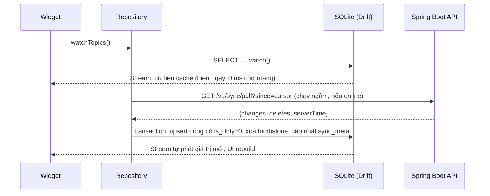
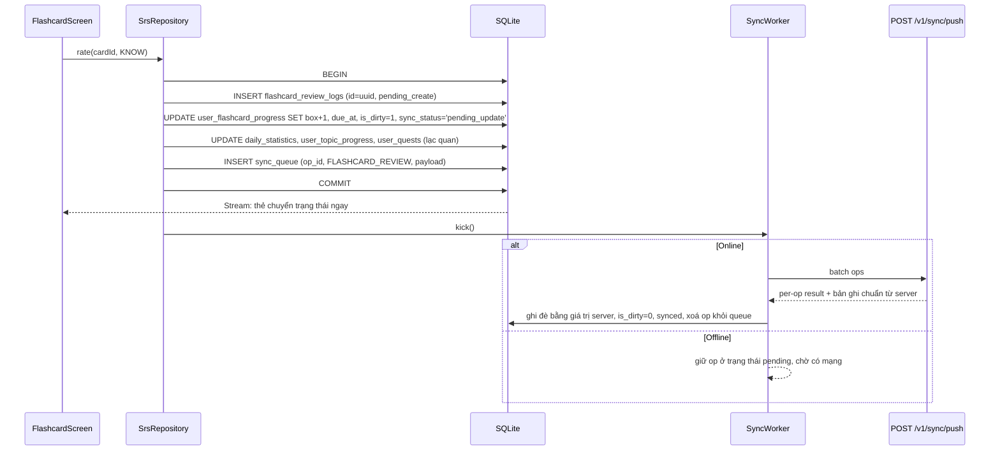

# AdvancedMobile_Flash — Kiến trúc dữ liệu & đồng bộ Offline-First

> Phạm vi: Server DB (MySQL 8), Local DB (SQLite + Drift), Key-Value storage, chiến lược đồng bộ, API contract (Spring Boot 2.7 + Swagger/OpenAPI 3).
> Nguồn: các model trong `lib/models/` và màn hình trong `lib/screens/` tại commit `a05122b`.
> DDL chạy được nằm riêng ở [`docs/sql/server_mysql.sql`](sql/server_mysql.sql) và [`docs/sql/client_sqlite.sql`](sql/client_sqlite.sql) — tài liệu này nhúng nguyên văn hai file đó.

## Tóm tắt các quyết định chính

| Vấn đề | Quyết định |
|---|---|
| Khoá chính | `CHAR(36)` UUID ở mọi bảng nghiệp vụ → client **tự sinh id khi offline**, không xung đột, khớp `String id` trong Dart. Bảng ledger nội bộ (`xp_transactions`) dùng `BIGINT AUTO_INCREMENT`. |
| Nguồn chân lý | **Server-authoritative** cho XP, streak, kho đồ, kết quả chấm quiz, trạng thái SRS. Client gửi **sự kiện** ("đã bấm Know lúc t", "đã chọn đáp án B"), không bao giờ gửi **con số** ("XP = 500"). |
| Idempotency | Mỗi thao tác offline có `op_id` (UUID). Server lưu vào `sync_operations`; gửi lại thì nhận lại đúng kết quả cũ, không cộng XP hai lần. |
| Ghi local | Mẫu **Transactional Outbox**: ghi dữ liệu + ghi `sync_queue` trong **cùng 1 transaction SQLite**, sau đó `SyncWorker` đẩy lên ngay nếu online. |
| Xung đột | Ghi chú: LWW theo `client_updated_at` (đã hiệu chỉnh lệch đồng hồ). Bookmark: LWW kèm tombstone. SRS: phát lại event log (không mất lượt ôn nào). XP/Streak: server tự tính. Shop: chỉ mua khi online. |
| Local DB | **Drift** (type-safe, stream reactive). |
| Key-Value | `flutter_secure_storage` cho token; `shared_preferences` cho cài đặt. |
| API | Theo quy ước của dự án: `/v1/{resource}`, `/v1/{resource}/get/{id}`, `/create`, `/update`, `/delete/{id}`; hành động nghiệp vụ dùng động từ (`/v1/quests/claim/{id}`). |

---

## PHẦN 1 — Bản đồ thực thể & quan hệ

### 1.1 Danh sách thực thể theo domain

#### Auth & Identity

| Bảng | Vai trò | Màn hình / Model |
|---|---|---|
| `users` | Tài khoản + hồ sơ + bộ đếm gamification (cache) | `UserModel`, Profile, Home |
| `user_auth_providers` | Liên kết Google Sign-In (`sub` của Google) | LoginScreen |
| `refresh_tokens` | Refresh token (chỉ lưu hash, có rotation) | — |
| `password_reset_tokens` | OTP/token quên mật khẩu (lưu hash, có giới hạn số lần thử) | ForgotPasswordScreen |
| `user_settings` | Bản sao cài đặt để đồng bộ đa thiết bị (1-1 với users) | SettingsScreen |

#### Learning Content (admin quản lý, client chỉ đọc)

| Bảng | Vai trò | Model |
|---|---|---|
| `topics` | Chủ đề từ vựng | `Topic`, `Lesson` (type=vocabulary) |
| `flashcards` | Từ vựng (mặt trước/sau thẻ) | `Flashcard` |
| `grammar_lessons` | Chủ điểm ngữ pháp + cấu trúc `S + am/is/are + V-ing` | `Grammar`, `Lesson` (type=grammar) |
| `grammar_examples` | Ví dụ minh hoạ của chủ điểm ngữ pháp | GrammarDetailScreen |
| `quizzes` | Đề kiểm tra gắn với 1 topic hoặc 1 grammar lesson | QuizScreen |
| `quiz_questions` | Câu hỏi + chỉ số đáp án đúng + giải thích | `QuizQuestion`, `QuizReviewItem` |
| `quiz_question_options` | 4 đáp án A/B/C/D (chuẩn hoá thành bảng con) | `QuizQuestion.options` |

#### User Progress & SRS

| Bảng | Vai trò |
|---|---|
| `user_flashcard_progress` | Trạng thái SRS hiện tại của từng cặp (user, flashcard): box Leitner, `due_at`, số lần Again/Know |
| `flashcard_review_logs` | Nhật ký **append-only** mỗi lần bấm Again/Know (event sourcing) |
| `user_flashcard_notes` | Ghi chú cá nhân, tối đa 1 ghi chú cho mỗi (user, từ) → `Flashcard.note` |
| `user_bookmarks` | Từ yêu thích |
| `user_topic_progress` | Tiến độ theo topic → `Topic.progress`, bộ lọc Đang học/Hoàn thành |
| `user_grammar_progress` | Tiến độ theo chủ điểm ngữ pháp → `Grammar.progress`, `Grammar.status` |
| `lesson_completions` | Mỗi bài học hoàn thành → "3/5 bài hôm nay", `completed_lessons` |
| `quiz_attempts` | Một lần làm quiz → `QuizResult` |
| `quiz_attempt_answers` | Đáp án user chọn cho từng câu → `wrongQuestionIds`, `QuizReviewItem.userIndex` |

#### Gamification & Economy

| Bảng | Vai trò |
|---|---|
| `xp_transactions` | **Sổ cái XP**; `users.current_xp` và `total_lifetime_xp` là số dư cache của bảng này |
| `quest_definitions` | Mẫu nhiệm vụ (VD: "Học 20 từ mới", +50 XP) |
| `user_quests` | Nhiệm vụ đã giao cho user trong 1 ngày/tuần, tiến độ 12/20, đã nhận thưởng chưa → `Quest` |
| `reward_items` | Vật phẩm cửa hàng: viền gradient, avatar, giá XP, yêu cầu Top N → `RewardItem` |
| `user_inventories` | Kho đồ, trạng thái trang bị → `UserInventory` |
| `v_leaderboard_xp`, `v_leaderboard_streak` | View xếp hạng (`RANK()` trên `users`), không phải bảng lưu trữ |

#### Activity & Tracking

| Bảng | Vai trò |
|---|---|
| `daily_statistics` | 1 dòng cho mỗi user mỗi ngày: số từ, XP, số câu đúng/tổng → `DailyStatistic`, biểu đồ, Accuracy |
| `users.streak_days / longest_streak / last_active_date` | Theo dõi streak (tính lại được từ `daily_statistics`) |
| `sync_operations` | Sổ idempotency cho batch sync |

### 1.2 Sơ đồ ERD

Quan hệ n-n giữa `users` và `flashcards` được tách thành 4 bảng liên kết có thuộc tính riêng (progress, review log, note, bookmark). Quan hệ n-n giữa `users` và `reward_items` đi qua `user_inventories`; giữa `users` và `quest_definitions` đi qua `user_quests`.

```mermaid
erDiagram
    users ||--o{ user_auth_providers : "đăng nhập qua"
    users ||--o{ refresh_tokens : "có"
    users ||--o{ password_reset_tokens : "yêu cầu"
    users ||--o| user_settings : "1-1"

    topics ||--o{ flashcards : "chứa"
    grammar_lessons ||--o{ grammar_examples : "minh hoạ bởi"
    topics |o--o{ quizzes : "kiểm tra"
    grammar_lessons |o--o{ quizzes : "kiểm tra"
    quizzes ||--|{ quiz_questions : "gồm"
    quiz_questions ||--|{ quiz_question_options : "4 đáp án"
    flashcards |o--o{ quiz_questions : "sinh ra"

    users ||--o{ user_flashcard_progress : "học"
    flashcards ||--o{ user_flashcard_progress : "được học"
    users ||--o{ flashcard_review_logs : "ôn"
    flashcards ||--o{ flashcard_review_logs : "được ôn"
    users ||--o{ user_flashcard_notes : "ghi chú"
    flashcards ||--o{ user_flashcard_notes : "có ghi chú"
    users ||--o{ user_bookmarks : "đánh dấu"
    flashcards ||--o{ user_bookmarks : "được đánh dấu"
    users ||--o{ user_topic_progress : "tiến độ"
    topics ||--o{ user_topic_progress : "được theo dõi"
    users ||--o{ user_grammar_progress : "tiến độ"
    grammar_lessons ||--o{ user_grammar_progress : "được theo dõi"
    users ||--o{ lesson_completions : "hoàn thành"
    users ||--o{ quiz_attempts : "làm bài"
    quizzes ||--o{ quiz_attempts : "được làm"
    quiz_attempts ||--|{ quiz_attempt_answers : "gồm"
    quiz_questions ||--o{ quiz_attempt_answers : "được trả lời"

    users ||--o{ xp_transactions : "sổ cái XP"
    users ||--o{ user_quests : "nhận"
    quest_definitions ||--o{ user_quests : "giao"
    users ||--o{ user_inventories : "sở hữu"
    reward_items ||--o{ user_inventories : "được mua"

    users ||--o{ daily_statistics : "thống kê ngày"
    users ||--o{ sync_operations : "đồng bộ"

    users {
        char36 id PK
        varchar email UK
        varchar full_name
        enum level
        varchar slogan
        int current_xp
        bigint total_lifetime_xp
        int streak_days
        int longest_streak
        date last_active_date
    }
    topics {
        char36 id PK
        varchar title
        varchar icon_path
        int total_words
    }
    flashcards {
        char36 id PK
        char36 topic_id FK
        varchar word
        varchar part_of_speech
        varchar pronunciation
        varchar meaning
        text example
    }
    grammar_lessons {
        char36 id PK
        varchar title
        varchar structure
        varchar icon_name
    }
    quizzes {
        char36 id PK
        char36 topic_id FK
        char36 grammar_lesson_id FK
    }
    quiz_questions {
        char36 id PK
        char36 quiz_id FK
        text question_text
        tinyint correct_option_index
        text explanation
    }
    user_flashcard_progress {
        char36 user_id PK
        char36 flashcard_id PK
        tinyint box
        datetime due_at
        enum last_rating
    }
    flashcard_review_logs {
        char36 id PK
        char36 user_id FK
        char36 flashcard_id FK
        enum rating
        datetime reviewed_at
    }
    user_flashcard_notes {
        char36 id PK
        char36 user_id FK
        char36 flashcard_id FK
        text content
        datetime client_updated_at
    }
    quiz_attempts {
        char36 id PK
        char36 user_id FK
        char36 quiz_id FK
        smallint correct_answers
        int time_taken_seconds
    }
    xp_transactions {
        bigint id PK
        char36 user_id FK
        int amount
        enum source_type
        varchar source_id
    }
    user_quests {
        char36 id PK
        char36 user_id FK
        char36 quest_definition_id FK
        date period_start
        int current_value
        boolean is_claimed
    }
    reward_items {
        char36 id PK
        enum item_type
        int xp_cost
        json border_colors
        smallint required_rank
    }
    user_inventories {
        char36 id PK
        char36 user_id FK
        char36 reward_item_id FK
        boolean is_equipped
    }
    daily_statistics {
        char36 id PK
        char36 user_id FK
        date stat_date
        int words_learned
        int xp_gained
    }
```



---

## PHẦN 2 — Cơ sở dữ liệu phía Server (MySQL 8)

### 2.1 Quy ước

- MySQL **8.0.16+** (cần để `CHECK` constraint có hiệu lực, cùng với descending index và window function `RANK()`), InnoDB, `utf8mb4_0900_ai_ci`.
- Thời gian lưu `DATETIME(3)` ở **UTC**; Spring cấu hình `spring.jpa.properties.hibernate.jdbc.time_zone=UTC` và JDBC URL có `serverTimezone=UTC`. (MySQL không có `TIMESTAMP WITH TIME ZONE` như PostgreSQL.)
- Cột phục vụ đồng bộ:
  - `version`: tăng mỗi lần ghi, dùng optimistic locking (`@Version` của JPA) và để client biết bản local đang dựa trên phiên bản nào.
  - `client_updated_at`: thời điểm user sửa trên thiết bị, dùng cho Last-Write-Wins.
  - `updated_at`: con trỏ cho delta pull (`WHERE updated_at > :cursor`).
  - `deleted_at`: soft delete / tombstone để client biết bản ghi đã bị xoá.
- **Ràng buộc của MySQL**: cột có FK kèm `ON DELETE CASCADE/SET NULL` không được nằm trong `CHECK`. Vì vậy các quy tắc "đúng 1 trong 2 FK khác NULL" (`quizzes`, `lesson_completions`) và "mỗi loại vật phẩm chỉ trang bị 1 món" được enforce ở tầng service. Phía SQLite không có giới hạn này nên vẫn có `CHECK`.

### 2.2 DDL

```sql
-- =====================================================================
-- AdvancedMobile_Flash - Server schema
-- Target : MySQL 8.0.16+ (InnoDB, utf8mb4, CHECK constraints enforced)
-- Conventions:
--   * PK  : CHAR(36) UUID (client có thể tự sinh id khi offline -> không đụng độ)
--           Ngoại lệ: bảng ledger/log nội bộ server dùng BIGINT AUTO_INCREMENT.
--   * Time: DATETIME(3) lưu UTC (JDBC: serverTimezone=UTC), ms precision.
--   * Sync: version (optimistic lock, tăng mỗi lần ghi), client_updated_at (LWW),
--           updated_at (delta pull cursor), deleted_at (soft delete / tombstone).
--   * Lưu ý MySQL: cột tham gia FK có ON DELETE CASCADE/SET NULL KHÔNG được
--     dùng trong CHECK constraint -> các ràng buộc kiểu "đúng 1 trong 2 FK"
--     được enforce ở tầng service.
-- =====================================================================

CREATE DATABASE IF NOT EXISTS flash_db
  CHARACTER SET utf8mb4 COLLATE utf8mb4_0900_ai_ci;
USE flash_db;

-- =====================================================================
-- 1. AUTH & IDENTITY DOMAIN
-- =====================================================================

CREATE TABLE users (
  id                  CHAR(36)        NOT NULL,
  email               VARCHAR(255)    NOT NULL,
  password_hash       VARCHAR(100)    NULL COMMENT 'BCrypt; NULL nếu chỉ đăng nhập Google',
  full_name           VARCHAR(100)    NOT NULL,
  avatar_url          VARCHAR(500)    NULL,
  level               ENUM('A1','A2','B1','B2','C1','C2') NOT NULL DEFAULT 'A1',
  slogan              VARCHAR(255)    NOT NULL DEFAULT 'Học, học nữa, học mãi!',
  -- Gamification counters (server-authoritative, chỉ service XP được ghi)
  current_xp          INT UNSIGNED    NOT NULL DEFAULT 0 COMMENT 'Số dư XP, bị trừ khi mua đồ',
  target_xp           INT UNSIGNED    NOT NULL DEFAULT 100,
  total_lifetime_xp   BIGINT UNSIGNED NOT NULL DEFAULT 0 COMMENT 'Tổng XP trọn đời, không bao giờ giảm',
  streak_days         INT UNSIGNED    NOT NULL DEFAULT 0,
  longest_streak      INT UNSIGNED    NOT NULL DEFAULT 0,
  last_active_date    DATE            NULL COMMENT 'Ngày học gần nhất theo timezone của user',
  -- Denormalized counters (cache có chủ đích, xem mục 2.3)
  total_words_learned INT UNSIGNED    NOT NULL DEFAULT 0,
  completed_lessons   INT UNSIGNED    NOT NULL DEFAULT 0,
  timezone            VARCHAR(64)     NOT NULL DEFAULT 'Asia/Ho_Chi_Minh',
  role                ENUM('USER','ADMIN') NOT NULL DEFAULT 'USER',
  status              ENUM('PENDING_VERIFY','ACTIVE','LOCKED') NOT NULL DEFAULT 'ACTIVE',
  email_verified_at   DATETIME(3)     NULL,
  version             INT UNSIGNED    NOT NULL DEFAULT 0,
  client_updated_at   DATETIME(3)     NULL COMMENT 'Thời điểm client sửa profile (slogan...)',
  created_at          DATETIME(3)     NOT NULL DEFAULT CURRENT_TIMESTAMP(3),
  updated_at          DATETIME(3)     NOT NULL DEFAULT CURRENT_TIMESTAMP(3) ON UPDATE CURRENT_TIMESTAMP(3),
  deleted_at          DATETIME(3)     NULL,
  PRIMARY KEY (id),
  UNIQUE KEY uk_users_email (email),
  KEY idx_users_lb_xp     (status, deleted_at, total_lifetime_xp DESC),
  KEY idx_users_lb_streak (status, deleted_at, longest_streak DESC),
  CONSTRAINT chk_users_streak CHECK (longest_streak >= streak_days)
) ENGINE=InnoDB;

CREATE TABLE user_auth_providers (
  id                CHAR(36)     NOT NULL,
  user_id           CHAR(36)     NOT NULL,
  provider          ENUM('GOOGLE') NOT NULL,
  provider_user_id  VARCHAR(255) NOT NULL COMMENT 'Google "sub" claim',
  provider_email    VARCHAR(255) NULL,
  created_at        DATETIME(3)  NOT NULL DEFAULT CURRENT_TIMESTAMP(3),
  PRIMARY KEY (id),
  UNIQUE KEY uk_provider_subject (provider, provider_user_id),
  UNIQUE KEY uk_user_provider (user_id, provider),
  CONSTRAINT fk_uap_user FOREIGN KEY (user_id) REFERENCES users (id) ON DELETE CASCADE
) ENGINE=InnoDB;

CREATE TABLE refresh_tokens (
  id              CHAR(36)     NOT NULL,
  user_id         CHAR(36)     NOT NULL,
  token_hash      CHAR(64)     NOT NULL COMMENT 'SHA-256 của refresh token, không lưu token thô',
  device_id       VARCHAR(100) NULL,
  user_agent      VARCHAR(255) NULL,
  expires_at      DATETIME(3)  NOT NULL,
  revoked_at      DATETIME(3)  NULL,
  replaced_by_id  CHAR(36)     NULL COMMENT 'Refresh token rotation: token kế nhiệm',
  created_at      DATETIME(3)  NOT NULL DEFAULT CURRENT_TIMESTAMP(3),
  PRIMARY KEY (id),
  UNIQUE KEY uk_refresh_token_hash (token_hash),
  KEY idx_refresh_user (user_id, revoked_at),
  CONSTRAINT fk_rt_user FOREIGN KEY (user_id) REFERENCES users (id) ON DELETE CASCADE
) ENGINE=InnoDB;

CREATE TABLE password_reset_tokens (
  id             CHAR(36)    NOT NULL,
  user_id        CHAR(36)    NOT NULL,
  token_hash     CHAR(64)    NOT NULL COMMENT 'SHA-256 của OTP/token gửi qua email',
  expires_at     DATETIME(3) NOT NULL,
  used_at        DATETIME(3) NULL,
  attempt_count  TINYINT UNSIGNED NOT NULL DEFAULT 0,
  created_at     DATETIME(3) NOT NULL DEFAULT CURRENT_TIMESTAMP(3),
  PRIMARY KEY (id),
  UNIQUE KEY uk_prt_hash (token_hash),
  KEY idx_prt_user (user_id, expires_at),
  CONSTRAINT fk_prt_user FOREIGN KEY (user_id) REFERENCES users (id) ON DELETE CASCADE
) ENGINE=InnoDB;

-- 1-1 với users. Bản gốc nằm ở SharedPreferences; bảng này chỉ để đồng bộ đa thiết bị
-- và để server biết giờ nhắc học nếu sau này gửi push notification.
CREATE TABLE user_settings (
  user_id                  CHAR(36)    NOT NULL,
  is_notification_enabled  BOOLEAN     NOT NULL DEFAULT TRUE,
  is_sound_enabled         BOOLEAN     NOT NULL DEFAULT TRUE,
  is_vibration_enabled     BOOLEAN     NOT NULL DEFAULT TRUE,
  is_dark_mode             BOOLEAN     NOT NULL DEFAULT FALSE,
  app_language             VARCHAR(10) NOT NULL DEFAULT 'vi',
  daily_reminder_time      TIME        NULL,
  daily_goal_lessons       TINYINT UNSIGNED NOT NULL DEFAULT 5 COMMENT 'Mục tiêu "3/5 bài" ở Home',
  version                  INT UNSIGNED NOT NULL DEFAULT 0,
  client_updated_at        DATETIME(3) NULL,
  updated_at               DATETIME(3) NOT NULL DEFAULT CURRENT_TIMESTAMP(3) ON UPDATE CURRENT_TIMESTAMP(3),
  PRIMARY KEY (user_id),
  CONSTRAINT fk_us_user FOREIGN KEY (user_id) REFERENCES users (id) ON DELETE CASCADE
) ENGINE=InnoDB;

-- =====================================================================
-- 2. LEARNING CONTENT DOMAIN (admin quản lý, client chỉ đọc + cache)
-- =====================================================================

CREATE TABLE topics (
  id                 CHAR(36)     NOT NULL,
  title              VARCHAR(150) NOT NULL,
  description        VARCHAR(500) NULL,
  icon_path          VARCHAR(255) NOT NULL,
  level              ENUM('A1','A2','B1','B2','C1','C2') NOT NULL DEFAULT 'A1',
  cover_color        INT UNSIGNED NULL COMMENT 'ARGB 0xAARRGGBB -> Color(int) trong Flutter',
  estimated_minutes  SMALLINT UNSIGNED NOT NULL DEFAULT 10,
  total_words        INT UNSIGNED NOT NULL DEFAULT 0 COMMENT 'Counter, cập nhật khi thêm/xoá flashcard',
  sort_order         INT          NOT NULL DEFAULT 0,
  is_published       BOOLEAN      NOT NULL DEFAULT FALSE,
  version            INT UNSIGNED NOT NULL DEFAULT 0,
  created_at         DATETIME(3)  NOT NULL DEFAULT CURRENT_TIMESTAMP(3),
  updated_at         DATETIME(3)  NOT NULL DEFAULT CURRENT_TIMESTAMP(3) ON UPDATE CURRENT_TIMESTAMP(3),
  deleted_at         DATETIME(3)  NULL,
  PRIMARY KEY (id),
  KEY idx_topics_list (is_published, deleted_at, sort_order),
  KEY idx_topics_updated (updated_at),
  FULLTEXT KEY ft_topics_title (title)
) ENGINE=InnoDB;

CREATE TABLE flashcards (
  id                   CHAR(36)     NOT NULL,
  topic_id             CHAR(36)     NOT NULL,
  word                 VARCHAR(100) NOT NULL,
  part_of_speech       VARCHAR(30)  NOT NULL,
  pronunciation        VARCHAR(100) NOT NULL,
  meaning              VARCHAR(500) NOT NULL,
  example              TEXT         NULL,
  example_translation  TEXT         NULL,
  audio_url            VARCHAR(500) NULL,
  image_url            VARCHAR(500) NULL,
  sort_order           INT          NOT NULL DEFAULT 0,
  version              INT UNSIGNED NOT NULL DEFAULT 0,
  created_at           DATETIME(3)  NOT NULL DEFAULT CURRENT_TIMESTAMP(3),
  updated_at           DATETIME(3)  NOT NULL DEFAULT CURRENT_TIMESTAMP(3) ON UPDATE CURRENT_TIMESTAMP(3),
  deleted_at           DATETIME(3)  NULL,
  PRIMARY KEY (id),
  UNIQUE KEY uk_flashcards_topic_word (topic_id, word),
  KEY idx_flashcards_topic (topic_id, deleted_at, sort_order),
  KEY idx_flashcards_word (word),
  KEY idx_flashcards_updated (updated_at),
  FULLTEXT KEY ft_flashcards_search (word, meaning),
  CONSTRAINT fk_fc_topic FOREIGN KEY (topic_id) REFERENCES topics (id) ON DELETE CASCADE
) ENGINE=InnoDB;

CREATE TABLE grammar_lessons (
  id                 CHAR(36)     NOT NULL,
  title              VARCHAR(150) NOT NULL,
  description        VARCHAR(500) NULL,
  structure          VARCHAR(255) NOT NULL COMMENT 'VD: S + am/is/are + V-ing',
  content            TEXT         NULL COMMENT 'Giải thích chi tiết (Markdown)',
  usage_notes        TEXT         NULL,
  icon_name          VARCHAR(50)  NOT NULL COMMENT 'Tên Material icon, Flutter tự map sang IconData',
  level              ENUM('A1','A2','B1','B2','C1','C2') NOT NULL DEFAULT 'A1',
  cover_color        INT UNSIGNED NULL,
  estimated_minutes  SMALLINT UNSIGNED NOT NULL DEFAULT 10,
  sort_order         INT          NOT NULL DEFAULT 0,
  is_published       BOOLEAN      NOT NULL DEFAULT FALSE,
  version            INT UNSIGNED NOT NULL DEFAULT 0,
  created_at         DATETIME(3)  NOT NULL DEFAULT CURRENT_TIMESTAMP(3),
  updated_at         DATETIME(3)  NOT NULL DEFAULT CURRENT_TIMESTAMP(3) ON UPDATE CURRENT_TIMESTAMP(3),
  deleted_at         DATETIME(3)  NULL,
  PRIMARY KEY (id),
  KEY idx_grammar_list (is_published, deleted_at, sort_order),
  KEY idx_grammar_updated (updated_at),
  FULLTEXT KEY ft_grammar_title (title)
) ENGINE=InnoDB;

CREATE TABLE grammar_examples (
  id                 CHAR(36)     NOT NULL,
  grammar_lesson_id  CHAR(36)     NOT NULL,
  sentence           TEXT         NOT NULL,
  translation        TEXT         NULL,
  highlight          VARCHAR(100) NULL COMMENT 'Cụm cần tô đậm trong câu, VD: "is playing"',
  sort_order         INT          NOT NULL DEFAULT 0,
  created_at         DATETIME(3)  NOT NULL DEFAULT CURRENT_TIMESTAMP(3),
  updated_at         DATETIME(3)  NOT NULL DEFAULT CURRENT_TIMESTAMP(3) ON UPDATE CURRENT_TIMESTAMP(3),
  deleted_at         DATETIME(3)  NULL,
  PRIMARY KEY (id),
  KEY idx_ge_lesson (grammar_lesson_id, sort_order),
  CONSTRAINT fk_ge_lesson FOREIGN KEY (grammar_lesson_id) REFERENCES grammar_lessons (id) ON DELETE CASCADE
) ENGINE=InnoDB;

-- Một quiz thuộc về đúng 1 trong 2: topic HOẶC grammar_lesson (enforce ở service).
CREATE TABLE quizzes (
  id                  CHAR(36)     NOT NULL,
  title               VARCHAR(150) NOT NULL,
  quiz_type           ENUM('TOPIC','GRAMMAR') NOT NULL,
  topic_id            CHAR(36)     NULL,
  grammar_lesson_id   CHAR(36)     NULL,
  time_limit_seconds  INT UNSIGNED NULL,
  pass_score_percent  TINYINT UNSIGNED NOT NULL DEFAULT 70,
  is_published        BOOLEAN      NOT NULL DEFAULT FALSE,
  version             INT UNSIGNED NOT NULL DEFAULT 0,
  created_at          DATETIME(3)  NOT NULL DEFAULT CURRENT_TIMESTAMP(3),
  updated_at          DATETIME(3)  NOT NULL DEFAULT CURRENT_TIMESTAMP(3) ON UPDATE CURRENT_TIMESTAMP(3),
  deleted_at          DATETIME(3)  NULL,
  PRIMARY KEY (id),
  KEY idx_quizzes_topic (topic_id),
  KEY idx_quizzes_grammar (grammar_lesson_id),
  KEY idx_quizzes_updated (updated_at),
  CONSTRAINT chk_quizzes_pass CHECK (pass_score_percent BETWEEN 0 AND 100),
  CONSTRAINT fk_quiz_topic   FOREIGN KEY (topic_id)          REFERENCES topics (id)          ON DELETE CASCADE,
  CONSTRAINT fk_quiz_grammar FOREIGN KEY (grammar_lesson_id) REFERENCES grammar_lessons (id) ON DELETE CASCADE
) ENGINE=InnoDB;

CREATE TABLE quiz_questions (
  id                    CHAR(36)    NOT NULL,
  quiz_id               CHAR(36)    NOT NULL,
  flashcard_id          CHAR(36)    NULL COMMENT 'Câu hỏi sinh từ từ vựng nào (nếu có)',
  question_text         TEXT        NOT NULL,
  correct_option_index  TINYINT UNSIGNED NOT NULL,
  explanation           TEXT        NULL COMMENT 'Hiển thị ở QuizReviewScreen',
  sort_order            INT         NOT NULL DEFAULT 0,
  version               INT UNSIGNED NOT NULL DEFAULT 0,
  created_at            DATETIME(3) NOT NULL DEFAULT CURRENT_TIMESTAMP(3),
  updated_at            DATETIME(3) NOT NULL DEFAULT CURRENT_TIMESTAMP(3) ON UPDATE CURRENT_TIMESTAMP(3),
  deleted_at            DATETIME(3) NULL,
  PRIMARY KEY (id),
  KEY idx_qq_quiz (quiz_id, sort_order),
  KEY idx_qq_flashcard (flashcard_id),
  CONSTRAINT chk_qq_correct CHECK (correct_option_index BETWEEN 0 AND 3),
  CONSTRAINT fk_qq_quiz      FOREIGN KEY (quiz_id)      REFERENCES quizzes (id)    ON DELETE CASCADE,
  CONSTRAINT fk_qq_flashcard FOREIGN KEY (flashcard_id) REFERENCES flashcards (id) ON DELETE SET NULL
) ENGINE=InnoDB;

-- Chuẩn hoá 4 đáp án A/B/C/D thành bảng con (1NF) thay vì JSON.
CREATE TABLE quiz_question_options (
  question_id   CHAR(36)     NOT NULL,
  option_index  TINYINT UNSIGNED NOT NULL COMMENT '0=A, 1=B, 2=C, 3=D',
  option_text   VARCHAR(500) NOT NULL,
  PRIMARY KEY (question_id, option_index),
  CONSTRAINT chk_qqo_index CHECK (option_index BETWEEN 0 AND 3),
  CONSTRAINT fk_qqo_question FOREIGN KEY (question_id) REFERENCES quiz_questions (id) ON DELETE CASCADE
) ENGINE=InnoDB;

-- =====================================================================
-- 3. USER PROGRESS & SRS DOMAIN
-- =====================================================================

-- Trạng thái SRS hiện tại của từng (user, flashcard) - bảng n-n users x flashcards.
-- Được server TÍNH LẠI từ flashcard_review_logs (event sourcing), không nhận trực tiếp từ client.
CREATE TABLE user_flashcard_progress (
  user_id           CHAR(36)    NOT NULL,
  flashcard_id      CHAR(36)    NOT NULL,
  box               TINYINT UNSIGNED NOT NULL DEFAULT 0 COMMENT 'Leitner box 0..5',
  repetitions       INT UNSIGNED NOT NULL DEFAULT 0,
  again_count       INT UNSIGNED NOT NULL DEFAULT 0,
  know_count        INT UNSIGNED NOT NULL DEFAULT 0,
  last_rating       ENUM('AGAIN','KNOW') NULL,
  is_learned        BOOLEAN     NOT NULL DEFAULT FALSE COMMENT 'TRUE khi box >= 3',
  last_reviewed_at  DATETIME(3) NULL,
  due_at            DATETIME(3) NULL COMMENT 'Thời điểm cần ôn lại',
  version           INT UNSIGNED NOT NULL DEFAULT 0,
  created_at        DATETIME(3) NOT NULL DEFAULT CURRENT_TIMESTAMP(3),
  updated_at        DATETIME(3) NOT NULL DEFAULT CURRENT_TIMESTAMP(3) ON UPDATE CURRENT_TIMESTAMP(3),
  PRIMARY KEY (user_id, flashcard_id),
  KEY idx_ufp_due (user_id, due_at),
  KEY idx_ufp_learned (user_id, is_learned),
  KEY idx_ufp_updated (user_id, updated_at),
  KEY idx_ufp_flashcard (flashcard_id),
  CONSTRAINT chk_ufp_box CHECK (box <= 5),
  CONSTRAINT fk_ufp_user      FOREIGN KEY (user_id)      REFERENCES users (id)      ON DELETE CASCADE,
  CONSTRAINT fk_ufp_flashcard FOREIGN KEY (flashcard_id) REFERENCES flashcards (id) ON DELETE CASCADE
) ENGINE=InnoDB;

-- Append-only log mỗi lần bấm "Again"/"Know". id do client sinh (UUID) -> idempotent.
CREATE TABLE flashcard_review_logs (
  id                CHAR(36)    NOT NULL,
  user_id           CHAR(36)    NOT NULL,
  flashcard_id      CHAR(36)    NOT NULL,
  rating            ENUM('AGAIN','KNOW') NOT NULL,
  box_before        TINYINT UNSIGNED NOT NULL,
  box_after         TINYINT UNSIGNED NOT NULL,
  response_time_ms  INT UNSIGNED NULL,
  reviewed_at       DATETIME(3) NOT NULL COMMENT 'Giờ client (đã hiệu chỉnh lệch đồng hồ)',
  received_at       DATETIME(3) NOT NULL DEFAULT CURRENT_TIMESTAMP(3),
  PRIMARY KEY (id),
  KEY idx_frl_user_time (user_id, reviewed_at),
  KEY idx_frl_card (user_id, flashcard_id, reviewed_at),
  KEY idx_frl_flashcard (flashcard_id),
  CONSTRAINT fk_frl_user      FOREIGN KEY (user_id)      REFERENCES users (id)      ON DELETE CASCADE,
  CONSTRAINT fk_frl_flashcard FOREIGN KEY (flashcard_id) REFERENCES flashcards (id) ON DELETE CASCADE
) ENGINE=InnoDB;

-- Ghi chú cá nhân: tối đa 1 ghi chú / (user, flashcard). Xoá = soft delete (tombstone để sync).
CREATE TABLE user_flashcard_notes (
  id                 CHAR(36)    NOT NULL,
  user_id            CHAR(36)    NOT NULL,
  flashcard_id       CHAR(36)    NOT NULL,
  content            TEXT        NOT NULL,
  version            INT UNSIGNED NOT NULL DEFAULT 0,
  client_updated_at  DATETIME(3) NOT NULL,
  created_at         DATETIME(3) NOT NULL DEFAULT CURRENT_TIMESTAMP(3),
  updated_at         DATETIME(3) NOT NULL DEFAULT CURRENT_TIMESTAMP(3) ON UPDATE CURRENT_TIMESTAMP(3),
  deleted_at         DATETIME(3) NULL,
  PRIMARY KEY (id),
  UNIQUE KEY uk_ufn_user_card (user_id, flashcard_id),
  KEY idx_ufn_updated (user_id, updated_at),
  KEY idx_ufn_flashcard (flashcard_id),
  CONSTRAINT fk_ufn_user      FOREIGN KEY (user_id)      REFERENCES users (id)      ON DELETE CASCADE,
  CONSTRAINT fk_ufn_flashcard FOREIGN KEY (flashcard_id) REFERENCES flashcards (id) ON DELETE CASCADE
) ENGINE=InnoDB;

-- Bookmark / từ yêu thích. Bỏ bookmark = set deleted_at (tombstone), bookmark lại = clear deleted_at.
CREATE TABLE user_bookmarks (
  user_id            CHAR(36)    NOT NULL,
  flashcard_id       CHAR(36)    NOT NULL,
  version            INT UNSIGNED NOT NULL DEFAULT 0,
  client_updated_at  DATETIME(3) NOT NULL,
  created_at         DATETIME(3) NOT NULL DEFAULT CURRENT_TIMESTAMP(3),
  updated_at         DATETIME(3) NOT NULL DEFAULT CURRENT_TIMESTAMP(3) ON UPDATE CURRENT_TIMESTAMP(3),
  deleted_at         DATETIME(3) NULL,
  PRIMARY KEY (user_id, flashcard_id),
  KEY idx_ub_list (user_id, deleted_at, created_at),
  KEY idx_ub_updated (user_id, updated_at),
  KEY idx_ub_flashcard (flashcard_id),
  CONSTRAINT fk_ub_user      FOREIGN KEY (user_id)      REFERENCES users (id)      ON DELETE CASCADE,
  CONSTRAINT fk_ub_flashcard FOREIGN KEY (flashcard_id) REFERENCES flashcards (id) ON DELETE CASCADE
) ENGINE=InnoDB;

CREATE TABLE user_topic_progress (
  user_id          CHAR(36)    NOT NULL,
  topic_id         CHAR(36)    NOT NULL,
  learned_words    INT UNSIGNED NOT NULL DEFAULT 0 COMMENT 'Số flashcard is_learned trong topic',
  status           ENUM('NOT_STARTED','IN_PROGRESS','COMPLETED') NOT NULL DEFAULT 'NOT_STARTED',
  last_studied_at  DATETIME(3) NULL,
  completed_at     DATETIME(3) NULL,
  version          INT UNSIGNED NOT NULL DEFAULT 0,
  created_at       DATETIME(3) NOT NULL DEFAULT CURRENT_TIMESTAMP(3),
  updated_at       DATETIME(3) NOT NULL DEFAULT CURRENT_TIMESTAMP(3) ON UPDATE CURRENT_TIMESTAMP(3),
  PRIMARY KEY (user_id, topic_id),
  KEY idx_utp_status (user_id, status, last_studied_at),
  KEY idx_utp_updated (user_id, updated_at),
  KEY idx_utp_topic (topic_id),
  CONSTRAINT fk_utp_user  FOREIGN KEY (user_id)  REFERENCES users (id)  ON DELETE CASCADE,
  CONSTRAINT fk_utp_topic FOREIGN KEY (topic_id) REFERENCES topics (id) ON DELETE CASCADE
) ENGINE=InnoDB;

CREATE TABLE user_grammar_progress (
  user_id            CHAR(36)    NOT NULL,
  grammar_lesson_id  CHAR(36)    NOT NULL,
  progress           DECIMAL(5,4) NOT NULL DEFAULT 0 COMMENT '0.0000 .. 1.0000',
  status             ENUM('NOT_STARTED','IN_PROGRESS','COMPLETED') NOT NULL DEFAULT 'NOT_STARTED',
  best_score_percent TINYINT UNSIGNED NULL,
  last_studied_at    DATETIME(3) NULL,
  completed_at       DATETIME(3) NULL,
  version            INT UNSIGNED NOT NULL DEFAULT 0,
  created_at         DATETIME(3) NOT NULL DEFAULT CURRENT_TIMESTAMP(3),
  updated_at         DATETIME(3) NOT NULL DEFAULT CURRENT_TIMESTAMP(3) ON UPDATE CURRENT_TIMESTAMP(3),
  PRIMARY KEY (user_id, grammar_lesson_id),
  KEY idx_ugp_status (user_id, status, last_studied_at),
  KEY idx_ugp_updated (user_id, updated_at),
  KEY idx_ugp_lesson (grammar_lesson_id),
  CONSTRAINT chk_ugp_progress CHECK (progress BETWEEN 0 AND 1),
  CONSTRAINT fk_ugp_user   FOREIGN KEY (user_id)           REFERENCES users (id)           ON DELETE CASCADE,
  CONSTRAINT fk_ugp_lesson FOREIGN KEY (grammar_lesson_id) REFERENCES grammar_lessons (id) ON DELETE CASCADE
) ENGINE=InnoDB;

-- Một phiên học hoàn thành (một "bài" trong mục tiêu ngày 3/5). id do client sinh.
-- Đúng 1 trong topic_id / grammar_lesson_id khác NULL (enforce ở service).
CREATE TABLE lesson_completions (
  id                 CHAR(36)    NOT NULL,
  user_id            CHAR(36)    NOT NULL,
  lesson_type        ENUM('TOPIC','GRAMMAR') NOT NULL,
  topic_id           CHAR(36)    NULL,
  grammar_lesson_id  CHAR(36)    NULL,
  cards_reviewed     INT UNSIGNED NOT NULL DEFAULT 0,
  duration_seconds   INT UNSIGNED NOT NULL DEFAULT 0,
  completed_at       DATETIME(3) NOT NULL,
  received_at        DATETIME(3) NOT NULL DEFAULT CURRENT_TIMESTAMP(3),
  PRIMARY KEY (id),
  KEY idx_lc_user_time (user_id, completed_at),
  KEY idx_lc_topic (topic_id),
  KEY idx_lc_grammar (grammar_lesson_id),
  CONSTRAINT fk_lc_user    FOREIGN KEY (user_id)           REFERENCES users (id)           ON DELETE CASCADE,
  CONSTRAINT fk_lc_topic   FOREIGN KEY (topic_id)          REFERENCES topics (id)          ON DELETE CASCADE,
  CONSTRAINT fk_lc_grammar FOREIGN KEY (grammar_lesson_id) REFERENCES grammar_lessons (id) ON DELETE CASCADE
) ENGINE=InnoDB;

-- Một lần làm quiz (QuizResult). id do client sinh -> nộp lại khi mất mạng không bị nhân đôi.
-- correct_answers / wrong_answers do SERVER chấm từ quiz_attempt_answers.
CREATE TABLE quiz_attempts (
  id                  CHAR(36)    NOT NULL,
  user_id             CHAR(36)    NOT NULL,
  quiz_id             CHAR(36)    NOT NULL,
  total_questions     SMALLINT UNSIGNED NOT NULL,
  correct_answers     SMALLINT UNSIGNED NOT NULL,
  wrong_answers       SMALLINT UNSIGNED NOT NULL,
  score_percent       TINYINT UNSIGNED NOT NULL,
  time_taken_seconds  INT UNSIGNED NOT NULL,
  started_at          DATETIME(3) NOT NULL,
  submitted_at        DATETIME(3) NOT NULL,
  received_at         DATETIME(3) NOT NULL DEFAULT CURRENT_TIMESTAMP(3),
  PRIMARY KEY (id),
  KEY idx_qa_user_time (user_id, submitted_at),
  KEY idx_qa_user_quiz (user_id, quiz_id, submitted_at),
  KEY idx_qa_quiz (quiz_id),
  CONSTRAINT chk_qa_sum   CHECK (correct_answers + wrong_answers <= total_questions),
  CONSTRAINT chk_qa_score CHECK (score_percent <= 100),
  CONSTRAINT fk_qa_user FOREIGN KEY (user_id) REFERENCES users (id)   ON DELETE CASCADE,
  CONSTRAINT fk_qa_quiz FOREIGN KEY (quiz_id) REFERENCES quizzes (id) ON DELETE CASCADE
) ENGINE=InnoDB;

-- Đáp án user chọn cho từng câu -> nguồn của wrongQuestionIds và QuizReviewItem.userIndex.
CREATE TABLE quiz_attempt_answers (
  attempt_id             CHAR(36)    NOT NULL,
  question_id            CHAR(36)    NOT NULL,
  selected_option_index  TINYINT UNSIGNED NULL COMMENT 'NULL = bỏ qua (Dart: -1)',
  is_correct             BOOLEAN     NOT NULL,
  answered_at            DATETIME(3) NULL,
  PRIMARY KEY (attempt_id, question_id),
  KEY idx_qaa_question (question_id),
  CONSTRAINT chk_qaa_index CHECK (selected_option_index IS NULL OR selected_option_index BETWEEN 0 AND 3),
  CONSTRAINT fk_qaa_attempt  FOREIGN KEY (attempt_id)  REFERENCES quiz_attempts (id)  ON DELETE CASCADE,
  CONSTRAINT fk_qaa_question FOREIGN KEY (question_id) REFERENCES quiz_questions (id) ON DELETE CASCADE
) ENGINE=InnoDB;

-- =====================================================================
-- 4. GAMIFICATION & ECONOMY DOMAIN
-- =====================================================================

-- Sổ cái XP (ledger). users.current_xp / total_lifetime_xp chỉ là số dư cache của bảng này.
-- UNIQUE(user_id, source_type, source_id) => mỗi sự kiện chỉ được cộng XP đúng 1 lần.
CREATE TABLE xp_transactions (
  id             BIGINT UNSIGNED NOT NULL AUTO_INCREMENT,
  user_id        CHAR(36)    NOT NULL,
  amount         INT         NOT NULL COMMENT 'Dương = nhận, âm = tiêu (mua đồ)',
  balance_after  INT UNSIGNED NOT NULL,
  source_type    ENUM('FLASHCARD_REVIEW','LESSON_COMPLETE','QUIZ','QUEST','STREAK_BONUS','SHOP_PURCHASE','ADMIN_ADJUST') NOT NULL,
  source_id      VARCHAR(64) NOT NULL COMMENT 'id của review log / attempt / user_quest / inventory...',
  note           VARCHAR(255) NULL,
  created_at     DATETIME(3) NOT NULL DEFAULT CURRENT_TIMESTAMP(3),
  PRIMARY KEY (id),
  UNIQUE KEY uk_xp_source (user_id, source_type, source_id),
  KEY idx_xp_user_time (user_id, created_at),
  CONSTRAINT chk_xp_amount CHECK (amount <> 0),
  CONSTRAINT fk_xp_user FOREIGN KEY (user_id) REFERENCES users (id) ON DELETE CASCADE
) ENGINE=InnoDB;

CREATE TABLE quest_definitions (
  id            CHAR(36)     NOT NULL,
  code          VARCHAR(50)  NOT NULL,
  title         VARCHAR(150) NOT NULL COMMENT 'VD: Học 20 từ mới',
  description   VARCHAR(500) NULL,
  quest_type    ENUM('LEARN_WORDS','REVIEW_CARDS','COMPLETE_LESSON','COMPLETE_QUIZ','PERFECT_QUIZ','STUDY_MINUTES','KEEP_STREAK') NOT NULL,
  frequency     ENUM('DAILY','WEEKLY','ONE_TIME') NOT NULL DEFAULT 'DAILY',
  target_value  INT UNSIGNED NOT NULL,
  xp_reward     INT UNSIGNED NOT NULL,
  icon_name     VARCHAR(50)  NOT NULL,
  is_active     BOOLEAN      NOT NULL DEFAULT TRUE,
  sort_order    INT          NOT NULL DEFAULT 0,
  created_at    DATETIME(3)  NOT NULL DEFAULT CURRENT_TIMESTAMP(3),
  updated_at    DATETIME(3)  NOT NULL DEFAULT CURRENT_TIMESTAMP(3) ON UPDATE CURRENT_TIMESTAMP(3),
  PRIMARY KEY (id),
  UNIQUE KEY uk_quest_code (code),
  KEY idx_quest_active (is_active, frequency, sort_order),
  CONSTRAINT chk_quest_target CHECK (target_value > 0)
) ENGINE=InnoDB;

-- Nhiệm vụ đã giao cho user trong 1 chu kỳ (ngày/tuần).
-- target_value / xp_reward được SNAPSHOT tại lúc giao để admin sửa định nghĩa không làm sai lịch sử.
CREATE TABLE user_quests (
  id                   CHAR(36)    NOT NULL,
  user_id              CHAR(36)    NOT NULL,
  quest_definition_id  CHAR(36)    NOT NULL,
  period_start         DATE        NOT NULL COMMENT 'Ngày giao (DAILY) / thứ Hai đầu tuần (WEEKLY)',
  current_value        INT UNSIGNED NOT NULL DEFAULT 0,
  target_value         INT UNSIGNED NOT NULL,
  xp_reward            INT UNSIGNED NOT NULL,
  completed_at         DATETIME(3) NULL,
  is_claimed           BOOLEAN     NOT NULL DEFAULT FALSE,
  claimed_at           DATETIME(3) NULL,
  version              INT UNSIGNED NOT NULL DEFAULT 0,
  created_at           DATETIME(3) NOT NULL DEFAULT CURRENT_TIMESTAMP(3),
  updated_at           DATETIME(3) NOT NULL DEFAULT CURRENT_TIMESTAMP(3) ON UPDATE CURRENT_TIMESTAMP(3),
  PRIMARY KEY (id),
  UNIQUE KEY uk_uq_period (user_id, quest_definition_id, period_start),
  KEY idx_uq_user_period (user_id, period_start),
  KEY idx_uq_updated (user_id, updated_at),
  KEY idx_uq_definition (quest_definition_id),
  CONSTRAINT chk_uq_claim CHECK (is_claimed = FALSE OR claimed_at IS NOT NULL),
  CONSTRAINT fk_uq_user       FOREIGN KEY (user_id)             REFERENCES users (id)             ON DELETE CASCADE,
  CONSTRAINT fk_uq_definition FOREIGN KEY (quest_definition_id) REFERENCES quest_definitions (id) ON DELETE CASCADE
) ENGINE=InnoDB;

CREATE TABLE reward_items (
  id             CHAR(36)     NOT NULL,
  code           VARCHAR(50)  NOT NULL,
  name           VARCHAR(100) NOT NULL,
  description    VARCHAR(255) NULL,
  item_type      ENUM('BORDER','AVATAR') NOT NULL,
  xp_cost        INT UNSIGNED NOT NULL DEFAULT 0,
  border_colors  JSON         NULL COMMENT 'Mảng ARGB int, VD: [4294198070, 4294940672]',
  image_url      VARCHAR(500) NULL COMMENT 'Dùng cho AVATAR',
  required_rank  SMALLINT UNSIGNED NOT NULL DEFAULT 0 COMMENT '0 = không yêu cầu; 3 = phải Top 3',
  rank_board     ENUM('XP','STREAK') NOT NULL DEFAULT 'XP',
  is_active      BOOLEAN      NOT NULL DEFAULT TRUE,
  sort_order     INT          NOT NULL DEFAULT 0,
  created_at     DATETIME(3)  NOT NULL DEFAULT CURRENT_TIMESTAMP(3),
  updated_at     DATETIME(3)  NOT NULL DEFAULT CURRENT_TIMESTAMP(3) ON UPDATE CURRENT_TIMESTAMP(3),
  PRIMARY KEY (id),
  UNIQUE KEY uk_reward_code (code),
  KEY idx_reward_list (is_active, item_type, sort_order),
  KEY idx_reward_updated (updated_at),
  CONSTRAINT chk_reward_border CHECK (item_type <> 'BORDER' OR border_colors IS NOT NULL)
) ENGINE=InnoDB;

-- Kho đồ. Có bản ghi = đã sở hữu (RewardItem.isUnlocked).
-- "Mỗi loại chỉ trang bị 1 món" enforce ở service (SELECT ... FOR UPDATE rồi bỏ equip món cũ).
CREATE TABLE user_inventories (
  id                 CHAR(36)    NOT NULL,
  user_id            CHAR(36)    NOT NULL,
  reward_item_id     CHAR(36)    NOT NULL,
  is_equipped        BOOLEAN     NOT NULL DEFAULT FALSE,
  unlocked_at        DATETIME(3) NOT NULL DEFAULT CURRENT_TIMESTAMP(3),
  version            INT UNSIGNED NOT NULL DEFAULT 0,
  client_updated_at  DATETIME(3) NULL COMMENT 'LWW cho thao tác equip/unequip',
  updated_at         DATETIME(3) NOT NULL DEFAULT CURRENT_TIMESTAMP(3) ON UPDATE CURRENT_TIMESTAMP(3),
  PRIMARY KEY (id),
  UNIQUE KEY uk_inv_user_item (user_id, reward_item_id),
  KEY idx_inv_equipped (user_id, is_equipped),
  KEY idx_inv_updated (user_id, updated_at),
  KEY idx_inv_item (reward_item_id),
  CONSTRAINT fk_inv_user FOREIGN KEY (user_id)        REFERENCES users (id)        ON DELETE CASCADE,
  CONSTRAINT fk_inv_item FOREIGN KEY (reward_item_id) REFERENCES reward_items (id) ON DELETE CASCADE
) ENGINE=InnoDB;

-- =====================================================================
-- 5. ACTIVITY & TRACKING DOMAIN
-- =====================================================================

-- Một dòng / user / ngày (theo timezone của user). Server là nguồn chân lý.
CREATE TABLE daily_statistics (
  id                 CHAR(36)    NOT NULL,
  user_id            CHAR(36)    NOT NULL,
  stat_date          DATE        NOT NULL,
  words_learned      INT UNSIGNED NOT NULL DEFAULT 0,
  cards_reviewed     INT UNSIGNED NOT NULL DEFAULT 0,
  xp_gained          INT UNSIGNED NOT NULL DEFAULT 0,
  lessons_completed  INT UNSIGNED NOT NULL DEFAULT 0,
  quizzes_completed  INT UNSIGNED NOT NULL DEFAULT 0,
  correct_answers    INT UNSIGNED NOT NULL DEFAULT 0,
  total_answers      INT UNSIGNED NOT NULL DEFAULT 0 COMMENT 'Accuracy = correct_answers / total_answers',
  study_seconds      INT UNSIGNED NOT NULL DEFAULT 0,
  created_at         DATETIME(3) NOT NULL DEFAULT CURRENT_TIMESTAMP(3),
  updated_at         DATETIME(3) NOT NULL DEFAULT CURRENT_TIMESTAMP(3) ON UPDATE CURRENT_TIMESTAMP(3),
  PRIMARY KEY (id),
  UNIQUE KEY uk_ds_user_date (user_id, stat_date),
  KEY idx_ds_updated (user_id, updated_at),
  CONSTRAINT chk_ds_answers CHECK (correct_answers <= total_answers),
  CONSTRAINT fk_ds_user FOREIGN KEY (user_id) REFERENCES users (id) ON DELETE CASCADE
) ENGINE=InnoDB;

-- =====================================================================
-- 6. SYNC INFRASTRUCTURE
-- =====================================================================

-- Sổ idempotency: mỗi op_id (client sinh) chỉ được xử lý 1 lần.
-- Client retry cùng op_id -> server trả lại result_json đã lưu. Dọn bản ghi > 30 ngày.
CREATE TABLE sync_operations (
  op_id              CHAR(36)    NOT NULL,
  user_id            CHAR(36)    NOT NULL,
  op_type            VARCHAR(40) NOT NULL,
  status             ENUM('APPLIED','REJECTED') NOT NULL,
  error_code         VARCHAR(50) NULL,
  result_json        JSON        NULL,
  client_created_at  DATETIME(3) NOT NULL,
  processed_at       DATETIME(3) NOT NULL DEFAULT CURRENT_TIMESTAMP(3),
  PRIMARY KEY (op_id),
  KEY idx_so_user_time (user_id, processed_at),
  KEY idx_so_processed (processed_at),
  CONSTRAINT fk_so_user FOREIGN KEY (user_id) REFERENCES users (id) ON DELETE CASCADE
) ENGINE=InnoDB;

-- =====================================================================
-- 7. READ MODELS - LEADERBOARD
-- =====================================================================

CREATE OR REPLACE VIEW v_leaderboard_xp AS
SELECT u.id                AS user_id,
       u.full_name,
       u.avatar_url,
       u.total_lifetime_xp AS score,
       RANK() OVER (ORDER BY u.total_lifetime_xp DESC) AS rank_no
FROM users u
WHERE u.status = 'ACTIVE' AND u.deleted_at IS NULL;

CREATE OR REPLACE VIEW v_leaderboard_streak AS
SELECT u.id             AS user_id,
       u.full_name,
       u.avatar_url,
       u.longest_streak AS score,
       RANK() OVER (ORDER BY u.longest_streak DESC) AS rank_no
FROM users u
WHERE u.status = 'ACTIVE' AND u.deleted_at IS NULL;
```

### 2.3 Chuẩn hoá (3NF) và các chỗ chủ động phi chuẩn hoá

Lược đồ đạt 3NF, có thêm vài **cache có chủ đích** để đọc nhanh. Mỗi cache đều tính lại được từ dữ liệu gốc và chỉ được cập nhật trong cùng transaction với dữ liệu gốc:

| Cột cache | Tính từ | Lý do giữ lại |
|---|---|---|
| `users.current_xp`, `total_lifetime_xp` | `SUM(xp_transactions.amount)` | Leaderboard và Profile đọc liên tục |
| `users.total_words_learned` | `COUNT(user_flashcard_progress WHERE is_learned)` | Profile, Home |
| `users.completed_lessons` | `COUNT(lesson_completions)` | Profile |
| `users.streak_days`, `longest_streak` | Các ngày có dòng trong `daily_statistics` | Leaderboard tab Streak |
| `topics.total_words` | `COUNT(flashcards)` | Danh sách topic |
| `user_topic_progress.learned_words` | Đếm flashcard đã thuộc trong topic | Bộ lọc Đang học / Hoàn thành |
| `user_quests.target_value`, `xp_reward` | Snapshot từ `quest_definitions` | Admin sửa định nghĩa thì lịch sử không bị sai |
| `quiz_attempts.correct_answers`, `wrong_answers` | Đếm `quiz_attempt_answers` | Danh sách lịch sử quiz |

Các thuộc tính "của user đối với nội dung" như `Topic.progress`, `Grammar.status`, `Flashcard.note` và `RewardItem.isUnlocked/isEquipped` **không** nằm trong bảng nội dung. Chúng ở bảng liên kết theo user, và API ghép lại khi trả về. Đây là điểm chuẩn hoá quan trọng nhất so với các model Dart hiện tại.

### 2.4 Index phục vụ truy vấn chính

| Truy vấn | Index |
|---|---|
| Tìm từ vựng (TopicScreen search) | `ft_flashcards_search (word, meaning)` FULLTEXT + `idx_flashcards_word` cho tìm theo tiền tố `LIKE 'app%'`. Nghĩa tiếng Việt có nhiều từ 2 ký tự (VD "ăn") nên cần đặt `innodb_ft_min_token_size=2` hoặc dùng `WITH PARSER ngram`. |
| Danh sách topic theo user + bộ lọc trạng thái | `idx_utp_status (user_id, status, last_studied_at)` |
| Thẻ đến hạn ôn (SRS) | `idx_ufp_due (user_id, due_at)` |
| Leaderboard XP / Streak | `idx_users_lb_xp (status, deleted_at, total_lifetime_xp DESC)`, `idx_users_lb_streak (...)` |
| Biểu đồ tuần/tháng | `uk_ds_user_date (user_id, stat_date)` |
| Delta pull | `idx_*_updated (user_id, updated_at)` trên mọi bảng dữ liệu user |
| Lịch sử quiz | `idx_qa_user_quiz (user_id, quiz_id, submitted_at)` |
| Chống cộng XP trùng | `uk_xp_source (user_id, source_type, source_id)` |

Truy vấn Top 10 và thứ hạng của chính mình:

```sql
-- Top 10 (dùng index idx_users_lb_xp)
SELECT user_id, full_name, avatar_url, score, rank_no
FROM v_leaderboard_xp ORDER BY rank_no LIMIT 10;

-- Hạng của user hiện tại (dùng để kiểm tra RewardItem.required_rank)
SELECT 1 + COUNT(*) AS my_rank
FROM users
WHERE status = 'ACTIVE' AND deleted_at IS NULL
  AND total_lifetime_xp > (SELECT total_lifetime_xp FROM users WHERE id = :userId);
```

Khi số user lớn, nên cache kết quả Top 10 (`@Cacheable` khoảng 60 giây, hoặc Redis sorted set).

---

## PHẦN 3 — Local Database phía Client (SQLite + Drift)

### 3.1 Bảng lưu cục bộ và lý do

| Nhóm | Bảng | Vì sao lưu local |
|---|---|---|
| **Content cache** (read-only) | `topics`, `flashcards`, `grammar_lessons`, `grammar_examples`, `quizzes`, `quiz_questions`, `quiz_question_options` | Dữ liệu tĩnh, ít đổi. Cache để **học, lật thẻ, làm quiz khi mất mạng**. Mở app là hiện ngay, không chờ API. |
| | `quest_definitions`, `reward_items` | Hiển thị Shop và nhiệm vụ khi offline (nút mua bị khoá khi offline). |
| | `leaderboard_cache` | Hiện BXH lần gần nhất khi offline. Có TTL, client không bao giờ ghi. |
| **User data** (đọc/ghi, có cờ sync) | `user_profile` | Home và Profile cần XP, streak, slogan tức thì. Sửa slogan được khi offline. |
| | `user_flashcard_progress`, `flashcard_review_logs` | Bấm Again/Know phải phản hồi **ngay**. Log là sự kiện để gửi lên server. |
| | `user_flashcard_notes`, `user_bookmarks` | Viết ghi chú và bookmark khi offline. |
| | `user_topic_progress`, `user_grammar_progress`, `lesson_completions` | Thanh tiến độ, bộ lọc, "3/5 bài hôm nay" cập nhật lạc quan. |
| | `quiz_attempts`, `quiz_attempt_answers` | Làm quiz offline, xem Result/Review ngay. Server chấm lại khi sync. |
| | `user_quests`, `user_inventories` | Hiện tiến độ nhiệm vụ, trạng thái đã nhận, đồ đang trang bị. |
| | `daily_statistics` | Vẽ biểu đồ ProgressScreen khi offline. |
| **Sync** | `sync_queue`, `sync_meta` | Hàng đợi thao tác chưa gửi và con trỏ delta pull. |

Không lưu trong SQLite: token (để ở Secure Storage), cài đặt UI (SharedPreferences), `xp_transactions`, `sync_operations`, `refresh_tokens` (chỉ có trên server).

Local DB chỉ chứa dữ liệu của **một** user đang đăng nhập, nên các bảng user không có cột `user_id`. Khi đăng xuất hoặc đổi tài khoản thì xoá toàn bộ nhóm User data và Sync.

### 3.2 Cờ đồng bộ

| Cột | Ý nghĩa |
|---|---|
| `is_dirty` | `1` = đã sửa ở local nhưng server chưa xác nhận. Pull từ server **không được ghi đè** dòng có `is_dirty = 1`. |
| `sync_status` | `synced` · `pending_create` · `pending_update` · `pending_delete` |
| `last_synced_at` | Lần cuối dòng này khớp với server (epoch ms) |
| `version` | Phiên bản server mà bản local dựa trên (gửi lên làm `baseVersion`) |
| `client_updated_at` | Thời điểm user sửa, dùng cho LWW |
| `deleted_at` | Tombstone local: xoá offline thì giữ dòng, chờ sync xong mới xoá hẳn |

Bảng append-only (`flashcard_review_logs`, `lesson_completions`, `quiz_attempts`) không cần `is_dirty` vì không bao giờ bị sửa. Chỉ có `sync_status ∈ {pending_create, synced}`.

### 3.3 DDL SQLite

Đã kiểm tra chạy sạch trên SQLite 3.46 (`sqlite3 :memory: ".read client_sqlite.sql"`).

```sql
-- =====================================================================
-- AdvancedMobile_Flash - Client local schema (SQLite 3.35+, dùng qua Drift)
-- Conventions:
--   * Tên bảng/cột trùng với server (snake_case) để mapper đơn giản.
--   * Thời gian: INTEGER epoch milliseconds UTC. Boolean: INTEGER 0/1.
--   * Bảng nội dung (cache, read-only): chỉ có server_updated_at, KHÔNG có cờ sync.
--   * Bảng do user tạo/sửa: is_dirty, sync_status, last_synced_at, version (server
--     version mà bản local dựa trên), client_updated_at, deleted_at (tombstone local).
-- =====================================================================

PRAGMA foreign_keys = ON;

-- ---------------------------------------------------------------------
-- A. CONTENT CACHE (read-only, pull từ server, phục vụ học offline)
-- ---------------------------------------------------------------------

CREATE TABLE topics (
  id                 TEXT    NOT NULL PRIMARY KEY,
  title              TEXT    NOT NULL,
  description        TEXT,
  icon_path          TEXT    NOT NULL,
  level              TEXT    NOT NULL DEFAULT 'A1',
  cover_color        INTEGER,
  estimated_minutes  INTEGER NOT NULL DEFAULT 10,
  total_words        INTEGER NOT NULL DEFAULT 0,
  sort_order         INTEGER NOT NULL DEFAULT 0,
  server_updated_at  INTEGER NOT NULL
);
CREATE INDEX idx_topics_sort ON topics (sort_order);

CREATE TABLE flashcards (
  id                   TEXT    NOT NULL PRIMARY KEY,
  topic_id             TEXT    NOT NULL REFERENCES topics (id) ON DELETE CASCADE,
  word                 TEXT    NOT NULL,
  part_of_speech       TEXT    NOT NULL,
  pronunciation        TEXT    NOT NULL,
  meaning              TEXT    NOT NULL,
  example              TEXT,
  example_translation  TEXT,
  audio_url            TEXT,
  image_url            TEXT,
  sort_order           INTEGER NOT NULL DEFAULT 0,
  server_updated_at    INTEGER NOT NULL
);
CREATE INDEX idx_flashcards_topic ON flashcards (topic_id, sort_order);
CREATE INDEX idx_flashcards_word  ON flashcards (word COLLATE NOCASE);

CREATE TABLE grammar_lessons (
  id                 TEXT    NOT NULL PRIMARY KEY,
  title              TEXT    NOT NULL,
  description        TEXT,
  structure          TEXT    NOT NULL,
  content            TEXT,
  usage_notes        TEXT,
  icon_name          TEXT    NOT NULL,
  level              TEXT    NOT NULL DEFAULT 'A1',
  cover_color        INTEGER,
  estimated_minutes  INTEGER NOT NULL DEFAULT 10,
  sort_order         INTEGER NOT NULL DEFAULT 0,
  server_updated_at  INTEGER NOT NULL
);

CREATE TABLE grammar_examples (
  id                 TEXT    NOT NULL PRIMARY KEY,
  grammar_lesson_id  TEXT    NOT NULL REFERENCES grammar_lessons (id) ON DELETE CASCADE,
  sentence           TEXT    NOT NULL,
  translation        TEXT,
  highlight          TEXT,
  sort_order         INTEGER NOT NULL DEFAULT 0
);
CREATE INDEX idx_ge_lesson ON grammar_examples (grammar_lesson_id, sort_order);

CREATE TABLE quizzes (
  id                  TEXT    NOT NULL PRIMARY KEY,
  title               TEXT    NOT NULL,
  quiz_type           TEXT    NOT NULL CHECK (quiz_type IN ('TOPIC','GRAMMAR')),
  topic_id            TEXT    REFERENCES topics (id) ON DELETE CASCADE,
  grammar_lesson_id   TEXT    REFERENCES grammar_lessons (id) ON DELETE CASCADE,
  time_limit_seconds  INTEGER,
  pass_score_percent  INTEGER NOT NULL DEFAULT 70,
  server_updated_at   INTEGER NOT NULL,
  CHECK ((topic_id IS NULL) <> (grammar_lesson_id IS NULL))
);
CREATE INDEX idx_quizzes_topic   ON quizzes (topic_id);
CREATE INDEX idx_quizzes_grammar ON quizzes (grammar_lesson_id);

CREATE TABLE quiz_questions (
  id                    TEXT    NOT NULL PRIMARY KEY,
  quiz_id               TEXT    NOT NULL REFERENCES quizzes (id) ON DELETE CASCADE,
  flashcard_id          TEXT,
  question_text         TEXT    NOT NULL,
  correct_option_index  INTEGER NOT NULL CHECK (correct_option_index BETWEEN 0 AND 3),
  explanation           TEXT,
  sort_order            INTEGER NOT NULL DEFAULT 0
);
CREATE INDEX idx_qq_quiz ON quiz_questions (quiz_id, sort_order);

CREATE TABLE quiz_question_options (
  question_id   TEXT    NOT NULL REFERENCES quiz_questions (id) ON DELETE CASCADE,
  option_index  INTEGER NOT NULL CHECK (option_index BETWEEN 0 AND 3),
  option_text   TEXT    NOT NULL,
  PRIMARY KEY (question_id, option_index)
) WITHOUT ROWID;

CREATE TABLE quest_definitions (
  id            TEXT    NOT NULL PRIMARY KEY,
  code          TEXT    NOT NULL UNIQUE,
  title         TEXT    NOT NULL,
  quest_type    TEXT    NOT NULL,
  frequency     TEXT    NOT NULL DEFAULT 'DAILY',
  target_value  INTEGER NOT NULL,
  xp_reward     INTEGER NOT NULL,
  icon_name     TEXT    NOT NULL,
  is_active     INTEGER NOT NULL DEFAULT 1 CHECK (is_active IN (0,1)),  -- 0: đã tắt, chỉ giữ cho user_quests cũ
  sort_order    INTEGER NOT NULL DEFAULT 0
);

CREATE TABLE reward_items (
  id                 TEXT    NOT NULL PRIMARY KEY,
  code               TEXT    NOT NULL UNIQUE,
  name               TEXT    NOT NULL,
  item_type          TEXT    NOT NULL CHECK (item_type IN ('BORDER','AVATAR')),
  xp_cost            INTEGER NOT NULL DEFAULT 0,
  border_colors      TEXT,               -- JSON array ARGB int, VD: "[4294198070,4294940672]"
  image_url          TEXT,
  required_rank      INTEGER NOT NULL DEFAULT 0,
  rank_board         TEXT    NOT NULL DEFAULT 'XP',
  is_active          INTEGER NOT NULL DEFAULT 1 CHECK (is_active IN (0,1)),  -- 0: gỡ khỏi shop, vẫn hiện trong kho đồ
  sort_order         INTEGER NOT NULL DEFAULT 0,
  server_updated_at  INTEGER NOT NULL
);

-- Read-only cache có TTL (VD 5 phút), không bao giờ ghi từ client.
CREATE TABLE leaderboard_cache (
  board       TEXT    NOT NULL CHECK (board IN ('XP','STREAK')),
  rank_no     INTEGER NOT NULL,
  user_id     TEXT    NOT NULL,
  full_name   TEXT    NOT NULL,
  avatar_url  TEXT,
  score       INTEGER NOT NULL,
  fetched_at  INTEGER NOT NULL,
  PRIMARY KEY (board, user_id)
) WITHOUT ROWID;
CREATE INDEX idx_lb_rank ON leaderboard_cache (board, rank_no);

-- ---------------------------------------------------------------------
-- B. USER DATA (đọc/ghi local, có cờ đồng bộ)
-- ---------------------------------------------------------------------

-- Bản cache của user đang đăng nhập (1 dòng). XP/streak là giá trị server trả về;
-- client chỉ được sửa slogan / full_name / level (các cột hồ sơ).
CREATE TABLE user_profile (
  id                   TEXT    NOT NULL PRIMARY KEY,
  email                TEXT    NOT NULL,
  full_name            TEXT    NOT NULL,
  avatar_url           TEXT,
  level                TEXT    NOT NULL DEFAULT 'A1',
  slogan               TEXT    NOT NULL DEFAULT 'Học, học nữa, học mãi!',
  current_xp           INTEGER NOT NULL DEFAULT 0,
  pending_xp           INTEGER NOT NULL DEFAULT 0,  -- XP dự kiến từ thao tác chưa sync (chỉ để hiển thị)
  target_xp            INTEGER NOT NULL DEFAULT 100,
  total_lifetime_xp    INTEGER NOT NULL DEFAULT 0,
  streak_days          INTEGER NOT NULL DEFAULT 0,
  longest_streak       INTEGER NOT NULL DEFAULT 0,
  last_active_date     TEXT,                         -- 'YYYY-MM-DD'
  total_words_learned  INTEGER NOT NULL DEFAULT 0,
  completed_lessons    INTEGER NOT NULL DEFAULT 0,
  -- sync
  version              INTEGER NOT NULL DEFAULT 0,
  client_updated_at    INTEGER,
  is_dirty             INTEGER NOT NULL DEFAULT 0 CHECK (is_dirty IN (0,1)),
  sync_status          TEXT    NOT NULL DEFAULT 'synced'
                       CHECK (sync_status IN ('synced','pending_create','pending_update','pending_delete')),
  last_synced_at       INTEGER
);

CREATE TABLE user_flashcard_progress (
  flashcard_id      TEXT    NOT NULL PRIMARY KEY REFERENCES flashcards (id) ON DELETE CASCADE,
  box               INTEGER NOT NULL DEFAULT 0 CHECK (box BETWEEN 0 AND 5),
  repetitions       INTEGER NOT NULL DEFAULT 0,
  again_count       INTEGER NOT NULL DEFAULT 0,
  know_count        INTEGER NOT NULL DEFAULT 0,
  last_rating       TEXT    CHECK (last_rating IN ('AGAIN','KNOW')),
  is_learned        INTEGER NOT NULL DEFAULT 0 CHECK (is_learned IN (0,1)),
  last_reviewed_at  INTEGER,
  due_at            INTEGER,
  -- sync
  version           INTEGER NOT NULL DEFAULT 0,
  client_updated_at INTEGER,
  is_dirty          INTEGER NOT NULL DEFAULT 0 CHECK (is_dirty IN (0,1)),
  sync_status       TEXT    NOT NULL DEFAULT 'synced'
                    CHECK (sync_status IN ('synced','pending_create','pending_update','pending_delete')),
  last_synced_at    INTEGER
);
CREATE INDEX idx_ufp_due   ON user_flashcard_progress (due_at);
CREATE INDEX idx_ufp_dirty ON user_flashcard_progress (is_dirty);

-- Append-only, mỗi lần bấm Again/Know. Là "sự kiện" gửi lên server.
CREATE TABLE flashcard_review_logs (
  id                TEXT    NOT NULL PRIMARY KEY,        -- UUID v4 sinh tại client
  flashcard_id      TEXT    NOT NULL REFERENCES flashcards (id) ON DELETE CASCADE,
  rating            TEXT    NOT NULL CHECK (rating IN ('AGAIN','KNOW')),
  box_before        INTEGER NOT NULL,
  box_after         INTEGER NOT NULL,
  response_time_ms  INTEGER,
  reviewed_at       INTEGER NOT NULL,
  -- sync
  sync_status       TEXT    NOT NULL DEFAULT 'pending_create'
                    CHECK (sync_status IN ('synced','pending_create')),
  last_synced_at    INTEGER
);
CREATE INDEX idx_frl_time ON flashcard_review_logs (reviewed_at);
CREATE INDEX idx_frl_sync ON flashcard_review_logs (sync_status);

CREATE TABLE user_flashcard_notes (
  id                 TEXT    NOT NULL PRIMARY KEY,
  flashcard_id       TEXT    NOT NULL UNIQUE REFERENCES flashcards (id) ON DELETE CASCADE,
  content            TEXT    NOT NULL,
  version            INTEGER NOT NULL DEFAULT 0,
  client_updated_at  INTEGER NOT NULL,
  deleted_at         INTEGER,
  is_dirty           INTEGER NOT NULL DEFAULT 0 CHECK (is_dirty IN (0,1)),
  sync_status        TEXT    NOT NULL DEFAULT 'synced'
                     CHECK (sync_status IN ('synced','pending_create','pending_update','pending_delete')),
  last_synced_at     INTEGER
);
CREATE INDEX idx_ufn_dirty ON user_flashcard_notes (is_dirty);

CREATE TABLE user_bookmarks (
  flashcard_id       TEXT    NOT NULL PRIMARY KEY REFERENCES flashcards (id) ON DELETE CASCADE,
  created_at         INTEGER NOT NULL,
  version            INTEGER NOT NULL DEFAULT 0,
  client_updated_at  INTEGER NOT NULL,
  deleted_at         INTEGER,                -- tombstone: bỏ bookmark khi offline
  is_dirty           INTEGER NOT NULL DEFAULT 0 CHECK (is_dirty IN (0,1)),
  sync_status        TEXT    NOT NULL DEFAULT 'synced'
                     CHECK (sync_status IN ('synced','pending_create','pending_update','pending_delete')),
  last_synced_at     INTEGER
);
CREATE INDEX idx_ub_list ON user_bookmarks (deleted_at, created_at);

-- Tiến độ theo topic/grammar: client tính lạc quan để UI phản hồi ngay,
-- server trả về giá trị chuẩn và ghi đè khi pull.
CREATE TABLE user_topic_progress (
  topic_id         TEXT    NOT NULL PRIMARY KEY REFERENCES topics (id) ON DELETE CASCADE,
  learned_words    INTEGER NOT NULL DEFAULT 0,
  status           TEXT    NOT NULL DEFAULT 'NOT_STARTED'
                   CHECK (status IN ('NOT_STARTED','IN_PROGRESS','COMPLETED')),
  last_studied_at  INTEGER,
  completed_at     INTEGER,
  version          INTEGER NOT NULL DEFAULT 0,
  is_dirty         INTEGER NOT NULL DEFAULT 0 CHECK (is_dirty IN (0,1)),
  sync_status      TEXT    NOT NULL DEFAULT 'synced'
                   CHECK (sync_status IN ('synced','pending_create','pending_update','pending_delete')),
  last_synced_at   INTEGER
);
CREATE INDEX idx_utp_status ON user_topic_progress (status);

CREATE TABLE user_grammar_progress (
  grammar_lesson_id   TEXT    NOT NULL PRIMARY KEY REFERENCES grammar_lessons (id) ON DELETE CASCADE,
  progress            REAL    NOT NULL DEFAULT 0 CHECK (progress BETWEEN 0 AND 1),
  status              TEXT    NOT NULL DEFAULT 'NOT_STARTED'
                      CHECK (status IN ('NOT_STARTED','IN_PROGRESS','COMPLETED')),
  best_score_percent  INTEGER,
  last_studied_at     INTEGER,
  completed_at        INTEGER,
  version             INTEGER NOT NULL DEFAULT 0,
  is_dirty            INTEGER NOT NULL DEFAULT 0 CHECK (is_dirty IN (0,1)),
  sync_status         TEXT    NOT NULL DEFAULT 'synced'
                      CHECK (sync_status IN ('synced','pending_create','pending_update','pending_delete')),
  last_synced_at      INTEGER
);

CREATE TABLE lesson_completions (
  id                 TEXT    NOT NULL PRIMARY KEY,
  lesson_type        TEXT    NOT NULL CHECK (lesson_type IN ('TOPIC','GRAMMAR')),
  topic_id           TEXT    REFERENCES topics (id) ON DELETE CASCADE,
  grammar_lesson_id  TEXT    REFERENCES grammar_lessons (id) ON DELETE CASCADE,
  cards_reviewed     INTEGER NOT NULL DEFAULT 0,
  duration_seconds   INTEGER NOT NULL DEFAULT 0,
  completed_at       INTEGER NOT NULL,
  sync_status        TEXT    NOT NULL DEFAULT 'pending_create'
                     CHECK (sync_status IN ('synced','pending_create')),
  last_synced_at     INTEGER,
  CHECK ((topic_id IS NULL) <> (grammar_lesson_id IS NULL))
);
CREATE INDEX idx_lc_time ON lesson_completions (completed_at);

CREATE TABLE quiz_attempts (
  id                  TEXT    NOT NULL PRIMARY KEY,
  quiz_id             TEXT    NOT NULL REFERENCES quizzes (id) ON DELETE CASCADE,
  total_questions     INTEGER NOT NULL,
  correct_answers     INTEGER NOT NULL,       -- chấm tạm ở client; server chấm lại và ghi đè
  wrong_answers       INTEGER NOT NULL,
  score_percent       INTEGER NOT NULL,
  time_taken_seconds  INTEGER NOT NULL,
  started_at          INTEGER NOT NULL,
  submitted_at        INTEGER NOT NULL,
  xp_awarded          INTEGER,                -- NULL cho tới khi server xác nhận
  sync_status         TEXT    NOT NULL DEFAULT 'pending_create'
                      CHECK (sync_status IN ('synced','pending_create')),
  last_synced_at      INTEGER
);
CREATE INDEX idx_qa_quiz_time ON quiz_attempts (quiz_id, submitted_at);

CREATE TABLE quiz_attempt_answers (
  attempt_id             TEXT    NOT NULL REFERENCES quiz_attempts (id) ON DELETE CASCADE,
  question_id            TEXT    NOT NULL REFERENCES quiz_questions (id) ON DELETE CASCADE,
  selected_option_index  INTEGER CHECK (selected_option_index IS NULL OR selected_option_index BETWEEN 0 AND 3),
  is_correct             INTEGER NOT NULL CHECK (is_correct IN (0,1)),
  answered_at            INTEGER,
  PRIMARY KEY (attempt_id, question_id)
) WITHOUT ROWID;

CREATE TABLE user_quests (
  id                   TEXT    NOT NULL PRIMARY KEY,
  quest_definition_id  TEXT    NOT NULL REFERENCES quest_definitions (id) ON DELETE CASCADE,
  period_start         TEXT    NOT NULL,      -- 'YYYY-MM-DD'
  current_value        INTEGER NOT NULL DEFAULT 0,
  target_value         INTEGER NOT NULL,
  xp_reward            INTEGER NOT NULL,
  completed_at         INTEGER,
  is_claimed           INTEGER NOT NULL DEFAULT 0 CHECK (is_claimed IN (0,1)),
  claimed_at           INTEGER,
  version              INTEGER NOT NULL DEFAULT 0,
  is_dirty             INTEGER NOT NULL DEFAULT 0 CHECK (is_dirty IN (0,1)),
  sync_status          TEXT    NOT NULL DEFAULT 'synced'
                       CHECK (sync_status IN ('synced','pending_create','pending_update','pending_delete')),
  last_synced_at       INTEGER,
  UNIQUE (quest_definition_id, period_start)
);
CREATE INDEX idx_uq_period ON user_quests (period_start);

CREATE TABLE user_inventories (
  id                 TEXT    NOT NULL PRIMARY KEY,
  reward_item_id     TEXT    NOT NULL UNIQUE REFERENCES reward_items (id) ON DELETE CASCADE,
  is_equipped        INTEGER NOT NULL DEFAULT 0 CHECK (is_equipped IN (0,1)),
  unlocked_at        INTEGER NOT NULL,
  version            INTEGER NOT NULL DEFAULT 0,
  client_updated_at  INTEGER,
  is_dirty           INTEGER NOT NULL DEFAULT 0 CHECK (is_dirty IN (0,1)),
  sync_status        TEXT    NOT NULL DEFAULT 'synced'
                     CHECK (sync_status IN ('synced','pending_create','pending_update','pending_delete')),
  last_synced_at     INTEGER
);

-- Bản local để vẽ biểu đồ offline; client cộng dồn lạc quan, server ghi đè khi pull.
CREATE TABLE daily_statistics (
  stat_date          TEXT    NOT NULL PRIMARY KEY,   -- 'YYYY-MM-DD' theo giờ địa phương
  id                 TEXT,                           -- id server, NULL nếu chưa sync
  words_learned      INTEGER NOT NULL DEFAULT 0,
  cards_reviewed     INTEGER NOT NULL DEFAULT 0,
  xp_gained          INTEGER NOT NULL DEFAULT 0,
  lessons_completed  INTEGER NOT NULL DEFAULT 0,
  quizzes_completed  INTEGER NOT NULL DEFAULT 0,
  correct_answers    INTEGER NOT NULL DEFAULT 0,
  total_answers      INTEGER NOT NULL DEFAULT 0,
  study_seconds      INTEGER NOT NULL DEFAULT 0,
  is_dirty           INTEGER NOT NULL DEFAULT 0 CHECK (is_dirty IN (0,1)),
  last_synced_at     INTEGER
) WITHOUT ROWID;

-- ---------------------------------------------------------------------
-- C. SYNC INFRASTRUCTURE
-- ---------------------------------------------------------------------

-- Outbox / hàng đợi ngoại tuyến. Ghi CÙNG transaction với thay đổi dữ liệu.
CREATE TABLE sync_queue (
  id             INTEGER PRIMARY KEY AUTOINCREMENT,  -- thứ tự FIFO
  op_id          TEXT    NOT NULL UNIQUE,            -- UUID, idempotency key gửi lên server
  op_type        TEXT    NOT NULL CHECK (op_type IN (
                   'FLASHCARD_REVIEW',   -- bấm Again / Know
                   'LESSON_COMPLETE',    -- hoàn thành bài học
                   'QUIZ_SUBMIT',        -- nộp bài kiểm tra
                   'NOTE_UPSERT', 'NOTE_DELETE',
                   'BOOKMARK_SET',       -- payload {flashcardId, bookmarked}
                   'QUEST_CLAIM',        -- nhận thưởng XP
                   'PROFILE_UPDATE',     -- sửa slogan / tên / level
                   'ITEM_EQUIP',         -- trang bị / tháo viền, avatar
                   'SHOP_PURCHASE',      -- chỉ để retry khi mất mạng giữa chừng (xem Phần 5)
                   'SETTINGS_UPDATE')),
  entity_table   TEXT    NOT NULL,
  entity_id      TEXT    NOT NULL,
  payload        TEXT    NOT NULL,                   -- JSON
  status         TEXT    NOT NULL DEFAULT 'pending'
                 CHECK (status IN ('pending','in_flight','failed','dead')),
  attempt_count  INTEGER NOT NULL DEFAULT 0,
  next_retry_at  INTEGER NOT NULL DEFAULT 0,
  last_error     TEXT,
  created_at     INTEGER NOT NULL
);
CREATE INDEX idx_sq_ready  ON sync_queue (status, next_retry_at, id);
CREATE INDEX idx_sq_entity ON sync_queue (entity_table, entity_id, status);

-- Con trỏ delta-pull theo từng nhóm dữ liệu (cập nhật cùng transaction với dữ liệu pull về).
CREATE TABLE sync_meta (
  scope           TEXT    NOT NULL PRIMARY KEY,  -- 'content', 'user_data', 'leaderboard'...
  server_cursor   TEXT,                          -- giá trị serverTime/cursor server trả về
  last_pulled_at  INTEGER,
  last_pushed_at  INTEGER
) WITHOUT ROWID;
```

**Thứ tự pull:** content cache phải về **trước** user data, vì các bảng user có FK tới `flashcards`, `topics`... Nếu server xoá một flashcard, `ON DELETE CASCADE` ở local sẽ dọn luôn progress, note, bookmark của từ đó.

### 3.4 Cấu trúc `sync_queue`

| Thao tác người dùng | `op_type` | `entity_table` / `entity_id` | `payload` (JSON) |
|---|---|---|---|
| Bấm Again / Know | `FLASHCARD_REVIEW` | `flashcard_review_logs` / log id | `{logId, flashcardId, rating, responseTimeMs, reviewedAt}` |
| Hoàn thành bài học | `LESSON_COMPLETE` | `lesson_completions` / id | `{id, lessonType, topicId, cardsReviewed, durationSeconds, completedAt}` |
| Nộp quiz | `QUIZ_SUBMIT` | `quiz_attempts` / attempt id | `{attemptId, quizId, startedAt, submittedAt, timeTakenSeconds, answers:[{questionId, selectedOptionIndex}]}` |
| Sửa / xoá ghi chú | `NOTE_UPSERT` / `NOTE_DELETE` | `user_flashcard_notes` / note id | `{noteId, flashcardId, content, baseVersion, clientUpdatedAt}` |
| Bookmark / bỏ bookmark | `BOOKMARK_SET` | `user_bookmarks` / flashcard id | `{flashcardId, bookmarked, clientUpdatedAt}` |
| Nhận thưởng quest | `QUEST_CLAIM` | `user_quests` / user quest id | `{userQuestId, claimedAt}` |
| Sửa slogan / tên / level | `PROFILE_UPDATE` | `user_profile` / user id | `{slogan, baseVersion, clientUpdatedAt}` (chỉ các field đã đổi) |
| Trang bị / tháo đồ | `ITEM_EQUIP` | `user_inventories` / inventory id | `{inventoryId, equipped, clientUpdatedAt}` |
| Mua đồ (mất mạng giữa chừng) | `SHOP_PURCHASE` | `reward_items` / item id | `{rewardItemId}` |
| Đổi cài đặt | `SETTINGS_UPDATE` | `user_settings` / user id | `{isSoundEnabled, ...}` |

Quy tắc xử lý hàng đợi:

1. **FIFO** theo `id`, gửi theo lô tối đa 50 op qua `POST /v1/sync/push`.
2. **Gộp (coalescing)** với các thao tác dạng trạng thái: khi thêm `NOTE_UPSERT`, `BOOKMARK_SET`, `PROFILE_UPDATE`, `ITEM_EQUIP` hoặc `SETTINGS_UPDATE` mà đã có op `pending` cùng `entity_id`, thì **thay payload** của op cũ thay vì thêm dòng mới. Không gộp các sự kiện (`FLASHCARD_REVIEW`, `QUIZ_SUBMIT`, `LESSON_COMPLETE`) vì mỗi lượt đều có ý nghĩa.
3. **Retry** với exponential backoff: `next_retry_at = now + min(2^attempt × 5s, 30 phút)`. Lỗi `4xx` nghiệp vụ (VD: quest chưa đủ tiến độ) thì chuyển thẳng sang `dead`, rollback trạng thái lạc quan ở local và báo user.
4. Trước khi gửi, op được đánh dấu `in_flight`. Khi app khởi động, mọi op `in_flight` còn sót được trả về `pending`. Gửi lại vẫn an toàn nhờ `op_id`.

### 3.5 So sánh thư viện SQLite cho Flutter

| Tiêu chí | `sqflite` | **`drift`** | `floor` |
|---|---|---|---|
| Kiểu dữ liệu | `Map<String, dynamic>`, tự viết mapper | Sinh class type-safe, lỗi SQL báo lúc **compile** | Type-safe qua annotation (giống Room) |
| Reactive | Không có, tự dùng StreamController | `watch()` trả về `Stream`, tự phát lại khi bảng đổi | Có Stream nhưng hạn chế (theo bảng, kém linh hoạt) |
| Transaction / batch | Có | Có, API gọn, lồng nhau được | Có |
| Migration | Viết tay | `MigrationStrategy`, `schemaVersion`, có công cụ kiểm tra schema | Viết tay |
| Join, truy vấn phức tạp | SQL thuần | Dart DSL hoặc file `.drift` viết SQL được kiểm tra kiểu | Hạn chế |
| Đa nền tảng | Android/iOS/macOS | Android/iOS/desktop/web (WASM) | Android/iOS/desktop |
| Bảo trì | Tốt | Rất tích cực | Chậm |

**Khuyến nghị: `drift` + `sqlite3_flutter_libs`.** Với app này, màn hình Flashcard chỉ cần `watch` trạng thái Again/Know, thanh tiến độ topic và số XP chờ, rồi UI tự cập nhật khi ghi local hoặc khi pull từ server. Đó đúng là luồng Local-First của Phần 5. `sqlite3_flutter_libs` còn đóng gói sẵn SQLite bản mới, nên mọi máy Android cũ đều có cùng phiên bản (có JSON1 và `RETURNING`).

Ví dụ định nghĩa bảng và stream:

```dart
// lib/data/local/tables.dart
class UserFlashcardProgress extends Table {
  TextColumn get flashcardId => text().references(Flashcards, #id, onDelete: KeyAction.cascade)();
  IntColumn get box => integer().withDefault(const Constant(0))();
  TextColumn get lastRating => text().nullable()(); // 'AGAIN' | 'KNOW'
  BoolColumn get isLearned => boolean().withDefault(const Constant(false))();
  IntColumn get dueAt => integer().nullable()();
  IntColumn get version => integer().withDefault(const Constant(0))();
  IntColumn get clientUpdatedAt => integer().nullable()();
  BoolColumn get isDirty => boolean().withDefault(const Constant(false))();
  TextColumn get syncStatus => text().withDefault(const Constant('synced'))();
  IntColumn get lastSyncedAt => integer().nullable()();

  @override
  Set<Column> get primaryKey => {flashcardId};
}

// Repository: UI lắng nghe tiến độ của 1 topic
Stream<double> watchTopicProgress(String topicId) {
  final learned = userFlashcardProgress.isLearned;
  final query = selectOnly(flashcards)
    ..join([leftOuterJoin(userFlashcardProgress,
        userFlashcardProgress.flashcardId.equalsExp(flashcards.id))])
    ..where(flashcards.topicId.equals(topicId))
    ..addColumns([flashcards.id.count(), learned.count(filter: learned.equals(true))]);
  return query.watchSingle().map((row) {
    final total = row.read(flashcards.id.count()) ?? 0;
    final done = row.read(learned.count(filter: learned.equals(true))) ?? 0;
    return total == 0 ? 0 : done / total;
  });
}
```

---

## PHẦN 4 — Key-Value storage

### 4.1 Nguyên tắc phân loại

| Lưu ở | Khi nào |
|---|---|
| **`flutter_secure_storage`** (Android Keystore / iOS Keychain) | Bí mật dùng để xác thực. Lộ ra là mất tài khoản. |
| **`shared_preferences`** | Cài đặt UI nhỏ, kiểu nguyên thuỷ, đọc đồng bộ lúc khởi động (theme, ngôn ngữ). Lộ ra không sao. |
| **SQLite** | Mọi thứ có cấu trúc, có quan hệ, cần truy vấn, cần đồng bộ hoặc có nhiều dòng. |

**Không** cho vào SQLite: token (file SQLite không mã hoá, đọc được trên máy đã root) và cài đặt theme/ngôn ngữ (cần đọc trước khi `runApp` để tránh nháy màn hình, SharedPreferences nhanh và đơn giản hơn).

**Không** cho vào SharedPreferences: token (lưu plaintext trong XML/plist), danh sách từ, ghi chú, tiến độ.

### 4.2 Flutter Secure Storage

| Key | Kiểu | Mục đích |
|---|---|---|
| `access_token` | String (JWT) | Gắn vào header `Authorization: Bearer ...`. Sống ngắn (15 phút). |
| `refresh_token` | String | Lấy access token mới qua `/v1/auth/refresh-token`. Được rotate sau mỗi lần dùng. |
| `access_token_expires_at` | String (epoch ms) | Chủ động refresh trước khi hết hạn khoảng 60 giây, tránh 401. |
| `user_id` | String (UUID) | Biết đang đăng nhập ai, kiểm tra DB local có đúng chủ không. |
| `user_role` | String | `USER` / `ADMIN`: chọn màn đầu tiên (`MainScreen` / `AdminMainScreen`) khi mở app, kể cả lúc offline. |
| `device_id` | String (UUID) | Sinh 1 lần, gửi khi login để server gắn refresh token theo thiết bị (đăng xuất từng máy). |

Android: `AndroidOptions(encryptedSharedPreferences: true)`. iOS: `IOSOptions(accessibility: KeychainAccessibility.first_unlock)` để background sync vẫn đọc được token.

### 4.3 SharedPreferences

| Key | Kiểu | Mặc định | Mục đích |
|---|---|---|---|
| `is_dark_mode` | bool | `false` | SettingsScreen, Chế độ tối |
| `is_sound_enabled` | bool | `true` | Âm thanh khi lật thẻ / trả lời |
| `is_vibration_enabled` | bool | `true` | Rung haptic khi nhận thưởng |
| `is_notification_enabled` | bool | `true` | Bật/tắt thông báo nhắc học |
| `app_language` | String | `'vi'` | `'vi'` / `'en'` |
| `daily_reminder_time` | String | `'20:00'` | Giờ nhắc học `HH:mm` (ReminderDialog) |
| `reminder_dialog_last_shown` | String | — | `YYYY-MM-DD`, để mỗi ngày chỉ hiện dialog nhắc 1 lần |
| `daily_goal_lessons` | int | `5` | Mẫu số của "3/5 bài" |
| `onboarding_completed` | bool | `false` | Bỏ qua WelcomeScreen khi đã xem |
| `last_login_email` | String | — | Điền sẵn vào ô email ở LoginScreen |
| `last_synced_timestamp` | int (epoch ms) | `0` | **Chỉ để hiển thị** "Đồng bộ lần cuối". Con trỏ thật nằm ở `sync_meta` trong SQLite để cập nhật cùng transaction với dữ liệu. |
| `local_db_owner_user_id` | String | — | Nếu khác `user_id` khi đăng nhập thì xoá dữ liệu user trong SQLite |

Các key cài đặt có thể đồng bộ thì khi đổi sẽ đưa thêm `SETTINGS_UPDATE` vào `sync_queue`. Khi đăng xuất: xoá toàn bộ Secure Storage, xoá các bảng User data và Sync trong SQLite, giữ lại cài đặt UI và content cache.

---

## PHẦN 5 — Đồng bộ Offline-First & xử lý xung đột

### 5.1 Luồng đọc (Local-First)



- Pull chạy khi: mở app, quay lại foreground, có mạng trở lại (`connectivity_plus`), sau mỗi lần push thành công, và định kỳ bằng `workmanager` (khoảng 15 phút, chỉ khi có mạng).
- Dòng có `is_dirty = 1` **không bị ghi đè** khi pull. Chờ push xong, response của server sẽ quyết định giá trị cuối.

### 5.2 Luồng ghi (ví dụ bấm "Know")



Khác biệt so với đề bài: đề bài gợi ý "online thì gọi API ngay, offline mới đẩy vào `sync_queue`". Thiết kế này **luôn** ghi vào `sync_queue` trong cùng transaction, rồi worker gửi ngay nếu online. Kết quả với người dùng giống hệt, nhưng tránh được hai lỗi kinh điển:

1. App bị kill hoặc mạng rớt giữa lúc gọi API thì thao tác **không bị mất**.
2. Chỉ có **một** đường code gửi dữ liệu lên server, nên không có trường hợp online gửi kiểu A, offline gửi kiểu B.

Thuật toán SRS (Leitner, phù hợp với 2 nút Again/Know). Client chạy để phản hồi ngay, server chạy lại để ra kết quả chuẩn:

| Box | 0 | 1 | 2 | 3 | 4 | 5 |
|---|---|---|---|---|---|---|
| Ôn lại sau | ngay | 1 ngày | 3 ngày | 7 ngày | 14 ngày | 30 ngày |

- **Know**: `box = min(box + 1, 5)`, `due_at = reviewed_at + interval[box]`. Khi `box ≥ 3` thì `is_learned = true`.
- **Again**: `box = max(box - 2, 0)` (tuỳ chọn: về 0), `due_at = reviewed_at + 10 phút`.

### 5.3 Xử lý xung đột

#### a) Ghi chú từ vựng (`note`): Last-Write-Wins có kiểm tra version

Ghi chú là văn bản ngắn của một người trên vài thiết bị. Merge từng ký tự (CRDT/OT) quá phức tạp so với lợi ích, nên dùng LWW:

```
server nhận NOTE_UPSERT {noteId, flashcardId, content, baseVersion, clientUpdatedAt}
adjustedTime = clientUpdatedAt + clockOffset            // xem mục d
row = SELECT ... FOR UPDATE WHERE user_id=? AND flashcard_id=?
if row == null                       -> INSERT, version = 1
elif baseVersion == row.version      -> UPDATE (không có xung đột), version++
elif adjustedTime > row.client_updated_at -> UPDATE (client mới hơn thắng), version++
else                                 -> giữ bản server, trả status=CONFLICT_SERVER_WINS + bản server
```

Client nhận `CONFLICT_SERVER_WINS` thì ghi đè local và hiện snackbar "Ghi chú đã được cập nhật từ thiết bị khác". Nếu muốn an toàn tuyệt đối, có thể lưu bản thua vào bảng `user_flashcard_note_history` (tuỳ chọn, chưa có trong DDL).

Xoá ghi chú là tombstone (`deleted_at`) và cũng tham gia LWW như một lần sửa.

#### b) Bookmark: LWW với tombstone

Mỗi `(user, flashcard)` là một cờ boolean có `client_updated_at`. Bản ghi mới hơn thắng. Bỏ bookmark thì set `deleted_at`, không xoá dòng, để thiết bị khác pull về biết từ đó đã bị bỏ bookmark.

#### c) Tiến độ SRS: phát lại event log, không dùng LWW

Nếu áp LWW lên `user_flashcard_progress`, user ôn trên điện thoại A (offline) và máy tính bảng B thì sẽ **mất** lượt ôn của một máy. Thay vào đó:

- `flashcard_review_logs` là tập sự kiện append-only có id duy nhất. Hợp nhất hai máy chỉ là **hợp (union)** hai tập log.
- Khi nhận log mới, server lấy các log của `(user, flashcard)` có `reviewed_at ≥` log mới nhất mới nhận, sắp theo `reviewed_at` rồi **tính lại** `box`, `due_at`, `is_learned`. Log đến muộn (offline 2 ngày) vẫn được xếp đúng chỗ.
- `user_flashcard_progress` chỉ là kết quả tính ra. Server trả về để client ghi đè.

#### d) XP và Streak: server-authoritative, chống gian lận

Mối đe doạ: user sửa file SQLite hoặc chặn request để thành `current_xp = 99999`.

Biện pháp:

1. **Client không bao giờ gửi XP.** API không có endpoint nào nhận số XP. `user_profile.current_xp` ở local chỉ là bản sao để hiển thị, sửa nó không có tác dụng gì vì lần pull sau server sẽ ghi đè.
2. **XP được server tính từ sự kiện** theo bảng luật nằm ở server. Ví dụ đề xuất:

   | Sự kiện | XP | Giới hạn |
   |---|---|---|
   | Know một thẻ (lần đầu trong ngày với thẻ đó) | +2 | Tối đa 300 XP/ngày từ review |
   | Thẻ chuyển sang `is_learned` lần đầu | +5 | — |
   | Hoàn thành bài học | +10 | Tối đa 20 bài/ngày tính XP |
   | Quiz: mỗi câu đúng (server chấm) | +2 | Chỉ lần làm đầu tiên trong ngày của mỗi quiz |
   | Quiz 100% | +10 | như trên |
   | Nhận quest | `user_quests.xp_reward` | Chỉ khi `current_value ≥ target_value` do **server** tính |

3. **Ledger + unique key**: mọi lần cộng/trừ XP là một dòng `xp_transactions` có `UNIQUE(user_id, source_type, source_id)`. Gửi lại cùng sự kiện thì vi phạm unique, không cộng hai lần. Có thể đối soát bất cứ lúc nào: `SUM(amount) == users.current_xp`.
4. **Kiểm tra tính hợp lý**:
   - `reviewed_at` (đã hiệu chỉnh) phải nằm trong `[now - 7 ngày, now + 5 phút]`. Sự kiện cũ hơn thì vẫn cập nhật SRS nhưng không cộng XP.
   - Hai review của cùng một thẻ cách nhau dưới 1 giây, hoặc hơn 60 review mỗi phút, thì bị gắn cờ và không cộng XP.
   - Quiz: `time_taken_seconds ≥ số câu × 1 giây`. `correct_answers` do server chấm từ `answers[]`, bỏ qua mọi con số client gửi.
   - Rate limit theo user ở endpoint sync (VD: 30 request mỗi phút).
5. **Hiệu chỉnh lệch đồng hồ**: mỗi batch gửi kèm `clientSentAt`. Server tính `clockOffset = serverReceivedAt − clientSentAt` rồi cộng vào mọi timestamp trong batch. Nếu `|offset| > 24h` thì ghi log nghi vấn. Cách này chặn được trò chỉnh giờ máy để "nhảy ngày" lấy streak.
6. **Streak** do server tính trong cùng transaction với sự kiện, theo **ngày địa phương** (`users.timezone`):

   ```
   d = localDate(adjustedEventTime, user.timezone)
   if last_active_date == d          : không đổi
   elif last_active_date == d - 1    : streak_days += 1
   elif last_active_date < d - 1 / null: streak_days = 1
   else (d < last_active_date, sự kiện offline đến muộn):
        tính lại streak từ các ngày có hoạt động trong daily_statistics
   longest_streak = max(longest_streak, streak_days)
   last_active_date = max(last_active_date, d)
   ```

   Ngày được tính là "có hoạt động" khi có ít nhất một sự kiện học hợp lệ (review, bài học hoặc quiz).

Client hiển thị `current_xp + pending_xp`, trong đó `pending_xp` là XP dự kiến của các op chưa sync, kèm nhãn "đang chờ". Server trả về số chuẩn thì `pending_xp` về 0.

#### e) Mua đồ trong Shop: bắt buộc online

| Phương án | Đánh giá |
|---|---|
| Cho mua offline rồi đối soát sau | ❌ Số dư XP và thứ hạng (Top 3) chỉ server biết chắc. Khi sync mà không đủ XP hoặc đã tụt hạng thì phải thu hồi món đồ user đang dùng, trải nghiệm tệ và dễ bị lợi dụng (mua cùng món trên 2 máy offline). |
| **Chỉ mua khi online, server xác thực trong 1 transaction** | ✅ Chọn phương án này. |

Luồng mua:

1. Offline thì nút "Mua" bị khoá, hiện "Cần kết nối mạng để mua".
2. Online: `POST /v1/shop/purchase {rewardItemId}` với header `Idempotency-Key: <op_id>`.
3. Server trong một transaction: khoá dòng `SELECT ... FROM users WHERE id=? FOR UPDATE`, kiểm tra chưa sở hữu, `current_xp ≥ xp_cost`, hạng hiện tại `≤ required_rank` (nếu `> 0`). Sau đó INSERT `user_inventories`, INSERT `xp_transactions(-xp_cost, SHOP_PURCHASE)`, rồi UPDATE `users.current_xp`. Chỉ trừ `current_xp`, **không** trừ `total_lifetime_xp`, nên mua đồ không làm tụt hạng BXH.
4. Nếu mạng rớt **sau khi đã gửi** request (không biết server đã xử lý chưa), op được đưa vào `sync_queue` dạng `SHOP_PURCHASE` với **cùng op_id** để hỏi lại. UI hiện "Đang xử lý", **không** trừ XP và **không** mở khoá món đồ cho tới khi server xác nhận.

**Trang bị / tháo** đồ đã sở hữu được phép làm offline (`ITEM_EQUIP`, LWW), vì không ảnh hưởng kinh tế.

#### Bảng tổng hợp

| Dữ liệu | Offline? | Chiến lược | Ai quyết định |
|---|---|---|---|
| Nội dung học | Đọc | Server ghi đè | Server |
| Again / Know | ✅ | Event log + phát lại | Server tính lại |
| Ghi chú | ✅ | LWW + version | Bản mới hơn (đã hiệu chỉnh giờ) |
| Bookmark | ✅ | LWW + tombstone | Bản mới hơn |
| Quiz | ✅ | Gửi đáp án, server chấm | Server |
| Hoàn thành bài | ✅ | Event, idempotent theo id | Server |
| Nhận quest | ✅ (tạm) | Server kiểm tra tiến độ | Server; bị từ chối thì rollback ở client |
| Slogan / profile | ✅ | LWW theo field | Bản mới hơn |
| XP, Streak, Leaderboard | Chỉ đọc | Server-authoritative | Server |
| Mua đồ | ❌ | Online, transaction | Server |
| Trang bị đồ | ✅ | LWW | Bản mới hơn |

---

## PHẦN 6 — Danh mục API

### 6.1 Quy ước chung

- Base URL: `https://<host>/v1/...`, Spring Boot 2.7, tài liệu tại `/swagger-ui.html` (springdoc-openapi, OpenAPI 3).
- Quy ước đường dẫn theo yêu cầu dự án:
  - `GET /v1/{res}`: danh sách, có phân trang `?page=0&size=20`
  - `GET /v1/{res}/get/{id}`: chi tiết
  - `POST /v1/{res}/create`
  - `PUT /v1/{res}/update` (hoặc `/update/{id}`)
  - `DELETE /v1/{res}/delete/{id}`
  - Hành động nghiệp vụ dùng động từ: `/v1/quests/claim/{id}`, `/v1/shop/purchase`
- Xác thực: `Authorization: Bearer <access_token>`. Các endpoint đánh dấu 🔓 là public, 🛡️ là chỉ `ADMIN`.
- JSON dùng **camelCase**, timestamp dạng ISO-8601 UTC (`2026-10-02T08:15:30.123Z`), ngày dạng `YYYY-MM-DD`.
- Các API ghi có thể nhận header `Idempotency-Key` (UUID), dùng chung bảng `sync_operations`.
- Response envelope:

```json
{
  "success": true,
  "code": "OK",
  "message": "Thành công",
  "data": { },
  "timestamp": "2026-10-02T08:15:30.123Z"
}
```

Lỗi: `{"success": false, "code": "INSUFFICIENT_XP", "message": "Không đủ XP", "errors": [{"field": "...", "message": "..."}]}`.

| HTTP | Khi nào |
|---|---|
| 200 | Đọc / cập nhật thành công |
| 201 | Tạo mới (register, nộp quiz, mua đồ, tạo bookmark) |
| 204 | Xoá thành công, logout |
| 400 | Body sai định dạng / validation (`@Valid`) |
| 401 | Thiếu hoặc hết hạn access token |
| 403 | Không đủ quyền, hoặc chưa đạt hạng yêu cầu (`RANK_REQUIREMENT_NOT_MET`) |
| 404 | Không tìm thấy |
| 409 | Xung đột trạng thái: email đã tồn tại, đã nhận thưởng, đã sở hữu, `version` lệch, không đủ XP |
| 422 | Đúng định dạng nhưng sai nghiệp vụ: quest chưa hoàn thành, quiz thiếu câu |
| 429 | Vượt rate limit |

### 6.2 Auth: `/v1/auth`

| Method | URL | Mô tả | Body (tóm tắt) | Response |
|---|---|---|---|---|
| POST 🔓 | `/v1/auth/register` | Đăng ký email/mật khẩu | `{fullName, email, password}` | 201 `{user, accessToken, refreshToken, expiresIn}` · 409 email trùng |
| POST 🔓 | `/v1/auth/login` | Đăng nhập | `{email, password, deviceId}` | 200 token · 401 sai thông tin · 423 tài khoản bị khoá |
| POST 🔓 | `/v1/auth/google` | Google Sign-In (server verify `idToken`) | `{idToken, deviceId}` | 200 token (tự tạo user nếu chưa có) · 401 idToken không hợp lệ |
| POST 🔓 | `/v1/auth/forgot-password` | Gửi OTP qua email | `{email}` | 200 (luôn 200 để không lộ email có tồn tại hay không) |
| POST 🔓 | `/v1/auth/reset-password` | Đặt lại mật khẩu bằng OTP | `{email, otp, newPassword}` | 200 · 400 OTP sai/hết hạn · 429 thử quá nhiều |
| POST 🔓 | `/v1/auth/refresh-token` | Đổi refresh token lấy cặp token mới (rotation) | `{refreshToken}` | 200 token · 401 token bị thu hồi (phát hiện dùng lại thì thu hồi cả chuỗi) |
| POST | `/v1/auth/logout` | Thu hồi refresh token của thiết bị | `{refreshToken}` | 204 |

### 6.3 Users: `/v1/users`

| Method | URL | Mô tả | Body | Response |
|---|---|---|---|---|
| GET | `/v1/users/me` | User hiện tại (`UserModel` + đồ đang trang bị) | — | 200 |
| GET | `/v1/users/get/{id}` | Hồ sơ công khai (khi bấm vào BXH) | — | 200 · 404 |
| PUT | `/v1/users/update` | Cập nhật hồ sơ | `{fullName?, slogan?, level?, avatarUrl?, baseVersion}` | 200 user mới · 409 version lệch (kèm bản server) |
| PUT | `/v1/users/change-password` | Đổi mật khẩu | `{currentPassword, newPassword}` | 200 · 400 sai mật khẩu cũ |
| DELETE | `/v1/users/delete` | Tự xoá tài khoản (soft delete, ẩn danh hoá email) | `{password}` | 204 |
| GET | `/v1/users/me/statistics` | Dữ liệu ProgressScreen | `?range=WEEK\|MONTH\|ALL` | 200 `{daily: DailyStatistic[], accuracy, streakDays, longestStreak, totalWordsLearned}` |
| GET | `/v1/users/me/settings` | Lấy cài đặt đã đồng bộ | — | 200 |
| PUT | `/v1/users/me/settings` | Lưu cài đặt | `{isSoundEnabled?, dailyReminderTime?, ...}` | 200 |
| GET 🛡️ | `/v1/users` | Danh sách user (admin) | `?keyword&page&size` | 200 |
| POST 🛡️ | `/v1/users/create` | Admin tạo user | `{fullName, email, password, role}` | 201 · 409 |
| PUT 🛡️ | `/v1/users/update/{id}` | Admin sửa / khoá user | `{status?, role?, ...}` | 200 |
| DELETE 🛡️ | `/v1/users/delete/{id}` | Admin xoá user | — | 204 |

### 6.4 Home: `/v1/home`

| Method | URL | Mô tả | Response |
|---|---|---|---|
| GET | `/v1/home/summary` | Gom dữ liệu HomeScreen trong 1 lần gọi | 200 `{streakDays, todayLessons: {done: 3, goal: 5}, continueLesson: Lesson, recommended: Lesson[], todayChallenge: Quest}` |

### 6.5 Topics & Flashcards: `/v1/topics`, `/v1/flashcards`

| Method | URL | Mô tả | Body / Query | Response |
|---|---|---|---|---|
| GET | `/v1/topics` | Danh sách topic kèm tiến độ của user | `?status=ALL\|IN_PROGRESS\|COMPLETED&keyword=&page&size` | 200 `Topic[]` (có `progress`, `learnedWords`) |
| GET | `/v1/topics/get/{id}` | Chi tiết topic | — | 200 · 404 |
| GET | `/v1/flashcards` | Từ vựng theo topic, kèm note/bookmark/SRS của user | `?topicId=...` | 200 `Flashcard[]` |
| GET | `/v1/flashcards/get/{id}` | Chi tiết 1 từ (BottomSheet) | — | 200 · 404 |
| GET | `/v1/flashcards/search` | Tìm theo từ / nghĩa | `?keyword=app&page&size` | 200 |
| GET | `/v1/flashcards/due` | Thẻ đến hạn ôn (SRS) | `?topicId=&limit=20` | 200 |
| POST | `/v1/flashcards/review` | Gửi một lượt Again/Know | `{logId, flashcardId, rating: "AGAIN"\|"KNOW", responseTimeMs, reviewedAt}` | 200 `{progress, xpAwarded, user: {currentXp, streakDays}}` |
| GET | `/v1/flashcards/bookmarks` | Danh sách từ yêu thích | `?page&size` | 200 |
| POST | `/v1/flashcards/bookmarks/create` | Thêm bookmark | `{flashcardId, clientUpdatedAt}` | 201 (đã có thì 200, idempotent) |
| DELETE | `/v1/flashcards/bookmarks/delete/{flashcardId}` | Bỏ bookmark | — | 204 |
| GET | `/v1/flashcards/notes/get/{flashcardId}` | Ghi chú của từ | — | 200 · 404 |
| PUT | `/v1/flashcards/notes/update` | Tạo/sửa ghi chú (upsert, LWW) | `{noteId, flashcardId, content, baseVersion, clientUpdatedAt}` | 200 `{note, resolution: "APPLIED"\|"CONFLICT_SERVER_WINS"}` |
| DELETE | `/v1/flashcards/notes/delete/{flashcardId}` | Xoá ghi chú | — | 204 |
| POST 🛡️ | `/v1/topics/create` · `/v1/flashcards/create` | Tạo nội dung | DTO tương ứng | 201 |
| PUT 🛡️ | `/v1/topics/update/{id}` · `/v1/flashcards/update/{id}` | Sửa nội dung | DTO | 200 |
| DELETE 🛡️ | `/v1/topics/delete/{id}` · `/v1/flashcards/delete/{id}` | Soft delete | — | 204 |

### 6.6 Grammar: `/v1/grammar`

| Method | URL | Mô tả | Response |
|---|---|---|---|
| GET | `/v1/grammar` | Danh sách chủ điểm kèm `progress`, `status` của user, `?status=&keyword=` | 200 `Grammar[]` |
| GET | `/v1/grammar/get/{id}` | Chi tiết: `structure`, `content`, `usageNotes`, `examples[]`, `quizId` | 200 · 404 |
| POST | `/v1/lessons/complete` | Báo hoàn thành 1 bài (topic hoặc grammar) | Body `{id, lessonType, topicId?, grammarLessonId?, cardsReviewed, durationSeconds, completedAt}` → 201 `{xpAwarded, todayLessons}` |
| POST/PUT/DELETE 🛡️ | `/v1/grammar/create` · `/update/{id}` · `/delete/{id}` | CRUD nội dung (kèm examples) | 201 / 200 / 204 |

### 6.7 Quizzes: `/v1/quizzes`

| Method | URL | Mô tả | Body / Query | Response |
|---|---|---|---|---|
| GET | `/v1/quizzes` | Danh sách quiz | `?topicId=` hoặc `?grammarLessonId=` | 200 |
| GET | `/v1/quizzes/get/{id}` | Đề bài kèm `options[4]`, `correctAnswerIndex`, `explanation` (để làm offline; điểm vẫn do server chấm) | — | 200 `{quiz, questions: QuizQuestion[]}` |
| POST | `/v1/quizzes/submit` | Nộp bài | `{attemptId, quizId, startedAt, submittedAt, timeTakenSeconds, answers: [{questionId, selectedOptionIndex\|null}]}` | 201 `QuizResult + {scorePercent, xpAwarded}` · 200 nếu `attemptId` đã nộp (idempotent) · 422 thiếu câu |
| GET | `/v1/quizzes/attempts` | Lịch sử làm bài | `?quizId=&page&size` | 200 `QuizResult[]` |
| GET | `/v1/quizzes/attempts/get/{attemptId}` | Kết quả 1 lần làm (QuizResultScreen) | — | 200 · 404 |
| GET | `/v1/quizzes/attempts/get/{attemptId}/review` | Dữ liệu QuizReviewScreen | — | 200 `QuizReviewItem[]` |
| POST/PUT/DELETE 🛡️ | `/v1/quizzes/create` · `/update/{id}` · `/delete/{id}` | CRUD đề và câu hỏi | — | 201 / 200 / 204 |

### 6.8 Quests: `/v1/quests`

| Method | URL | Mô tả | Response |
|---|---|---|---|
| GET | `/v1/quests/today` | Nhiệm vụ hôm nay (server tự giao nếu chưa có) và tổng XP | 200 `{totalXp, quests: Quest[]}` |
| POST | `/v1/quests/claim/{userQuestId}` | Nhận thưởng | 200 `{xpAwarded, currentXp, totalLifetimeXp}` · 409 `ALREADY_CLAIMED` · 422 `QUEST_NOT_COMPLETED` |
| POST/PUT/DELETE 🛡️ | `/v1/quests/create` · `/update/{id}` · `/delete/{id}` | CRUD `quest_definitions` | 201 / 200 / 204 |

### 6.9 Shop: `/v1/shop`

| Method | URL | Mô tả | Body | Response |
|---|---|---|---|---|
| GET | `/v1/shop/items` | Danh mục vật phẩm kèm `isUnlocked`, `isEquipped`, `canAfford`, `meetsRankRequirement` | `?type=BORDER\|AVATAR` | 200 `RewardItem[]` |
| GET | `/v1/shop/inventory` | Kho đồ của user | — | 200 `UserInventory[]` |
| POST | `/v1/shop/purchase` | Mua (chỉ online, header `Idempotency-Key`) | `{rewardItemId}` | 201 `{inventory, currentXp}` · 409 `INSUFFICIENT_XP` / `ALREADY_OWNED` · 403 `RANK_REQUIREMENT_NOT_MET` |
| PUT | `/v1/shop/equip/{inventoryId}` | Trang bị (tự tháo món cùng loại) | `{clientUpdatedAt}` | 200 · 404 |
| PUT | `/v1/shop/unequip/{inventoryId}` | Tháo | `{clientUpdatedAt}` | 200 |
| POST/PUT/DELETE 🛡️ | `/v1/shop/items/create` · `/update/{id}` · `/delete/{id}` | CRUD vật phẩm | — | 201 / 200 / 204 |

### 6.10 Leaderboard: `/v1/leaderboard`

| Method | URL | Mô tả | Response |
|---|---|---|---|
| GET | `/v1/leaderboard/xp` | Top N theo `totalLifetimeXp` | `?limit=10` → 200 `{items: [{rank, userId, fullName, avatarUrl, equippedBorderColors, score}], me: {rank, score}}` |
| GET | `/v1/leaderboard/streak` | Top N theo `longestStreak` | như trên |

### 6.11 Sync: `/v1/sync`

| Method | URL | Mô tả | Response |
|---|---|---|---|
| POST | `/v1/sync/push` | Gửi một lô thao tác offline (tối đa 50) | 200, kết quả từng op |
| GET | `/v1/sync/pull` | Delta dữ liệu **của user** từ `since` | `?since=<cursor>&limit=500` → 200 |
| GET | `/v1/sync/content` | Delta **nội dung** (topic, flashcard, grammar, quiz, shop, quest definitions) | `?since=<cursor>` → 200 |

Mỗi op trong `/v1/sync/push` được xử lý trong **transaction riêng**, nên một op lỗi không kéo các op khác rollback theo. Các op được áp dụng theo đúng thứ tự gửi lên. Op đã có trong `sync_operations` sẽ không chạy lại, server trả về `result_json` đã lưu.

Request:

```json
{
  "deviceId": "6f1c...",
  "clientSentAt": "2026-10-02T08:15:30.000Z",
  "operations": [
    {
      "opId": "0b6e7c1a-...",
      "opType": "FLASHCARD_REVIEW",
      "createdAt": "2026-10-01T22:10:05.120Z",
      "payload": { "logId": "a1...", "flashcardId": "f1", "rating": "KNOW", "responseTimeMs": 1800, "reviewedAt": "2026-10-01T22:10:05.120Z" }
    },
    {
      "opId": "4d2f...",
      "opType": "NOTE_UPSERT",
      "createdAt": "2026-10-01T22:11:00.000Z",
      "payload": { "noteId": "n9...", "flashcardId": "f1", "content": "apple = táo, đừng nhầm với apply", "baseVersion": 2, "clientUpdatedAt": "2026-10-01T22:11:00.000Z" }
    },
    {
      "opId": "9a01...",
      "opType": "QUEST_CLAIM",
      "createdAt": "2026-10-01T22:12:00.000Z",
      "payload": { "userQuestId": "uq3", "claimedAt": "2026-10-01T22:12:00.000Z" }
    }
  ]
}
```

Response:

```json
{
  "success": true,
  "code": "OK",
  "data": {
    "serverTime": "2026-10-02T08:15:30.412Z",
    "results": [
      { "opId": "0b6e7c1a-...", "status": "APPLIED", "data": { "progress": { "flashcardId": "f1", "box": 3, "dueAt": "2026-10-08T22:10:05.120Z", "isLearned": true, "version": 7 }, "xpAwarded": 7 } },
      { "opId": "4d2f...", "status": "CONFLICT_SERVER_WINS", "data": { "note": { "noteId": "n9...", "content": "bản từ máy tính bảng", "version": 4 } } },
      { "opId": "9a01...", "status": "REJECTED", "errorCode": "QUEST_NOT_COMPLETED", "message": "Tiến độ 18/20" }
    ],
    "user": { "currentXp": 1250, "totalLifetimeXp": 5400, "streakDays": 13, "longestStreak": 21 }
  }
}
```

`status` của mỗi op có thể là: `APPLIED`, `DUPLICATE` (đã xử lý trước đó, trả lại kết quả cũ), `CONFLICT_SERVER_WINS`, `REJECTED` (client xoá op và rollback trạng thái lạc quan).

Ngoài ra (bổ sung khi làm G5):

- `FAILED`: lỗi tạm thời phía server, op **chưa** được ghi nhận. Client giữ op và gửi lại với backoff. Các op đứng sau trong cùng lô cũng nhận `FAILED` (`errorCode: "NOT_PROCESSED"`) để giữ thứ tự FIFO.
- `DUPLICATE` của một op từng bị từ chối thì có kèm `errorCode`: client xử lý như `REJECTED`.
- Response có thêm `clockOffsetMs`, là độ lệch đã cộng vào mọi timestamp của lô.

Response của pull:

```json
{
  "data": {
    "cursor": "2026-10-02T08:15:30.412Z",
    "hasMore": false,
    "changes": {
      "userFlashcardProgress": [ { "flashcardId": "f1", "box": 3, "version": 7, "updatedAt": "..." } ],
      "userFlashcardNotes": [ ],
      "userBookmarks": [ { "flashcardId": "f2", "deletedAt": "2026-10-01T10:00:00Z" } ],
      "userQuests": [ ], "userInventories": [ ], "dailyStatistics": [ ],
      "userTopicProgress": [ ], "userGrammarProgress": [ ],
      "user": { "currentXp": 1250, "streakDays": 13 }
    }
  }
}
```

`GET /v1/sync/content` trả cùng dạng `{cursor, hasMore, changes}`, với `changes` gồm `topics`, `flashcards`, `grammarLessons`, `grammarExamples`, `quizzes`, `quizQuestions` (kèm `options[4]`), `questDefinitions`, `rewardItems` và `deleted: {topics: [id], flashcards: [id], ...}`. Bảng nội dung ở client không có tombstone, nên nội dung bị xoá hoặc bị bỏ xuất bản được báo qua `deleted`, và client xoá theo id.

Lưu ý về cursor: server trả `cursor = thời điểm bắt đầu truy vấn − 2 giây` (có chồng lấn nhỏ) để không bỏ sót các transaction commit chậm. Client upsert theo khoá chính nên nhận trùng cũng không sao.

### 6.12 Cấu hình Spring Boot 2.7 + Swagger (OpenAPI 3)

```xml
<!-- springdoc 1.x là dòng hỗ trợ Spring Boot 2.7 (2.x chỉ dành cho Boot 3) -->
<dependency>
  <groupId>org.springdoc</groupId>
  <artifactId>springdoc-openapi-ui</artifactId>
  <version>1.7.0</version>
</dependency>
<dependency>
  <groupId>org.flywaydb</groupId>
  <artifactId>flyway-mysql</artifactId>
</dependency>
```

```java
@Configuration
@OpenAPIDefinition(info = @Info(title = "AdvancedMobile_Flash API", version = "v1"),
                   security = @SecurityRequirement(name = "bearerAuth"))
@SecurityScheme(name = "bearerAuth", type = SecuritySchemeType.HTTP, scheme = "bearer", bearerFormat = "JWT")
public class OpenApiConfig { }

@Entity @Table(name = "user_flashcard_notes")
public class UserFlashcardNote {
    @Id @Column(columnDefinition = "CHAR(36)") @Type(type = "uuid-char") // Hibernate 5.6 (Boot 2.7)
    private UUID id;
    @Version private Integer version;   // optimistic locking
    private Instant clientUpdatedAt;
    private Instant deletedAt;
    // ...
}
```

```yaml
spring:
  datasource:
    url: jdbc:mysql://localhost:3306/flash_db?serverTimezone=UTC&useUnicode=true&characterEncoding=utf8
  jpa:
    hibernate.ddl-auto: validate          # schema do Flyway quản lý (V1__init.sql = server_mysql.sql)
    properties.hibernate.jdbc.time_zone: UTC
springdoc:
  swagger-ui.path: /swagger-ui.html
```

Khi đưa `server_mysql.sql` vào Flyway (`src/main/resources/db/migration/V1__init.sql`), bỏ hai dòng `CREATE DATABASE` và `USE` ở đầu file vì Flyway đã chạy trên schema được cấu hình sẵn.

---

## Phụ lục A — Bảng ánh xạ tên trường Dart ↔ API JSON ↔ MySQL ↔ SQLite

Quy tắc: Dart và JSON dùng **camelCase** giống nhau, MySQL và SQLite dùng **snake_case** giống nhau. Drift tự chuyển `flashcardId` ↔ `flashcard_id`. Spring dùng `SpringPhysicalNamingStrategy` (mặc định) để chuyển field Java camelCase sang cột snake_case. Bảng dưới chỉ liệt kê các trường **không** ánh xạ trực tiếp hoặc lấy từ bảng khác.

| Dart model.field | JSON | Nguồn MySQL | SQLite | Ghi chú |
|---|---|---|---|---|
| `UserModel.streakDays` | `streakDays` | `users.streak_days` | `user_profile.streak_days` | Server-authoritative |
| `UserModel.level` | `level` | `users.level` ENUM | `user_profile.level` | `'A1'..'C2'` |
| `Topic.progress` (double) | `progress` | `user_topic_progress.learned_words / topics.total_words` | tính bằng join | Không lưu ở `topics` |
| `Topic.iconPath` | `iconPath` | `topics.icon_path` | `topics.icon_path` | |
| `Flashcard.note` | `note` | `user_flashcard_notes.content` | `user_flashcard_notes.content` | Bảng riêng theo user |
| *(mới)* `Flashcard.isBookmarked` | `isBookmarked` | có dòng `user_bookmarks` với `deleted_at IS NULL` | như trên | Nên thêm vào model |
| `Grammar.status` | `status` | `user_grammar_progress.status` | như trên | `NOT_STARTED / IN_PROGRESS / COMPLETED` |
| `Grammar.progress` | `progress` | `user_grammar_progress.progress` | như trên | 0..1 |
| `Grammar.iconName` | `iconName` | `grammar_lessons.icon_name` | như trên | Flutter map sang `IconData` |
| `Lesson.type` | `type` | `'vocabulary'` nếu từ `topics`, `'grammar'` nếu từ `grammar_lessons` | | `Lesson` là DTO tổng hợp, không có bảng riêng |
| `Lesson.itemCounts` (String) | `itemCount` (int) | `topics.total_words` / số ví dụ | | Nên đổi sang `int`, format "20 từ" ở UI |
| `Lesson.estimatedTime` (String) | `estimatedMinutes` (int) | `*.estimated_minutes` | | Nên đổi sang `int` |
| `Lesson.imageBg` (Color) | `coverColor` (int ARGB) | `*.cover_color` | | `Color(json['coverColor'])` |
| `QuizQuestion.topicId` | `topicId` | `quizzes.topic_id` (qua `quiz_id`) | như trên | Nên thêm `quizId` vào model |
| `QuizQuestion.options` | `options` (String[4]) | `quiz_question_options ORDER BY option_index` | như trên | |
| `QuizQuestion.correctAnswerIndex` | `correctAnswerIndex` | `quiz_questions.correct_option_index` | như trên | Tên cột khác tên field |
| `QuizResult.id` | `id` | `quiz_attempts.id` | `quiz_attempts.id` | |
| `QuizResult.topicId` | `topicId` | `quizzes.topic_id` | | Nên bổ sung `quizId` |
| `QuizResult.wrongQuestionIds` | `wrongQuestionIds` | `quiz_attempt_answers WHERE is_correct = 0` | như trên | Tính ra, không lưu |
| `QuizReviewItem.question` | `question` | `quiz_questions.question_text` | | |
| `QuizReviewItem.correctIndex` | `correctIndex` | `quiz_questions.correct_option_index` | | |
| `QuizReviewItem.userIndex` | `userIndex` | `quiz_attempt_answers.selected_option_index` | | `NULL` ↔ `-1` |
| `Quest.id` | `id` | `user_quests.id` | `user_quests.id` | id của **lần giao**, không phải định nghĩa |
| `Quest.title` / `icon` | `title` / `iconName` | `quest_definitions.title / icon_name` | | `IconData` ↔ `iconName` |
| `Quest.current` | `current` | `user_quests.current_value` | như trên | |
| `Quest.target` | `target` | `user_quests.target_value` | như trên | |
| `Quest.xp` | `xp` | `user_quests.xp_reward` | như trên | |
| `RewardItem.type` | `type` | `reward_items.item_type` (`BORDER/AVATAR`) | như trên | Dart đang dùng `'border'/'avatar'`, map bằng `toLowerCase()` |
| `RewardItem.borderColors` (List\<int\>) | `borderColors` (int[]) | `reward_items.border_colors` JSON | TEXT JSON | Số ARGB, VD `0xFFFF6B6B = 4294929259` |
| `RewardItem.isUnlocked` | `isUnlocked` | có dòng `user_inventories` | như trên | Tính ra |
| `RewardItem.isEquipped` | `isEquipped` | `user_inventories.is_equipped` | như trên | |
| `UserInventory.unlockedAt` | `unlockedAt` | `user_inventories.unlocked_at` | INTEGER ms | |
| `DailyStatistic.date` | `date` (`YYYY-MM-DD`) | `daily_statistics.stat_date` | `daily_statistics.stat_date` | Tên cột khác vì `date` là từ khoá |

## Phụ lục B — Đề xuất chỉnh model Dart (khi nối API)

1. `Flashcard`: thêm `bool isBookmarked`, `int srsBox`, `DateTime? dueAt`.
2. `QuizQuestion`: thêm `String quizId`, `String? explanation`. Như vậy `QuizReviewItem` có thể dựng từ `QuizQuestion` cộng với đáp án đã chọn.
3. `QuizResult`: thêm `String quizId`, `int scorePercent`, `int? xpAwarded`, `DateTime submittedAt`.
4. `Quest`: đổi `IconData icon` thành `String iconName` (map ở UI), thêm `String questDefinitionId`.
5. `Lesson`: `itemCounts` sang `int itemCount`, `estimatedTime` sang `int estimatedMinutes`, `Color imageBg` sang `int coverColor`, và thêm `String refId` (id topic hoặc grammar). Model sẽ không còn import `material.dart`.
6. `RewardItem`: thêm `fromJson`, thêm `String? imageUrl`, `String rankBoard`.
7. `UserModel`: thêm `int pendingXp` (chỉ local), `String? avatarUrl`, `String? equippedBorderId`.
8. Mọi `fromJson` hiện dùng `?? ''` cho `id`. Nên bỏ fallback này cho id và để lỗi nổi lên, vì id rỗng sẽ làm hỏng khoá chính ở SQLite.
