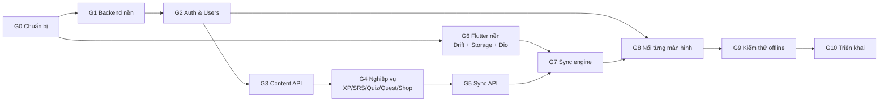

# AdvancedMobile_Flash — Quy trình triển khai

> Dựa trên [`DATA_ARCHITECTURE.md`](DATA_ARCHITECTURE.md), [`sql/server_mysql.sql`](sql/server_mysql.sql), [`sql/client_sqlite.sql`](sql/client_sqlite.sql).
> Ký hiệu `§x.y` = mục tương ứng trong `DATA_ARCHITECTURE.md`.
> Mỗi giai đoạn có **Đầu ra** và **Điều kiện hoàn thành (DoD)**: chưa đạt DoD thì chưa sang giai đoạn sau.

## Lộ trình tổng thể



Backend (G1→G5) và Flutter nền (G6) **làm song song** được. G6 chỉ cần DDL client, không cần backend chạy.

| Giai đoạn | Khối lượng tương đối | Phụ thuộc |
|---|---|---|
| G0 Chuẩn bị | S | — |
| G1 Backend nền | M | G0 |
| G2 Auth & Users | M | G1 |
| G3 Content API + seed | M | G2 |
| G4 Nghiệp vụ | L | G3 |
| G5 Sync API | L | G4 |
| G6 Flutter nền | M | G0 |
| G7 Sync engine | L | G5, G6 |
| G8 Nối màn hình | L | G7 (Auth chỉ cần G2) |
| G9 Kiểm thử | M | G8 |
| G10 Triển khai | S | G9 |

---

## G0 — Chuẩn bị

**Việc cần làm**

- [ ] Commit hoặc dọn các thay đổi đang dở, tạo nhánh `feature/data-layer`. *(Đang làm trên nhánh `manh_dev`; chưa commit.)*
- [x] Chọn cấu trúc repo. Khuyến nghị **monorepo**:
  ```
  AdvancedMobile_Flash/
  ├── lib/ ...            (Flutter, như hiện tại)
  ├── backend/            (Spring Boot)
  ├── docs/
  └── docker-compose.yml  (MySQL cho dev)
  ```
- [x] Cài JDK 17 (Boot 2.7 chạy được với 11/17), Maven 3.8+, Docker Desktop. *(Đã chạy được trên JDK 24 nhờ nâng Lombok/ByteBuddy trong `pom.xml`; Maven dùng qua `backend/mvnw`, không cần cài.)*
- [x] Tạo `docker-compose.yml`:
  ```yaml
  services:
    mysql:
      image: mysql:8.0
      environment:
        MYSQL_ROOT_PASSWORD: root
        MYSQL_DATABASE: flash_db
      command: --innodb_ft_min_token_size=2 --character-set-server=utf8mb4
      ports: ["3307:3306"]   # 3306 có thể đang bị MySQL dự án khác chiếm
      volumes: ["mysql_data:/var/lib/mysql"]
  volumes:
    mysql_data:
  ```
- [x] **Kiểm tra DDL MySQL**: đã chạy sạch trên MySQL 8.0.46, ra 28 bảng + 2 view.
  ```bash
  docker compose up -d mysql
  docker compose exec -T mysql mysql -uroot -proot < docs/sql/server_mysql.sql
  docker compose exec mysql mysql -uroot -proot -e "USE flash_db; SHOW TABLES;"
  ```
  Kỳ vọng: 28 bảng + 2 view. Lỗi nào thì sửa trực tiếp trong `server_mysql.sql`.

**DoD:** MySQL chạy trong Docker, `server_mysql.sql` import không lỗi. ✅ *Đạt.*

---

## G1 — Backend nền

**Việc cần làm**

- [x] Tạo project (start.spring.io không còn Boot 2.7 nên `pom.xml` được viết tay): Spring Boot **2.7.18**, Java 17, Maven, group `com.flash`, artifact `backend`. Dependencies: Web, Data JPA, Security, Validation, MySQL Driver, Flyway, Lombok.
- [x] Thêm `springdoc-openapi-ui:1.7.0`, `flyway-mysql`, `jjwt-api/impl/jackson:0.11.5` — §6.12. *(`google-api-client` để sang G2, lúc làm Google Sign-In.)*
- [x] Flyway:
  - `src/main/resources/db/migration/V1__init.sql` = `docs/sql/server_mysql.sql` **bỏ 2 dòng `CREATE DATABASE` và `USE`**.
  - `V2__seed_content.sql`: chuyển dữ liệu trong `lib/data/mock_data.dart` (5 topic, 5 grammar, flashcards, 3 quest, 4 reward item, quiz) sang `INSERT`. Đổi id `'t1'`, `'f1'`... sang UUID cố định để dễ test.
- [x] `application.yml` như §6.12 (`ddl-auto: validate`, UTC, mặc định nối MySQL cổng 3307).
- [x] Cấu trúc package (G1 mới có `common`, `config`, `security` (401/403 JSON), `health` và `entity` của từng module; `JwtService`, `JwtAuthFilter`, `CurrentUser` làm ở G2):
  ```
  com.flash
  ├── common/        ApiResponse, ErrorCode, BusinessException, GlobalExceptionHandler, PageResponse
  ├── config/        OpenApiConfig, SecurityConfig, JacksonConfig (ISO-8601 UTC)
  ├── security/      JwtService, JwtAuthFilter, CurrentUser
  ├── auth/          ┐
  ├── user/          │ mỗi module: controller / service / repository / entity / dto
  ├── content/       │ (topic, flashcard, grammar, quiz)
  ├── progress/      │ (srs, note, bookmark, lesson, quizattempt)
  ├── gamification/  │ (xp, quest, shop, leaderboard)
  ├── stats/         │
  └── sync/          ┘
  ```
- [x] `ApiResponse<T>` + `GlobalExceptionHandler` map lỗi → mã HTTP theo bảng §6.1 (400/401/403/404/409/422/429).
- [x] Entity JPA cho **tất cả** bảng (cột `CHAR`/`ENUM`/`TINYINT`/`TEXT`/`JSON` cần `columnDefinition` để `validate` khớp kiểu): id `UUID` + `@Type(type="uuid-char")`, `@Version` cho cột `version`, `Instant` cho `DATETIME(3)`, enum `@Enumerated(EnumType.STRING)`.

**DoD:** `mvn spring-boot:run` khởi động được, Flyway chạy V1+V2, Hibernate `validate` không báo lệch schema, mở được `/swagger-ui.html`. ✅ *Đạt.*

---

## G2 — Auth & Users (§6.2, §6.3)

**Việc cần làm**

- [x] `POST /v1/auth/register`, `/login`: BCrypt, trả access token (15 phút) + refresh token.
- [x] Refresh token: sinh chuỗi ngẫu nhiên 256-bit, lưu **SHA-256** vào `refresh_tokens`, rotation qua `replaced_by_id`. Token đã bị thay mà bị dùng lại thì thu hồi cả chuỗi.
- [x] `POST /v1/auth/google`: verify `idToken` bằng `GoogleIdTokenVerifier`, tìm/ tạo `users` + `user_auth_providers`.
- [x] `forgot-password` (luôn 200) + `reset-password`: OTP 6 số, lưu hash, hết hạn 10 phút, tối đa 5 lần thử. Gửi mail bằng `spring-boot-starter-mail` (dev: in OTP ra log).
- [x] `logout`, `/v1/users/me`, `/v1/users/update` (kiểm `baseVersion` → 409), `change-password`, `delete` (soft delete + ẩn danh email), `me/settings`.
- [x] Endpoint admin `/v1/users`, `/create`, `/update/{id}`, `/delete/{id}` với `@PreAuthorize("hasRole('ADMIN')")`.
- [x] Rate limit cho `/v1/auth/**` (Bucket4j hoặc filter đơn giản theo IP).

**DoD:** Toàn bộ luồng register → login → gọi `/me` → refresh → logout chạy được trên Swagger; test tích hợp cho rotation refresh token. ✅ *Đạt: 16 test tích hợp (Testcontainers MySQL) đều qua.*

*Ghi chú khi làm:* `/v1/users/me/statistics` để sang G4 (`StatsService`). Đổi mật khẩu trả cặp token mới vì mọi phiên cũ bị thu hồi. Cập nhật hồ sơ dùng version **hoặc** `clientUpdatedAt` mới hơn (LWW), vì `users.version` còn tăng khi server cộng XP. Mọi response có `charset=UTF-8` để package `http` của Dart không đọc tiếng Việt thành Latin-1. Admin đầu tiên tạo bằng `ADMIN_EMAIL`/`ADMIN_PASSWORD`.


---

## G3 — Content API (§6.5, §6.6, §6.7 phần đọc)

**Việc cần làm**

- [x] `GET /v1/topics` (lọc `status`, `keyword`, phân trang) ghép `user_topic_progress` để trả `progress`.
- [x] `GET /v1/flashcards?topicId=` ghép note + bookmark + SRS của user (1 query `LEFT JOIN`, tránh N+1).
- [x] `GET /v1/flashcards/search`: `MATCH(word, meaning) AGAINST(? IN BOOLEAN MODE)` + fallback `word LIKE 'x%'`.
- [x] `GET /v1/grammar`, `/get/{id}` (kèm examples).
- [x] `GET /v1/quizzes`, `/get/{id}` (kèm options, correctAnswerIndex, explanation).
- [x] `GET /v1/home/summary` (§6.4).
- [x] CRUD admin cho topic/flashcard/grammar/quiz/quest/reward item. Khi thêm/xoá flashcard nhớ cập nhật `topics.total_words`.

**DoD:** Gọi được mọi endpoint đọc với dữ liệu seed; JSON trả về khớp tên field camelCase ở **Phụ lục A**. ✅ *Đạt: 9 test tích hợp mới (tổng 25 test đều qua).*

*Ghi chú khi làm:* Bộ lọc `status` có thêm `NOT_STARTED` (gồm cả topic user chưa có dòng tiến độ). Tạo lại một từ đã xoá mềm trong cùng topic sẽ **khôi phục** dòng cũ, vì `UNIQUE(topic_id, word)` vẫn tính dòng đã xoá. Sửa grammar/quiz thì ví dụ/câu hỏi cũ bị xoá mềm (bài làm cũ vẫn xem lại được). Xoá quest definition / reward item chỉ đặt `is_active = false`. Admin xem danh sách qua `GET /v1/quests/definitions`, `GET /v1/shop/items/definitions`. `todayChallenge` ở Home rỗng cho tới khi G4 giao nhiệm vụ ngày. MySQL cần `innodb_ft_min_token_size=2` để tìm được từ tiếng Việt 2 ký tự ("cơ", "ăn").


---

## G4 — Nghiệp vụ server-authoritative (§5.2, §5.3)

Làm theo thứ tự, vì các service sau gọi service trước.

| # | Service | Việc chính | Bảng |
|---|---|---|---|
| 1 | `XpService.award(userId, amount, sourceType, sourceId)` | INSERT ledger; bắt `DuplicateKeyException` → bỏ qua (idempotent); cập nhật `current_xp`, `total_lifetime_xp` (chỉ khi amount > 0 và không phải purchase), `daily_statistics.xp_gained`. Áp giới hạn XP/ngày. | `xp_transactions`, `users`, `daily_statistics` |
| 2 | `StreakService.recordActivity(userId, eventTime)` | Thuật toán §5.3d theo `users.timezone`, kể cả nhánh tính lại khi sự kiện đến muộn. | `users`, `daily_statistics` |
| 3 | `SrsService.applyReview(log)` | Lưu log (id client sinh → trùng thì bỏ qua), phát lại log để tính `box`, `due_at`, `is_learned` theo bảng Leitner §5.2; cập nhật `user_topic_progress`, `total_words_learned`; gọi 1, 2, 4. | `flashcard_review_logs`, `user_flashcard_progress`, `user_topic_progress` |
| 4 | `QuestService` | Giao quest ngày khi user gọi `/today` lần đầu (snapshot target/xp); `onEvent(type, delta)` tăng `current_value`; `claim()` kiểm tra đủ tiến độ + chưa nhận → gọi `XpService`. | `quest_definitions`, `user_quests` |
| 5 | `QuizService.submit()` | Chấm lại từ `answers[]`, kiểm `time_taken_seconds ≥ số câu`, lưu attempt + answers, XP chỉ lần đầu trong ngày, cập nhật `user_grammar_progress.best_score_percent`. | `quiz_attempts`, `quiz_attempt_answers` |
| 6 | `LessonService.complete()` | Lưu `lesson_completions` (idempotent theo id), tăng `completed_lessons`, `daily_statistics.lessons_completed`, quest. | `lesson_completions` |
| 7 | `NoteService`, `BookmarkService` | LWW đúng pseudo-code §5.3a/b, trả `resolution`. | `user_flashcard_notes`, `user_bookmarks` |
| 8 | `ShopService.purchase()` | Transaction + `SELECT ... FOR UPDATE` trên `users`, kiểm sở hữu/XP/hạng, trừ `current_xp`. `equip()` tháo món cùng loại. | `reward_items`, `user_inventories` |
| 9 | `LeaderboardService` | Top N từ view, `myRank` bằng query `COUNT`, `@Cacheable` 60 giây. | view `v_leaderboard_*` |
| 10 | `StatsService` | `/v1/users/me/statistics?range=`, accuracy = correct/total. | `daily_statistics` |

- [x] Viết controller cho các endpoint ghi ở §6.5–§6.10 gọi các service trên.
- [x] Unit test cho 1, 2, 3, 8 (đây là chỗ dễ sai và dễ bị gian lận nhất).

**DoD:** Test chứng minh được: gửi cùng một review 2 lần chỉ cộng XP 1 lần; streak đúng qua ranh giới ngày theo timezone; mua đồ khi thiếu XP → 409, chưa đủ hạng → 403; claim quest chưa xong → 422. ✅ *Đạt: 23 unit test (`XpServiceTest`, `StreakServiceTest`, `SrsReplayTest`, `ShopServiceTest`) + 11 test tích hợp (`GamificationIntegrationTest`); tổng 59 test đều qua.*

*Ghi chú khi làm:*
- **Khoá:** mọi thao tác đổi XP / streak / thống kê / nhiệm vụ / kho đồ bắt đầu bằng `UserService.lockActiveUser` (`SELECT ... FOR UPDATE` trên `users`), nên request song song của cùng user chạy tuần tự. Nhờ vậy `XpService` kiểm tra "đã có dòng ledger chưa" rồi mới INSERT thay vì bắt `DuplicateKeyException` (lỗi flush làm hỏng persistence context); `UNIQUE(user_id, source_type, source_id)` chỉ còn là chốt chặn cuối.
- **`source_id` của ledger:** `know:<flashcardId>:<ngày>` (Know lần đầu trong ngày, giới hạn 300 XP/ngày bằng `LIKE 'know:%:<ngày>'`), `learned:<flashcardId>` (+5 một lần duy nhất), `quiz:<quizId>:<ngày>` (lần làm đầu trong ngày), id bài học, id `user_quests`, id `user_inventories` (mua đồ, số âm).
- **Sự kiện ngoài `[now − 7 ngày, now + 5 phút]`:** vẫn lưu và tính SRS / tiến độ, nhưng không cộng XP, không tính streak, không vào `daily_statistics`. Review cùng thẻ cách < 1 giây hoặc > 60 review/phút: lưu nhưng không cộng XP.
- **SRS:** phát lại **toàn bộ** log của (user, thẻ) mỗi lần nhận log mới (vài chục dòng), ghi lại `box_before/box_after` của các log bị log đến muộn chen vào. `is_learned = box ≥ 3` (có thể rớt lại nếu log AGAIN đến muộn); `learned_words` / `total_words_learned` luôn đếm lại, không +1/−1.
- **Quest:** `LEARN_WORDS` = ôn một thẻ **lần đầu tiên** (mục tiêu "Học 20 flashcard mới"/ngày không đạt được nếu phải lên box 3). `KEEP_STREAK` +1 khi có hoạt động đầu tiên của ngày. Nhiệm vụ được giao khi gọi `/v1/quests/today` **hoặc** khi có sự kiện học của hôm nay; sự kiện offline của ngày cũ chỉ cập nhật nhiệm vụ đã giao cho ngày đó. `ONE_TIME` dùng `period_start = 1970-01-01`.
- **Ngữ pháp:** hoàn thành bài đọc → `COMPLETED` nếu chủ điểm không có quiz, ngược lại `IN_PROGRESS` + `progress ≥ 0.5`; qua quiz (`score ≥ pass_score_percent`) → `COMPLETED`.
- **Quiz:** phải trả lời (hoặc `null` = bỏ qua) đúng mỗi câu **hiện có** của đề; đề đã bị admin sửa khi client offline → 422 (client bỏ op). `wrongAnswers` gồm cả câu bỏ qua.
- **Shop:** `Idempotency-Key` được ghi vào `sync_operations` (`op_type = SHOP_PURCHASE`); gửi lại cùng key trả lại đúng kết quả cũ thay vì 409 `ALREADY_OWNED`. Thứ tự kiểm tra: không hoạt động (404) → đã sở hữu (409) → hạng (403) → XP (409).
- **Leaderboard:** cache top N 60 giây bằng map trong bộ nhớ (không thêm Caffeine); `me` luôn tính mới bằng `COUNT(*) + 1` (khớp `RANK()`).
- **Thống kê:** `accuracy` chỉ tính từ câu trả lời quiz. `streakDays` ở `/statistics` là streak **hiện tại** (về 0 nếu đã bỏ lỡ quá 1 ngày); `/v1/users/me` và Home vẫn trả `users.streak_days` đã lưu.
- **API thêm ngoài §6:** response ghi trả kèm `user` snapshot (`currentXp`, `totalLifetimeXp`, `streakDays`, …) để client ghi đè bản lạc quan; `duplicate: true` khi id đã được xử lý. `POST /v1/lessons/complete` trả 200 khi trùng id. `PUT /v1/shop/equip|unequip` trả `{inventory, unequipped[], resolution}`.

---

## G5 — Sync API (§6.11)

**Việc cần làm**

- [x] `POST /v1/sync/push`:
  - Tính `clockOffset = now − clientSentAt`, cộng vào mọi timestamp trong batch.
  - Duyệt op theo thứ tự; **mỗi op 1 transaction riêng** (`TransactionTemplate`).
  - Trước khi xử lý: tìm `op_id` trong `sync_operations` → có rồi thì trả `DUPLICATE` + `result_json` cũ.
  - Dispatcher `opType → handler` gọi lại đúng service ở G4 (không viết logic lần 2).
  - Lưu kết quả vào `sync_operations`; cuối response trả snapshot `user`.
- [x] `GET /v1/sync/pull?since=`: với mỗi bảng dữ liệu user, `WHERE user_id=? AND updated_at > ?` (gồm cả dòng có `deleted_at`), cursor = thời điểm bắt đầu − 2 giây, `hasMore` khi vượt `limit`.
- [x] `GET /v1/sync/content?since=`: tương tự cho bảng nội dung.
- [x] Job `@Scheduled` xoá `sync_operations` > 30 ngày.
- [x] Rate limit endpoint sync 30 request/phút/user.

**DoD:** Test tích hợp: gửi batch 3 op (review, note xung đột, quest chưa xong) → nhận đúng `APPLIED` / `CONFLICT_SERVER_WINS` / `REJECTED` như ví dụ §6.11; gửi lại cùng batch → toàn `DUPLICATE`, XP không đổi. ✅ *Đạt: 11 test trong `SyncIntegrationTest`; tổng 71 test đều qua (kể cả `OpenApiDocsTest`).*

*Ghi chú khi làm:*
- **Push:** mỗi op khoá dòng `users` trước rồi mới tra `sync_operations`, nên hai lần push song song của cùng user không thể chạy trùng một `opId`. Op bị từ chối (`BusinessException`) thì transaction của op rollback, sau đó ghi một dòng `REJECTED` (kèm `error_code`) trong transaction riêng. Gửi lại op đó nhận `DUPLICATE` **kèm `errorCode`**: client coi như bị từ chối.
- **Trạng thái thêm `FAILED`** (ngoài 4 trạng thái của §6.11): lỗi không phải nghiệp vụ (DB, bug) thì op **không** được ghi nhận, client giữ op và gửi lại với backoff. Các op phía sau trong lô cũng nhận `FAILED` (`errorCode = NOT_PROCESSED`) để giữ đúng FIFO.
- **Payload** của op được đọc thành đúng DTO của API REST rồi chạy Bean Validation; sai thì `REJECTED` + `VALIDATION_ERROR`. `opType` lạ thì `REJECTED` + `BAD_REQUEST`. Lô > 50 op hoặc thiếu `clientSentAt` thì cả request bị 400.
- **`SHOP_PURCHASE`:** `opId` chính là `Idempotency-Key`, nên REST `/v1/shop/purchase` và sync dùng chung sổ. Lần mua bị từ chối qua sync rồi gửi lại cùng key qua REST sẽ nhận lại đúng lỗi cũ.
- **LWW không ném lỗi khi sync:** `PROFILE_UPDATE` (`UserService.updateProfileIfNewer`) và `SETTINGS_UPDATE` (`UserSettingsService.updateIfNewer`, LWW theo `clientUpdatedAt`) trả `CONFLICT_SERVER_WINS` kèm bản server. REST `PUT /v1/users/update` vẫn trả 409 như cũ.
- **Pull:** đọc trong 1 transaction chỉ đọc (snapshot REPEATABLE READ). Mỗi bảng tối đa `limit` dòng (mặc định 500, tối đa 1000). Khi có bảng vượt limit thì cursor dừng ngay trước dòng đầu tiên chưa trả (ranh giới cắt theo nguyên nhóm cùng `updated_at`). `changes.user` luôn có, `changes.settings` chỉ có khi đổi.
- **Content:** client không có `deleted_at` cho nội dung, nên response có `changes.deleted.{topics, flashcards, grammarLessons, grammarExamples, quizzes, quizQuestions}`: các id đã xoá mềm, bỏ xuất bản, hoặc có cha bị ẩn. Cha có trong delta thì gửi kèm toàn bộ con đang hiển thị (xuất bản lại topic thì thẻ cũ cũng về lại). `rewardItems` / `questDefinitions` gửi cả dòng `isActive = false` vì kho đồ / nhiệm vụ cũ vẫn tham chiếu tới. **G6 cần thêm cột `is_active`** vào 2 bảng này ở SQLite.
- **Swagger:** springdoc tự sinh `/v3/api-docs` từ controller nên Swagger UI (`/swagger-ui.html`) luôn khớp code. Hiện có 74 path / 75 operation thuộc 16 tag, đều có `summary`. `OpenApiDocsTest` chặn việc thêm endpoint mà quên `@Tag` / `@Operation` và ghi bản api-docs ra `backend/target/openapi.json`. `POST /v1/sync/push` có body mẫu 3 op (dùng id seed V2) và danh sách `opType` để bấm "Try it out".
- **Rate limit:** `SyncRateLimitFilter` chạy sau `JwtAuthFilter`, đếm theo user, tính chung cả push/pull/content (`app.sync.rate-limit-per-minute`, mặc định 30). Logic cửa sổ 1 phút tách thành `FixedWindowRateLimiter`, dùng chung với rate limit của auth.

---

## Hiện trạng `lib/` trước khi vào G6 (sau merge PR #8)

| Mặt | Hiện tại | Hệ quả khi nối API |
|---|---|---|
| Package | Chỉ có `cupertino_icons`; SDK `^3.13.1` | G6 thêm toàn bộ hạ tầng |
| State | `setState` + `themeNotifier` toàn cục (`core/theme.dart`) | Dùng Riverpod cho dữ liệu; giữ `themeNotifier` tới G8 #5 |
| Dữ liệu | 16 file đọc `MockData` (`grep -rn "MockData\." lib/`), sửa trực tiếp list tĩnh | Mỗi màn hình đổi sang provider (G8) |
| Điều hướng | `Navigator.push(MaterialPageRoute)`, truyền **tiêu đề** thay vì id: `FlashcardScreen(topicTitle)`, `GrammarDetailScreen(title)`, `QuizScreen()` (3 câu hard-code), Home "Tiếp tục học" hard-code `'Business Vocabulary'` | Đổi constructor sang id (bảng G6.8) |
| Đăng nhập | `LoginScreen` có toggle `_isAdminLogin` → `AdminMainScreen` / `MainScreen`; Google, Register, Forgot chỉ chuyển màn | Chọn màn theo `user.role` server trả |
| Admin | `AdminMainScreen` 4 tab: Tổng quan, Học viên, Nội dung (topic/flashcard, grammar/ví dụ, quiz/câu hỏi), Kinh tế (shop, quest) | **Chỉ online**, gọi thẳng API admin, không qua SQLite |
| Model | `fromJson` viết tay, không có `toJson`; `Quest.icon` là `IconData`, `Lesson.imageBg` là `Color`, `RewardItem.type` là `'border'`/`'avatar'` (API: `BORDER`/`AVATAR`) | Chỉnh theo G6.6 |

**Nguyên tắc chung cho G6–G8:** giữ nguyên giao diện, chỉ thay nguồn dữ liệu. Mỗi PR một màn hình (hoặc một mục checklist), merge vào `dev`. Request/response tra trên Swagger (`http://localhost:8080/swagger-ui.html`) hoặc `backend/target/openapi.json`.

**Chạy backend để thử app:** `docker compose up -d mysql` → `cd backend && mvnw.cmd spring-boot:run`. Đặt `ADMIN_EMAIL` / `ADMIN_PASSWORD` để có tài khoản admin. Emulator Android gọi `http://10.0.2.2:8080`; máy thật dùng IP LAN của máy chạy backend (cùng Wi-Fi, mở firewall cổng 8080).

---

## G6 — Flutter nền (làm song song với G1–G5)

### G6.1 Package

- [ ] ```bash
  flutter pub add drift drift_flutter sqlite3_flutter_libs path_provider path \
    flutter_secure_storage shared_preferences dio connectivity_plus \
    workmanager uuid flutter_riverpod google_sign_in json_annotation intl
  flutter pub add -d drift_dev build_runner json_serializable mocktail
  ```
  Quản lý state: **Riverpod** (hợp với `Stream` của Drift). Không cần code-gen cho Riverpod: dùng `Provider`, `StreamProvider`, `FutureProvider`, `NotifierProvider` viết tay.
- [ ] Android: `minSdkVersion 23` (flutter_secure_storage), quyền `INTERNET` trong `AndroidManifest.xml` (bản release), `android:usesCleartextTraffic="true"` **chỉ ở debug** để gọi `http://`.

### G6.2 Cấu trúc thư mục

- [ ] Giữ `screens/`, `widgets/`, `models/`, `core/theme.dart`; thêm:
  ```
  lib/
  ├── main.dart                bootstrap(): ensureInitialized → AppPrefs.load → AppDatabase → ProviderScope
  ├── app.dart                 FlashApp (tách từ main.dart) + StartGate chọn màn đầu tiên
  ├── core/
  │   ├── theme.dart           (giữ) themeNotifier khởi tạo từ AppPrefs
  │   ├── env.dart             apiBaseUrl = String.fromEnvironment('API_BASE_URL', defaultValue: 'http://10.0.2.2:8080')
  │   ├── clock.dart           Clock.now() (thay được trong test)
  │   ├── ids.dart             newId() = Uuid().v4()
  │   └── icons.dart           iconFor(String iconName), map iconPath/iconName của server → IconData/asset
  ├── data/
  │   ├── local/               app_database.dart, schema.drift, converters.dart, daos/*.dart
  │   ├── remote/              api_client.dart, auth_interceptor.dart, api_exception.dart, apis/*.dart, dto/*.dart
  │   ├── storage/             secure_store.dart, app_prefs.dart
  │   ├── sync/                sync_queue_service.dart, sync_worker.dart, pull_service.dart, op_handlers.dart, xp_estimator.dart, srs.dart
  │   └── repositories/        auth, content, srs, note, bookmark, lesson, quiz, quest, shop, profile, stats, leaderboard, settings, admin
  ├── providers/               providers.dart (db, api, repos), auth_providers.dart, *_providers.dart theo màn hình
  ├── models/  screens/  widgets/   (giữ)
  └── data/mock_data.dart      (xoá ở cuối G8)
  ```

### G6.3 Local DB (Drift)

- [ ] Copy `docs/sql/client_sqlite.sql` → `lib/data/local/schema.drift`, **bỏ dòng `PRAGMA`**. DDL đã có `is_active` cho `reward_items` và `quest_definitions` (`/v1/sync/content` gửi cả vật phẩm / nhiệm vụ đã tắt; Shop lọc `is_active = 1`, kho đồ và nhiệm vụ cũ vẫn hiện).
- [ ] ```dart
  @DriftDatabase(include: {'schema.drift'})
  class AppDatabase extends _$AppDatabase {
    AppDatabase([QueryExecutor? e]) : super(e ?? driftDatabase(name: 'flash.db'));
    @override int get schemaVersion => 1;
    @override MigrationStrategy get migration => MigrationStrategy(
      beforeOpen: (_) async => customStatement('PRAGMA foreign_keys = ON'),
    );
    /// Đăng xuất / đổi tài khoản: xoá nhóm User data + Sync (§3.1), giữ content cache.
    Future<void> clearUserData() => transaction(() async { /* delete 16 bảng nhóm B, C */ });
  }
  ```
  `dart run build_runner build --delete-conflicting-outputs`.
- [ ] Converter: thời gian ở SQLite là **epoch ms UTC** (`INTEGER`), API là ISO-8601 → hàm `int? toEpoch(String?)`, `String? toIso(int?)` trong `converters.dart`. Boolean là `0/1`.
- [ ] DAO tối thiểu cho G7/G8 (mỗi DAO một file, đọc bằng `.watch()`):

  | DAO | Bảng | Hàm chính |
  |---|---|---|
  | `ContentDao` | topics, flashcards, grammar_lessons, grammar_examples, quizzes, quiz_questions, quiz_question_options, quest_definitions, reward_items | `watchTopicsWithProgress(filter, keyword)`, `watchCards(topicId)` (join progress + note + bookmark), `watchGrammar(id)`, `quizForGrammar(id)`, `quizForTopic(id)`, `questionsWithOptions(quizId)`, `upsertContent(changes)`, `deleteContent(deleted)` |
  | `SrsDao` | user_flashcard_progress, flashcard_review_logs | `logsOf(cardId)`, `insertLog`, `upsertProgress`, `applyServerProgress` |
  | `NoteDao`, `BookmarkDao` | user_flashcard_notes, user_bookmarks | upsert local + `applyServer` (bỏ qua nếu dirty khi pull) |
  | `LessonDao`, `QuizDao` | lesson_completions, quiz_attempts, quiz_attempt_answers | insert, `watchAttempt(id)`, `reviewItems(attemptId)` |
  | `QuestDao`, `ShopDao` | user_quests, user_inventories (+ definitions, reward_items) | `watchTodayQuests(date)`, `watchInventoryWithItems()`, `equippedOf(type)` |
  | `ProfileDao`, `StatsDao` | user_profile, daily_statistics | `watchProfile()`, `watchDaily(from, to)`, `bumpToday(...)` |
  | `SyncDao` | sync_queue, sync_meta | `enqueue`, `nextBatch(50)`, `markInFlight`, `resetInFlight`, cursor get/set |

### G6.4 Key-value storage

- [ ] `SecureStore` với các key §4.2, **thêm `user_role`** (`USER` / `ADMIN`) vì `user_profile` không có cột role mà màn đầu tiên cần biết vào `MainScreen` hay `AdminMainScreen`. Android `encryptedSharedPreferences: true`; iOS `first_unlock`. `device_id` sinh 1 lần.
- [ ] `AppPrefs` với các key §4.3. Đọc trong `main()` **trước** `runApp`, đặt `themeNotifier.value` theo `is_dark_mode` để không bị nháy.

### G6.5 API client (Dio)

- [ ] `ApiClient`: `baseUrl = env.apiBaseUrl`, timeout 10 giây, header `Accept-Language` theo `app_language`.
- [ ] Bóc envelope `{success, code, message, data, errors, timestamp}` ở **một chỗ**: thành công trả `data`. Lỗi ném `ApiException(status, code, message, errors, data)`; lỗi mạng ném `NetworkException`. Riêng 409 `VERSION_CONFLICT` có `data` là bản server.
- [ ] Danh sách phân trang có dạng `{items, page, size, totalElements, totalPages}` → `PageDto<T>`.
- [ ] `AuthInterceptor` (`QueuedInterceptor` để nhiều request không refresh cùng lúc):
  - Gắn `Authorization: Bearer <access_token>`, trừ `/v1/auth/**`.
  - Chủ động refresh khi `access_token_expires_at - now < 60s`. Khi gặp 401 thì refresh **một lần** rồi gọi lại.
  - Refresh: `POST /v1/auth/refresh-token {refreshToken}` → lưu cặp token mới (refresh token bị rotate). Thất bại → `authController.forceLogout()`.
- [ ] Mã lỗi map sang câu tiếng Việt cho UI (`api_exception.dart`): `INVALID_CREDENTIALS`, `ACCOUNT_LOCKED` (423), `EMAIL_ALREADY_EXISTS`, `INVALID_OTP`, `WRONG_PASSWORD`, `INSUFFICIENT_XP`, `ALREADY_OWNED`, `RANK_REQUIREMENT_NOT_MET`, `QUEST_NOT_COMPLETED`, `VERSION_CONFLICT`, `TOO_MANY_REQUESTS`, `VALIDATION_ERROR` (hiện `errors[].message`).
- [ ] 429: không retry ngay. `/v1/auth/**` 20 request/phút theo IP; `/v1/sync/**` 30 request/phút theo user (tính chung push/pull/content).
- [ ] `apis/*.dart` mỏng, mỗi hàm một endpoint, trả DTO. DTO dùng `json_serializable`, tên field trùng JSON (camelCase), enum giữ nguyên chuỗi server (`BORDER`, `KNOW`, `IN_PROGRESS`…).

### G6.6 Chỉnh model (`lib/models/`)

Model là thứ UI dùng; dựng từ **dòng Drift** (qua extension `toModel()` trong DAO), không parse JSON trực tiếp nữa. Bỏ fallback `?? ''` cho id.

| Model | Thay đổi |
|---|---|
| `UserModel` | thêm `avatarUrl`, `version`, `pendingXp` (chỉ local), `equippedBorderColors`, `equippedAvatarUrl`; giữ `role` |
| `Topic` | thêm `description`, `level`, `coverColor`, `learnedWords`, `status` (`NOT_STARTED`/`IN_PROGRESS`/`COMPLETED`), `sortOrder` |
| `Flashcard` | thêm `isBookmarked`, `srsBox`, `isLearned`, `dueAt`, `noteVersion`; `example*` nullable |
| `Grammar` | thêm `structure`, `description`, `level`, `bestScorePercent`. **Model mới** `GrammarDetail` (`content`, `usageNotes`, `examples: List<GrammarExample>`, `quizId?`) và `GrammarExample` |
| `QuizQuestion` | thêm `quizId`, `sortOrder`; `topicId` nullable (quiz ngữ pháp không có topic) |
| `QuizResult` | `id` = attemptId (client sinh); thêm `quizId`, `totalQuestions`, `scorePercent`, `passed`, `xpAwarded?` (null = chờ server), `submittedAt`, `isSynced`; `userId`/`topicId` bỏ hoặc nullable |
| `QuizReviewItem` | khớp `QuizReviewItemResponse`; thêm `isCorrect` |
| `Quest` | `IconData icon` → `String iconName` (UI gọi `iconFor()`), thêm `questDefinitionId`, `periodStart`, `isCompleted` |
| `RewardItem` | thêm `fromRow`, `code`, `rankBoard`, `isActive`, `inventoryId?`; `type` lấy `BORDER`/`AVATAR` → đổi so sánh ở UI (`'border'` → `'BORDER'`) hoặc map về chữ thường trong `toModel()` |
| `UserInventory` | thêm `clientUpdatedAt`; `userId` bỏ (DB local 1 user) |
| `DailyStatistic` | thêm `cardsReviewed`, `lessonsCompleted`, `quizzesCompleted`, `correctAnswers`, `totalAnswers`, `studySeconds` |
| `Lesson` | `itemCounts` → `int itemCount`, `estimatedTime` → `int estimatedMinutes`, `Color imageBg` → `int? coverColor`, thêm `refId` (topic/grammar id); bỏ import `material.dart` |
| Mới | `LeaderboardEntry {rank, userId, fullName, avatarUrl, equippedBorderColors, score}`, `LeaderboardMe {rank?, score}` |

### G6.7 Khởi động app

- [ ] `main()`:
  ```dart
  Future<void> main() async {
    WidgetsFlutterBinding.ensureInitialized();
    final prefs = await AppPrefs.load();
    themeNotifier.value = prefs.isDarkMode ? ThemeMode.dark : ThemeMode.light;
    final db = AppDatabase();
    runApp(ProviderScope(overrides: [appPrefsProvider.overrideWithValue(prefs), dbProvider.overrideWithValue(db)],
                         child: const FlashApp()));
  }
  ```
- [ ] `StartGate` (thay `home: const WelcomeScreen()`): chưa có `refresh_token` → `WelcomeScreen` (hoặc `LoginScreen` nếu `onboarding_completed`); có token → `user_role == 'ADMIN'` ? `AdminMainScreen` : `MainScreen`, đồng thời kick sync nền. Mở app offline vẫn vào thẳng được vì dữ liệu nằm trong SQLite.
- [ ] `authStateProvider` (`NotifierProvider`): `signedOut` / `signedIn(userId, role)`. Mọi nút "Đăng xuất" và `forceLogout()` đều đi qua đây để xoá dữ liệu đúng một chỗ.

### G6.8 Đổi tham số điều hướng (làm cùng màn hình ở G8, nhưng chốt từ G6)

| Màn hình | Hiện tại | Sau khi đổi | Ai gọi |
|---|---|---|---|
| `FlashcardScreen` | `topicTitle` | `topicId`, `topicTitle` | TopicScreen, HomeScreen (continue/suggested) |
| `GrammarDetailScreen` | `title` | `grammarId`, `title` | TopicScreen tab Ngữ pháp, HomeScreen |
| `QuizScreen` | — (hard-code 3 câu) | `quizId`, `title` | GrammarDetailScreen, (mới) CompletionScreen / TopicScreen nếu topic có quiz |
| `QuizResultScreen` / `QuizReviewScreen` | `result`, `reviewData` | `attemptId` (watch từ SQLite) | QuizScreen, lịch sử |
| `CompletionScreen` | — | `lessonCompletionId`, `xpEstimate` | FlashcardScreen, GrammarDetailScreen |
| `AdminFlashcardsScreen` / `AdminGrammarExamplesScreen` / `AdminQuizQuestionsScreen` | id + title (id mock) | giữ, id là UUID server | AdminContentScreen |

**DoD G6:** `flutter build apk --debug` được. Test Drift in-memory (`NativeDatabase.memory()`) tạo đủ **25 bảng** và `clearUserData()` chỉ xoá nhóm B, C. Đọc/ghi SecureStore + AppPrefs được. Test `ApiClient` với `DioAdapter`/`mocktail`: bóc envelope đúng, `ApiException` đúng `code`, 2 request cùng gặp 401 chỉ refresh 1 lần.

---

## G7 — Sync engine phía Flutter (§3.4, §5)

### G7.1 Hàng đợi

- [ ] `SyncQueueService.enqueue(opType, entityTable, entityId, payload)`:
  - Luôn gọi **bên trong** `db.transaction` của thao tác ghi (cùng transaction với ghi lạc quan ở G7.3).
  - `op_id = newId()`, `created_at = now`, `payload` là JSON đúng body REST tương ứng (Swagger, schema `SyncOperation`).
  - Coalescing cho `NOTE_UPSERT`, `BOOKMARK_SET`, `PROFILE_UPDATE`, `ITEM_EQUIP`, `SETTINGS_UPDATE`: đã có op `pending` cùng `entity_id` → thay payload (giữ `op_id` cũ). Không gộp `FLASHCARD_REVIEW`, `QUIZ_SUBMIT`, `LESSON_COMPLETE`.
- [ ] `SyncWorker.flush()`:
  1. Lúc khởi động: đưa op `in_flight` còn sót về `pending`.
  2. Lấy ≤ 50 op `pending` có `next_retry_at ≤ now` theo `id`, đánh dấu `in_flight`.
  3. `POST /v1/sync/push {deviceId, clientSentAt, operations: [{opId, opType, createdAt, payload}]}`. `clientSentAt` lấy **ngay trước khi gửi** (server dựa vào nó để tính lệch đồng hồ).
  4. Xử lý từng `results[i]` (khớp thứ tự op gửi lên) theo bảng G7.3:
     - `APPLIED` / `DUPLICATE` (không có `errorCode`): áp `data`, đặt `is_dirty=0`, `synced`, rồi xoá op.
     - `CONFLICT_SERVER_WINS`: áp bản server trong `data` + snackbar "Đã cập nhật từ thiết bị khác".
     - `REJECTED`, hoặc `DUPLICATE` **có `errorCode`**: rollback (cột cuối bảng G7.3), op → `dead`, `last_error = errorCode`.
     - `FAILED` (kể cả `errorCode = NOT_PROCESSED`): giữ `pending`, backoff.
  5. Lỗi mạng / 5xx / 429 → `pending`, `attempt_count++`, `next_retry_at = now + min(2^n × 5s, 30 phút)`.
  6. Ghi `user` snapshot trong response vào `user_profile` (các cột XP / streak / tổng số). Khi hàng đợi rỗng thì đặt `pending_xp = 0`.
  7. Còn op `pending` → lặp lại (tối đa vài lô mỗi lần flush để không chạm 30 request/phút).
  8. Một mutex để chỉ một `flush()` chạy cùng lúc.
- [ ] `SyncWorker.kick()`: debounce khoảng 2 giây rồi `flush()` → `PullService.pullUserData()`.

### G7.2 Pull

- [ ] `PullService.pullContent()` rồi `pullUserData()`: `GET /v1/sync/content|pull?since=<cursor>&limit=500` (lần đầu bỏ `since`) → `{cursor, hasMore, changes}`. Mỗi trang upsert trong 1 transaction cùng lưu `cursor` vào `sync_meta` (scope `content` / `user_data`), lặp khi `hasMore`.
  - **Content:** `changes.{topics, flashcards, grammarLessons, grammarExamples, quizzes, quizQuestions, questDefinitions, rewardItems}`; `updatedAt` → `server_updated_at`; `quizQuestions[].options[4]` → 4 dòng `quiz_question_options` (xoá cũ, chèn mới). `changes.deleted.{topics, flashcards, grammarLessons, grammarExamples, quizzes, quizQuestions}` là id cần **xoá** khỏi cache (FK cascade dọn bảng con).
  - **User data:** `changes.{userFlashcardProgress, userFlashcardNotes, userBookmarks, userTopicProgress, userGrammarProgress, userQuests, userInventories, dailyStatistics}`. **Bỏ qua dòng local có `is_dirty = 1`**. Ghi chú / bookmark có `deletedAt` thì giữ tombstone (UI lọc `deleted_at IS NULL`). `changes.user` luôn có → ghi đè `user_profile` (giữ nguyên slogan / tên / level nếu profile đang dirty); `changes.settings` có thì ghi vào `AppPrefs`.
  - `daily_statistics` của **hôm nay** đang có số lạc quan: chỉ ghi đè khi không còn op `pending` nào làm thay đổi nó (hoặc cộng lại phần pending).
- [ ] Không pull được: lịch sử quiz của thiết bị khác (`quiz_attempts` không có `updated_at`) → màn lịch sử gọi `GET /v1/quizzes/attempts` khi online.
- [ ] Trigger: mở app, `AppLifecycleState.resumed`, `connectivity_plus` báo có mạng, sau push thành công, `workmanager` định kỳ 15 phút (constraint: có mạng). Tất cả đi qua `kick()` (debounce).

### G7.3 Ghi lạc quan và xử lý kết quả theo từng op

Ghi lạc quan nằm cùng transaction với `enqueue`. `pending_xp` chỉ là **ước lượng** để hiển thị (`xp_estimator.dart` chép luật `XpRules` của server: Know lần đầu trong ngày +2, thẻ thành "đã thuộc" +5, bài học +10, quiz +2/câu đúng và +10 nếu 100% chỉ lần đầu trong ngày, quest = `xp_reward`).

| opType | Gọi từ | Ghi lạc quan | `entity_id` | Khi APPLIED / DUPLICATE (`data`) | Khi REJECTED |
|---|---|---|---|---|---|
| `FLASHCARD_REVIEW` | FlashcardScreen (Again/Know) | INSERT `flashcard_review_logs`; tính lại `user_flashcard_progress` bằng `srs.dart` (bản Dart của `SrsService.replay`: Know `box+1` tối đa 5, Again `box-2` tối thiểu 0, hạn 0/1/3/7/14/30 ngày, Again +10 phút, `is_learned = box ≥ 3`); `daily_statistics.cards_reviewed+1`; quest `REVIEW_CARDS` +1 (và `LEARN_WORDS` nếu thẻ ôn lần đầu); `user_topic_progress`; `pending_xp` | logId | `data.progress` → `user_flashcard_progress` (version); log → `synced`; `data.user` → `user_profile` | Xoá log, phát lại các log còn lại |
| `LESSON_COMPLETE` | CompletionScreen, GrammarDetailScreen | INSERT `lesson_completions`; `daily_statistics.lessons_completed+1`; `user_profile.completed_lessons+1`; quest `COMPLETE_LESSON`; `pending_xp += 10` | id | `data.todayLessons`, `data.user` | Xoá dòng, trả các bộ đếm |
| `QUIZ_SUBMIT` | QuizScreen | INSERT `quiz_attempts` (chấm tạm, `xp_awarded = NULL`) + `quiz_attempt_answers`; `daily_statistics` quizzes/answers; quest `COMPLETE_QUIZ` / `PERFECT_QUIZ` | attemptId | Ghi đè `correct_answers`, `wrong_answers`, `score_percent`, `xp_awarded`; `user_grammar_progress` lấy ở lần pull sau | Đánh dấu attempt lỗi; snackbar "Đề đã được cập nhật, hãy làm lại" (`BUSINESS_RULE_VIOLATION` khi admin sửa đề lúc offline) |
| `NOTE_UPSERT` / `NOTE_DELETE` | Dialog ghi chú ở FlashcardScreen | upsert `user_flashcard_notes` (`is_dirty=1`, `client_updated_at=now`; xoá = `deleted_at`) | noteId | `data.note` → ghi đè (`version`) | Lấy lại từ server ở lần pull sau |
| `BOOKMARK_SET` | `VocabularyBottomSheet` | upsert `user_bookmarks` (`deleted_at` = null / now) | flashcardId | `data` (`isBookmarked`, `version`, `deletedAt`) | Trả trạng thái cũ |
| `QUEST_CLAIM` | ChallengeScreen | `user_quests.is_claimed=1`, `claimed_at`; `pending_xp += xp_reward` | userQuestId | `data.currentXp`, `data.totalLifetimeXp` → `user_profile` | `is_claimed=0`, trừ `pending_xp`, snackbar theo `errorCode` (`QUEST_NOT_COMPLETED` kèm "Tiến độ x/y") |
| `PROFILE_UPDATE` | ProfileScreen (slogan) | `user_profile` slogan / tên / level, `is_dirty=1` | userId | `data.user` → ghi đè (lấy `version` mới) | Lấy lại `data.user` |
| `ITEM_EQUIP` | Shop, Profile | `user_inventories.is_equipped`, tự tháo món cùng loại | inventoryId | `data.inventory` + `data.unequipped[]` | Trả trạng thái cũ |
| `SETTINGS_UPDATE` | SettingsScreen | `AppPrefs` đã đổi | userId | `data.settings` → `AppPrefs` | Bỏ qua |
| `SHOP_PURCHASE` | ShopScreen, chỉ khi **rớt mạng sau khi đã gửi** `POST /v1/shop/purchase` | Không ghi lạc quan; UI "Đang xử lý" | rewardItemId (`op_id` = `Idempotency-Key` đã gửi) | INSERT `user_inventories`, `current_xp` | Snackbar theo `errorCode` |

- [ ] Đăng xuất / đổi tài khoản: `POST /v1/auth/logout {refreshToken}` (bỏ qua lỗi mạng) → xoá Secure Storage → `db.clearUserData()`. Khi đăng nhập, `user_id` khác `local_db_owner_user_id` thì cũng `clearUserData()`.

**DoD G7:** Unit test `srs.dart` cho cùng các ca của `SrsReplayTest` (backend). Test với Dio giả lập: op được gộp đúng; lỗi mạng / `FAILED` / 429 → retry với backoff; `REJECTED` và `DUPLICATE` kèm `errorCode` → rollback đúng bảng G7.3; pull không đè dòng dirty; `deleted` của content xoá đúng dòng; lặp đúng khi `hasMore`. Chạy thêm một lần với backend thật: học offline 5 thẻ → bật mạng → `/v1/sync/pull` trên Swagger thấy đúng dữ liệu.

---

## G8 — Nối từng màn hình (thay `MockData`)

Mỗi màn hình làm theo cùng một khuôn:

1. Chỉnh model liên quan theo G6.6.
2. Repository: **đọc** bằng `watch()` từ SQLite; **ghi** = transaction (dữ liệu + `enqueue`) rồi `SyncWorker.kick()`. Admin, đăng nhập, mua đồ, leaderboard gọi thẳng API.
3. Provider Riverpod; màn hình chuyển sang `ConsumerWidget` / `ConsumerStatefulWidget`, dùng `ref.watch(...)`, xử lý `AsyncValue` (loading / error / data).
4. Xoá tham chiếu `MockData.*` của màn hình đó.
5. Thử: online, rồi bật chế độ máy bay và làm lại.

### Đợt 1 — Xác thực và khung app (chỉ cần G6)

| # | File | Việc cần làm | API | Ghi chú |
|---|---|---|---|---|
| 1 | `main.dart`, `app.dart`, `splash/welcome_screen.dart` | `StartGate` (G6.7); Welcome đặt `onboarding_completed = true` khi bấm tiếp | — | Mở app có token thì không qua Welcome |
| 2 | `auth/login_screen.dart` | Bỏ toggle `_isAdminLogin`; gọi login, lưu token + `user_role` + `last_login_email`, ghi `user_profile` từ `data.user`, pull lần đầu, vào `MainScreen` hoặc `AdminMainScreen` theo `role`. Nút Google: `google_sign_in` lấy `idToken` → `/v1/auth/google` | `POST /v1/auth/login {email, password, deviceId}`, `POST /v1/auth/google {idToken, deviceId}` | 401 `INVALID_CREDENTIALS`, 423 `ACCOUNT_LOCKED`. Google cần `GOOGLE_CLIENT_IDS` ở backend và SHA-1 ở Firebase/Google Cloud |
| 3 | `auth/register_screen.dart` | Gắn controller cho 3 ô, validate (mật khẩu ≥ 8), đăng ký xong vào thẳng app | `POST /v1/auth/register {fullName, email, password, deviceId}` → 201 kèm token | 409 `EMAIL_ALREADY_EXISTS` |
| 4 | `auth/forgot_password_screen.dart` | Hiện chỉ có 1 bước. **Thêm bước 2**: nhập OTP 6 số + mật khẩu mới (cùng màn, đổi state, hoặc màn mới `ResetPasswordScreen`) | `POST /v1/auth/forgot-password {email}` (luôn 200), `POST /v1/auth/reset-password {email, otp, newPassword}` | 400 `INVALID_OTP`, 429. Backend dev chưa cấu hình mail thì OTP in ở log backend |
| 5 | `profile/settings_screen.dart`, `widgets/reminder_dialog.dart` | Switch / ngôn ngữ / giờ nhắc đọc-ghi `AppPrefs` + `SETTINGS_UPDATE`; dark mode đổi `themeNotifier` và lưu prefs. Đổi mật khẩu: dialog có controller → **lưu cặp token mới** server trả. Đăng xuất qua `authStateProvider` | `PUT /v1/users/change-password {currentPassword, newPassword}` → `AuthResponse` | 400 `WRONG_PASSWORD`. Đổi mật khẩu là thao tác online, khoá nút khi offline |

### Đợt 2 — Học tập (cần G7)

| # | File | Việc cần làm | Nguồn dữ liệu | Ghi chú |
|---|---|---|---|---|
| 6 | `vocabulary/topic_screen.dart` | 2 tab đọc `ContentDao.watchTopicsWithProgress` / `watchGrammarWithProgress`; bộ lọc Tất cả / Đang học / Hoàn thành theo `status`; tìm kiếm `LIKE` local; điều hướng truyền id (G6.8) | `topics` ⨝ `user_topic_progress`, `grammar_lessons` ⨝ `user_grammar_progress` | `progress = learned_words / total_words`. Icon: `iconFor(iconPath)` |
| 7 | `flashcard/flashcard_screen.dart`, `widgets/vocabulary_bottom_sheet.dart` | Danh sách thẻ theo `topicId` (thẻ đến hạn lên trước). Again/Know → `SrsRepository.rate(card, rating, responseTimeMs)` rồi sang thẻ. Dialog ghi chú → `NoteRepository.save/delete`. Bottom sheet: nút bookmark (hiện `onPressed: () {}`) → `BookmarkRepository.toggle`, đổi icon theo `isBookmarked`. Thẻ cuối → tạo `LESSON_COMPLETE {lessonType: TOPIC, topicId, cardsReviewed, durationSeconds}` → `CompletionScreen` | `ContentDao.watchCards(topicId)` | Đo `responseTimeMs` từ lúc lật thẻ tới lúc bấm |
| 8 | `grammar/grammar_detail_screen.dart` | Thay nội dung hard-code `S + am/is/are + V-ing` bằng `structure`, `content`, `usageNotes`, `examples` (in đậm `highlight`). Nút "Làm bài tập": có quiz thì mở `QuizScreen(quizId)`, không có thì ẩn. Đọc xong (cuộn hết hoặc bấm "Hoàn thành") → `LESSON_COMPLETE {lessonType: GRAMMAR, grammarLessonId}` | `ContentDao.watchGrammar(id)`, `quizForGrammar(id)` | Server: chủ điểm có quiz thì `IN_PROGRESS` (≥ 50%) tới khi qua quiz |
| 9 | `quiz/quiz_screen.dart`, `quiz_result_screen.dart`, `quiz_review_screen.dart` | Bỏ 3 câu hard-code; nạp câu hỏi + 4 đáp án theo `quizId`. Nộp: `QuizRepository.submit` chấm tạm local, ghi `quiz_attempts` + answers, enqueue `QUIZ_SUBMIT {attemptId, quizId, startedAt, submittedAt, timeTakenSeconds, answers[{questionId, selectedOptionIndex\|null}]}` → `QuizResultScreen(attemptId)` watch dòng attempt (tự cập nhật khi server chấm lại, hiện `xpAwarded` hoặc "Đang chờ đồng bộ"). Review dựng từ `quiz_attempt_answers` ⨝ `quiz_questions` | `ContentDao.questionsWithOptions(quizId)`, `QuizDao.watchAttempt` | Phải gửi **đủ mọi câu** của đề (câu bỏ qua = `null`). Thêm lối vào quiz của topic: nút "Kiểm tra" ở `CompletionScreen` / TopicScreen khi `quizForTopic(id)` có |
| 10 | `home/completion_screen.dart` | Hiện XP ước tính (`pending_xp` tăng thêm) + streak từ `user_profile`; nút "Kiểm tra" (mục 9) | `ProfileDao.watchProfile()` | — |

### Đợt 3 — Trang chủ, gamification, hồ sơ

| # | File | Việc cần làm | Nguồn dữ liệu | Ghi chú |
|---|---|---|---|---|
| 11 | `home/home_screen.dart` | Tên, streak, XP từ `user_profile` (hiển thị `current_xp + pending_xp`). Viền / avatar đang trang bị từ `user_inventories` ⨝ `reward_items`. "3/5 bài" = `daily_statistics(hôm nay).lessons_completed` / `daily_goal_lessons`. "Tiếp tục học" = topic `IN_PROGRESS` có `last_studied_at` mới nhất (bỏ hard-code `'Business Vocabulary'`). Gợi ý = topic / grammar `NOT_STARTED` theo `sort_order`. Thử thách hôm nay = quest đầu tiên chưa nhận | SQLite (đọc offline được). Có thể dùng `GET /v1/home/summary` khi online để đối chiếu | `Lesson` theo G6.6; `HomeScreen` thành `ConsumerWidget` |
| 12 | `challenge/challenge_screen.dart` | Danh sách quest kỳ hiện tại (`user_quests` ⨝ `quest_definitions`, `period_start` = hôm nay / đầu tuần / `1970-01-01`); tổng XP từ `user_profile`; nhận thưởng → `QuestRepository.claim` (rung haptic giữ nguyên) | `QuestDao.watchTodayQuests` | Lần đầu trong ngày chưa có quest local: online thì gọi `GET /v1/quests/today` (server tự giao) rồi pull |
| 13 | `profile/shop_screen.dart` | Danh mục `reward_items` (`is_active = 1`) + trạng thái sở hữu / trang bị từ `user_inventories`. Online: `GET /v1/shop/items` lấy `canAfford`, `meetsRankRequirement` (thay `currentUserRank` hard-code). Mua: chỉ online, `ShopRepository.purchase(itemId)` gửi `Idempotency-Key = newId()`; mất mạng sau khi gửi → enqueue `SHOP_PURCHASE` cùng `op_id`. Trang bị → `ITEM_EQUIP` | SQLite + `POST /v1/shop/purchase` | Offline: nút Mua khoá, hiện "Cần kết nối mạng để mua". 409 `INSUFFICIENT_XP` / `ALREADY_OWNED`, 403 `RANK_REQUIREMENT_NOT_MET` |
| 14 | `profile/profile_screen.dart` | Thông tin + thống kê từ `user_profile`; đổi slogan → `PROFILE_UPDATE {slogan, baseVersion, clientUpdatedAt}`; kho đồ / trang bị như mục 13 | `ProfileDao`, `ShopDao` | `baseVersion` = `user_profile.version` |
| 15 | `leaderboard/leaderboard_screen.dart` | 2 tab XP / Streak từ `leaderboard_cache`; online và quá TTL 5 phút thì gọi API rồi ghi cache; hiện dòng "Hạng của bạn" từ `me` | `GET /v1/leaderboard/xp?limit=10`, `/streak?limit=10` | Viền avatar dùng `equippedBorderColors` (ARGB int) |
| 16 | `progress/progress_screen.dart` | Biểu đồ Tuần / Tháng / Tất cả từ `daily_statistics` (điền 0 cho ngày trống); accuracy = Σ`correct_answers` / Σ`total_answers`; streak / longest từ `user_profile` | `StatsDao.watchDaily(from, to)` | `GET /v1/users/me/statistics?range=` chỉ dùng khi cần số chuẩn lúc online |

### Đợt 4 — Admin (chỉ online, không dùng SQLite)

`AdminRepository` gọi thẳng API (mọi endpoint `[ADMIN]` trên Swagger). Thao tác thành công thì tải lại danh sách. Thay đổi nội dung đến được app người học qua `/v1/sync/content` ở lần pull sau.

| # | File | API | Ghi chú |
|---|---|---|---|
| 17 | `admin/admin_main_screen.dart`, `admin_dashboard_screen.dart` | Số liệu tổng: `totalElements` của `GET /v1/users?size=1`, `GET /v1/topics?includeUnpublished=true&size=100` (tổng từ vựng = Σ`totalWords`), `GET /v1/shop/items/definitions` | Mục "Hoạt động gần đây" chưa có API → ẩn, hoặc thêm backend `GET /v1/admin/stats` (việc phụ, không chặn G8). Nút đăng xuất qua `authStateProvider` |
| 18 | `admin/admin_users_screen.dart` (+ `UserFormScreen`) | `GET /v1/users?keyword=&status=&page=&size=`, `POST /v1/users/create`, `PUT /v1/users/update/{id}` (tên, level, role, status `ACTIVE`/`LOCKED`), `DELETE /v1/users/delete/{id}` | Không tự khoá / hạ quyền / xoá chính mình (server trả 422) |
| 19 | `admin/admin_content_screen.dart` | Tab Từ vựng: `GET /v1/topics?includeUnpublished=true`, `POST /v1/topics/create`, `PUT /v1/topics/update/{id}`, `DELETE /v1/topics/delete/{id}`. Tab Ngữ pháp: `/v1/grammar` tương tự. Tab Quiz: `GET /v1/quizzes?includeUnpublished=true`, `/v1/quizzes/create\|update/{id}\|delete/{id}` | Form cần thêm `isPublished` (mặc định `false` = bản nháp), `level`, `iconPath` / `iconName` |
| 20 | `admin/admin_flashcards_screen.dart` | `GET /v1/flashcards?topicId=`, `POST /v1/flashcards/create`, `PUT /v1/flashcards/update/{id}`, `DELETE /v1/flashcards/delete/{id}` | Sửa / xoá từng thẻ gọi API ngay |
| 21 | `admin/admin_grammar_examples_screen.dart`, `admin_quiz_questions_screen.dart` | `GET /v1/grammar/get/{id}` / `GET /v1/quizzes/get/{id}` để nạp; lưu bằng `PUT /v1/grammar/update/{id}` / `PUT /v1/quizzes/update/{id}` **gửi toàn bộ danh sách** | Server **thay toàn bộ** ví dụ / câu hỏi mỗi lần update → màn hình sửa danh sách cục bộ rồi thêm nút **"Lưu"** gửi một lần (hiện đang `add` / `removeAt` từng dòng). Sửa câu hỏi quiz làm các bài đang làm offline của học viên bị từ chối khi sync |
| 22 | `admin/admin_economy_screen.dart` (+ `ShopItemFormScreen`, `QuestFormScreen`) | Shop: `GET /v1/shop/items/definitions`, `POST /v1/shop/items/create`, `PUT /v1/shop/items/update/{id}`, `DELETE /v1/shop/items/delete/{id}` (gỡ khỏi shop). Quest: `GET /v1/quests/definitions`, `POST /v1/quests/create`, `PUT /v1/quests/update/{id}`, `DELETE /v1/quests/delete/{id}` | `QuestFormScreen` hiện rỗng → thêm field `code`, `title`, `questType` (`LEARN_WORDS`, `REVIEW_CARDS`, `COMPLETE_LESSON`, `COMPLETE_QUIZ`, `PERFECT_QUIZ`, `STUDY_MINUTES`, `KEEP_STREAK`), `frequency` (`DAILY`/`WEEKLY`/`ONE_TIME`), `targetValue`, `xpReward`, `iconName`. Viền: `borderColors` là mảng ARGB int; `requiredRank` + `rankBoard` (`XP`/`STREAK`) |

### Đợt 5 — Dọn dẹp

- [ ] 23. Xoá `lib/data/mock_data.dart`; `grep -rn "MockData" lib/` rỗng; `flutter analyze` sạch.

Gợi ý chia việc: một người làm G6 + G7 (hạ tầng); người còn lại làm Đợt 1 ngay khi có G6.5 / G6.7, rồi Đợt 4 (admin không phụ thuộc G7); Đợt 2, 3 làm sau khi G7 xong.

**DoD G8:** `grep -rn MockData lib/` không còn kết quả; mọi màn hình người học chạy được cả online lẫn chế độ máy bay; màn admin báo lỗi rõ ràng khi offline.

---

## G9 — Kiểm thử

**Tự động**

- [x] Backend: Testcontainers MySQL 8 cho test tích hợp (chạy luôn Flyway V1 → kiểm DDL thật), JUnit cho service G4/G5. *Đã có từ G1–G5: 71 test, gồm `SyncIntegrationTest` và `OpenApiDocsTest`. Chạy `cd backend && mvnw test`, cần Docker.*
- [ ] Flutter unit: `srs.dart`, `xp_estimator.dart`, converter thời gian, mapper DTO ↔ Drift.
- [ ] Flutter DAO: Drift in-memory cho các query `watch*` chính (lọc topic, thẻ theo topic, quest hôm nay, thống kê theo khoảng ngày).
- [ ] Flutter sync: `SyncWorker` / `PullService` với Dio giả lập (các ca ở DoD G7).
- [ ] Widget test: FlashcardScreen (Know → thẻ tiếp theo, box tăng), QuizScreen (nộp → Result hiện điểm), LoginScreen (role ADMIN → AdminMainScreen).

**Kịch bản offline bắt buộc (chạy tay trên máy thật)**

| # | Kịch bản | Kỳ vọng |
|---|---|---|
| 1 | Bật máy bay → học 20 thẻ → tắt máy bay | XP, streak, tiến độ topic khớp server; không cộng XP trùng |
| 2 | Bật máy bay → làm quiz → **kill app** → mở lại có mạng | Quiz vẫn được nộp, có trong lịch sử |
| 3 | Sửa ghi chú cùng 1 từ trên 2 máy offline → lần lượt bật mạng | Bản sửa sau thắng; máy kia hiện thông báo "cập nhật từ thiết bị khác" |
| 4 | Ôn cùng 1 thẻ trên 2 máy offline | Server giữ đủ log của cả 2 máy, `box` tính theo thứ tự thời gian |
| 5 | Sửa `current_xp` trong file SQLite (máy root / emulator) | Lần pull sau trở về số server |
| 6 | Chỉnh đồng hồ máy lùi/tiến 2 ngày rồi học | Streak không tăng sai |
| 7 | Bấm Mua rồi rớt mạng ngay | UI "Đang xử lý", không trừ XP; có mạng lại → hoàn tất đúng 1 lần |
| 8 | Claim quest offline nhưng tiến độ thật chưa đủ | Bị từ chối, nút quay lại trạng thái chưa nhận |
| 9 | Đăng xuất → đăng nhập tài khoản khác | Không thấy dữ liệu của tài khoản cũ |
| 10 | Access token hết hạn giữa lúc dùng | Tự refresh, người dùng không bị đăng xuất |
| 11 | Admin bỏ xuất bản / xoá một topic khi app đang offline | Có mạng lại → topic và thẻ biến khỏi app; xuất bản lại → hiện lại đủ thẻ |
| 12 | Offline lâu, tích > 50 op rồi bật mạng | Gửi nhiều lô liên tiếp, không bị 429 làm mất op, thứ tự FIFO giữ nguyên |
| 13 | Admin sửa câu hỏi của một quiz trong lúc học viên đang làm quiz đó offline | Khi sync: bài bị từ chối, app báo "Đề đã được cập nhật" và không treo hàng đợi |
| 14 | Đăng nhập tài khoản ADMIN | Vào thẳng `AdminMainScreen`; mở lại app vẫn vào đúng màn admin |

**DoD:** Toàn bộ test tự động xanh; 14 kịch bản trên đạt.

---

## G10 — Triển khai

- [ ] Backend: `Dockerfile` (eclipse-temurin:17-jre), biến môi trường theo `backend/README.md`: `DB_*`, `JWT_SECRET` (≥ 32 ký tự), `GOOGLE_CLIENT_IDS`, `SPRING_MAIL_*`, `MAIL_FROM`, `ADMIN_EMAIL` / `ADMIN_PASSWORD`, `AUTH_RATE_LIMIT_PER_MINUTE`, `SYNC_RATE_LIMIT_PER_MINUTE`.
- [ ] Swagger ở production: `application-prod.yml` đặt `springdoc.api-docs.enabled=false` và `springdoc.swagger-ui.enabled=false`, đồng thời bỏ `/swagger-ui/**`, `/v3/api-docs/**` khỏi `PUBLIC_PATHS` của `SecurityConfig`. Nếu vẫn cần tài liệu cho team thì để bật nhưng chỉ cho `ADMIN`. Bản `openapi.json` từ `OpenApiDocsTest` có thể lưu kèm mỗi bản release.
- [ ] Sau reverse proxy: bật `server.forward-headers-strategy=framework` để rate limit auth đếm theo IP thật. Rate limit hiện nằm trong bộ nhớ, chỉ đúng khi chạy **1 instance**; nhiều instance thì chuyển sang Redis/Bucket4j. Job dọn `sync_operations` cũng cần chạy trên đúng 1 instance (hoặc dùng ShedLock).
- [ ] MySQL production: bật backup hằng ngày, `innodb_ft_min_token_size=2`, user DB riêng chỉ có quyền trên `flash_db`.
- [ ] HTTPS bắt buộc (reverse proxy Nginx/Caddy).
- [ ] Flutter: `--dart-define=API_BASE_URL=https://<host>` cho bản release (dev / prod), bỏ `usesCleartextTraffic`, SHA-1 release cho Google Sign-In Android, `flutter build apk --release` (hoặc `appbundle`).
- [ ] Theo dõi: log lỗi sync (op `dead` kèm `last_error`) gửi về server hoặc Crashlytics.

**DoD:** App release cài trên máy thật, đăng nhập và đồng bộ với server production.

---

## Phụ lục — Quy ước khi làm

- **Đổi schema**: sửa file trong `docs/sql/` **và** tạo migration mới (Flyway `V3__...sql` ở server, tăng `schemaVersion` + `onUpgrade` ở Drift). Không sửa migration đã chạy.
- **Thêm loại thao tác offline mới**: thêm vào `CHECK` của `sync_queue.op_type`, thêm giá trị vào `SyncOpType` + nhánh trong `SyncOpDispatcher` (và `allowableValues` của `SyncPushRequest.opType` cho Swagger), thêm dòng vào bảng §3.4.
- **Thêm endpoint**: luôn có `@Tag` ở controller và `@Operation(summary = ...)` ở method, nếu không `OpenApiDocsTest` sẽ báo lỗi.
- **Không bao giờ** thêm API nhận số XP/streak từ client (§5.3d).
- Commit nhỏ theo từng ô checklist; mỗi giai đoạn một PR.
