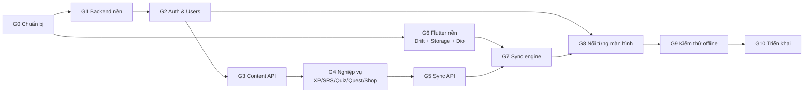

# AdvancedMobile_Flash — Quy trình triển khai

> Dựa trên [`DATA_ARCHITECTURE.md`](DATA_ARCHITECTURE.md), [`sql/server_mysql.sql`](sql/server_mysql.sql), [`sql/client_sqlite.sql`](sql/client_sqlite.sql).
> Ký hiệu `§x.y` = mục tương ứng trong `DATA_ARCHITECTURE.md`.
> Mỗi giai đoạn có **Đầu ra** và **Điều kiện hoàn thành (DoD)**: chưa đạt DoD thì chưa sang giai đoạn sau.

## Lộ trình tổng thể



Backend (G1→G5) và Flutter nền (G6) **làm song song** được. G6 chỉ cần DDL client, không cần backend chạy.

| Giai đoạn | Khối lượng tương đối | Phụ thuộc |
|---|---|---|
| G0 Chuẩn bị | S | — |
| G1 Backend nền | M | G0 |
| G2 Auth & Users | M | G1 |
| G3 Content API + seed | M | G2 |
| G4 Nghiệp vụ | L | G3 |
| G5 Sync API | L | G4 |
| G6 Flutter nền | M | G0 |
| G7 Sync engine | L | G5, G6 |
| G8 Nối màn hình | L | G7 (Auth chỉ cần G2) |
| G9 Kiểm thử | M | G8 |
| G10 Triển khai | S | G9 |

---

## G0 — Chuẩn bị

**Việc cần làm**

- [ ] Commit hoặc dọn các thay đổi đang dở, tạo nhánh `feature/data-layer`. *(Đang làm trên nhánh `manh_dev`; chưa commit.)*
- [x] Chọn cấu trúc repo. Khuyến nghị **monorepo**:
  ```
  AdvancedMobile_Flash/
  ├── lib/ ...            (Flutter, như hiện tại)
  ├── backend/            (Spring Boot)
  ├── docs/
  └── docker-compose.yml  (MySQL cho dev)
  ```
- [x] Cài JDK 17 (Boot 2.7 chạy được với 11/17), Maven 3.8+, Docker Desktop. *(Đã chạy được trên JDK 24 nhờ nâng Lombok/ByteBuddy trong `pom.xml`; Maven dùng qua `backend/mvnw`, không cần cài.)*
- [x] Tạo `docker-compose.yml`:
  ```yaml
  services:
    mysql:
      image: mysql:8.0
      environment:
        MYSQL_ROOT_PASSWORD: root
        MYSQL_DATABASE: flash_db
      command: --innodb_ft_min_token_size=2 --character-set-server=utf8mb4
      ports: ["3307:3306"]   # 3306 có thể đang bị MySQL dự án khác chiếm
      volumes: ["mysql_data:/var/lib/mysql"]
  volumes:
    mysql_data:
  ```
- [x] **Kiểm tra DDL MySQL**: đã chạy sạch trên MySQL 8.0.46, ra 28 bảng + 2 view.
  ```bash
  docker compose up -d mysql
  docker compose exec -T mysql mysql -uroot -proot < docs/sql/server_mysql.sql
  docker compose exec mysql mysql -uroot -proot -e "USE flash_db; SHOW TABLES;"
  ```
  Kỳ vọng: 28 bảng + 2 view. Lỗi nào thì sửa trực tiếp trong `server_mysql.sql`.

**DoD:** MySQL chạy trong Docker, `server_mysql.sql` import không lỗi. ✅ *Đạt.*

---

## G1 — Backend nền

**Việc cần làm**

- [x] Tạo project (start.spring.io không còn Boot 2.7 nên `pom.xml` được viết tay): Spring Boot **2.7.18**, Java 17, Maven, group `com.flash`, artifact `backend`. Dependencies: Web, Data JPA, Security, Validation, MySQL Driver, Flyway, Lombok.
- [x] Thêm `springdoc-openapi-ui:1.7.0`, `flyway-mysql`, `jjwt-api/impl/jackson:0.11.5` — §6.12. *(`google-api-client` để sang G2, lúc làm Google Sign-In.)*
- [x] Flyway:
  - `src/main/resources/db/migration/V1__init.sql` = `docs/sql/server_mysql.sql` **bỏ 2 dòng `CREATE DATABASE` và `USE`**.
  - `V2__seed_content.sql`: chuyển dữ liệu trong `lib/data/mock_data.dart` (5 topic, 5 grammar, flashcards, 3 quest, 4 reward item, quiz) sang `INSERT`. Đổi id `'t1'`, `'f1'`... sang UUID cố định để dễ test.
- [x] `application.yml` như §6.12 (`ddl-auto: validate`, UTC, mặc định nối MySQL cổng 3307).
- [x] Cấu trúc package (G1 mới có `common`, `config`, `security` (401/403 JSON), `health` và `entity` của từng module; `JwtService`, `JwtAuthFilter`, `CurrentUser` làm ở G2):
  ```
  com.flash
  ├── common/        ApiResponse, ErrorCode, BusinessException, GlobalExceptionHandler, PageResponse
  ├── config/        OpenApiConfig, SecurityConfig, JacksonConfig (ISO-8601 UTC)
  ├── security/      JwtService, JwtAuthFilter, CurrentUser
  ├── auth/          ┐
  ├── user/          │ mỗi module: controller / service / repository / entity / dto
  ├── content/       │ (topic, flashcard, grammar, quiz)
  ├── progress/      │ (srs, note, bookmark, lesson, quizattempt)
  ├── gamification/  │ (xp, quest, shop, leaderboard)
  ├── stats/         │
  └── sync/          ┘
  ```
- [x] `ApiResponse<T>` + `GlobalExceptionHandler` map lỗi → mã HTTP theo bảng §6.1 (400/401/403/404/409/422/429).
- [x] Entity JPA cho **tất cả** bảng (cột `CHAR`/`ENUM`/`TINYINT`/`TEXT`/`JSON` cần `columnDefinition` để `validate` khớp kiểu): id `UUID` + `@Type(type="uuid-char")`, `@Version` cho cột `version`, `Instant` cho `DATETIME(3)`, enum `@Enumerated(EnumType.STRING)`.

**DoD:** `mvn spring-boot:run` khởi động được, Flyway chạy V1+V2, Hibernate `validate` không báo lệch schema, mở được `/swagger-ui.html`. ✅ *Đạt.*

---

## G2 — Auth & Users (§6.2, §6.3)

**Việc cần làm**

- [x] `POST /v1/auth/register`, `/login`: BCrypt, trả access token (15 phút) + refresh token.
- [x] Refresh token: sinh chuỗi ngẫu nhiên 256-bit, lưu **SHA-256** vào `refresh_tokens`, rotation qua `replaced_by_id`. Token đã bị thay mà bị dùng lại thì thu hồi cả chuỗi.
- [x] `POST /v1/auth/google`: verify `idToken` bằng `GoogleIdTokenVerifier`, tìm/ tạo `users` + `user_auth_providers`.
- [x] `forgot-password` (luôn 200) + `reset-password`: OTP 6 số, lưu hash, hết hạn 10 phút, tối đa 5 lần thử. Gửi mail bằng `spring-boot-starter-mail` (dev: in OTP ra log).
- [x] `logout`, `/v1/users/me`, `/v1/users/update` (kiểm `baseVersion` → 409), `change-password`, `delete` (soft delete + ẩn danh email), `me/settings`.
- [x] Endpoint admin `/v1/users`, `/create`, `/update/{id}`, `/delete/{id}` với `@PreAuthorize("hasRole('ADMIN')")`.
- [x] Rate limit cho `/v1/auth/**` (Bucket4j hoặc filter đơn giản theo IP).

**DoD:** Toàn bộ luồng register → login → gọi `/me` → refresh → logout chạy được trên Swagger; test tích hợp cho rotation refresh token. ✅ *Đạt: 16 test tích hợp (Testcontainers MySQL) đều qua.*

*Ghi chú khi làm:* `/v1/users/me/statistics` để sang G4 (`StatsService`). Đổi mật khẩu trả cặp token mới vì mọi phiên cũ bị thu hồi. Cập nhật hồ sơ dùng version **hoặc** `clientUpdatedAt` mới hơn (LWW), vì `users.version` còn tăng khi server cộng XP. Mọi response có `charset=UTF-8` để package `http` của Dart không đọc tiếng Việt thành Latin-1. Admin đầu tiên tạo bằng `ADMIN_EMAIL`/`ADMIN_PASSWORD`.


---

## G3 — Content API (§6.5, §6.6, §6.7 phần đọc)

**Việc cần làm**

- [x] `GET /v1/topics` (lọc `status`, `keyword`, phân trang) ghép `user_topic_progress` để trả `progress`.
- [x] `GET /v1/flashcards?topicId=` ghép note + bookmark + SRS của user (1 query `LEFT JOIN`, tránh N+1).
- [x] `GET /v1/flashcards/search`: `MATCH(word, meaning) AGAINST(? IN BOOLEAN MODE)` + fallback `word LIKE 'x%'`.
- [x] `GET /v1/grammar`, `/get/{id}` (kèm examples).
- [x] `GET /v1/quizzes`, `/get/{id}` (kèm options, correctAnswerIndex, explanation).
- [x] `GET /v1/home/summary` (§6.4).
- [x] CRUD admin cho topic/flashcard/grammar/quiz/quest/reward item. Khi thêm/xoá flashcard nhớ cập nhật `topics.total_words`.

**DoD:** Gọi được mọi endpoint đọc với dữ liệu seed; JSON trả về khớp tên field camelCase ở **Phụ lục A**. ✅ *Đạt: 9 test tích hợp mới (tổng 25 test đều qua).*

*Ghi chú khi làm:* Bộ lọc `status` có thêm `NOT_STARTED` (gồm cả topic user chưa có dòng tiến độ). Tạo lại một từ đã xoá mềm trong cùng topic sẽ **khôi phục** dòng cũ, vì `UNIQUE(topic_id, word)` vẫn tính dòng đã xoá. Sửa grammar/quiz thì ví dụ/câu hỏi cũ bị xoá mềm (bài làm cũ vẫn xem lại được). Xoá quest definition / reward item chỉ đặt `is_active = false`. Admin xem danh sách qua `GET /v1/quests/definitions`, `GET /v1/shop/items/definitions`. `todayChallenge` ở Home rỗng cho tới khi G4 giao nhiệm vụ ngày. MySQL cần `innodb_ft_min_token_size=2` để tìm được từ tiếng Việt 2 ký tự ("cơ", "ăn").


---

## G4 — Nghiệp vụ server-authoritative (§5.2, §5.3)

Làm theo thứ tự, vì các service sau gọi service trước.

| # | Service | Việc chính | Bảng |
|---|---|---|---|
| 1 | `XpService.award(userId, amount, sourceType, sourceId)` | INSERT ledger; bắt `DuplicateKeyException` → bỏ qua (idempotent); cập nhật `current_xp`, `total_lifetime_xp` (chỉ khi amount > 0 và không phải purchase), `daily_statistics.xp_gained`. Áp giới hạn XP/ngày. | `xp_transactions`, `users`, `daily_statistics` |
| 2 | `StreakService.recordActivity(userId, eventTime)` | Thuật toán §5.3d theo `users.timezone`, kể cả nhánh tính lại khi sự kiện đến muộn. | `users`, `daily_statistics` |
| 3 | `SrsService.applyReview(log)` | Lưu log (id client sinh → trùng thì bỏ qua), phát lại log để tính `box`, `due_at`, `is_learned` theo bảng Leitner §5.2; cập nhật `user_topic_progress`, `total_words_learned`; gọi 1, 2, 4. | `flashcard_review_logs`, `user_flashcard_progress`, `user_topic_progress` |
| 4 | `QuestService` | Giao quest ngày khi user gọi `/today` lần đầu (snapshot target/xp); `onEvent(type, delta)` tăng `current_value`; `claim()` kiểm tra đủ tiến độ + chưa nhận → gọi `XpService`. | `quest_definitions`, `user_quests` |
| 5 | `QuizService.submit()` | Chấm lại từ `answers[]`, kiểm `time_taken_seconds ≥ số câu`, lưu attempt + answers, XP chỉ lần đầu trong ngày, cập nhật `user_grammar_progress.best_score_percent`. | `quiz_attempts`, `quiz_attempt_answers` |
| 6 | `LessonService.complete()` | Lưu `lesson_completions` (idempotent theo id), tăng `completed_lessons`, `daily_statistics.lessons_completed`, quest. | `lesson_completions` |
| 7 | `NoteService`, `BookmarkService` | LWW đúng pseudo-code §5.3a/b, trả `resolution`. | `user_flashcard_notes`, `user_bookmarks` |
| 8 | `ShopService.purchase()` | Transaction + `SELECT ... FOR UPDATE` trên `users`, kiểm sở hữu/XP/hạng, trừ `current_xp`. `equip()` tháo món cùng loại. | `reward_items`, `user_inventories` |
| 9 | `LeaderboardService` | Top N từ view, `myRank` bằng query `COUNT`, `@Cacheable` 60 giây. | view `v_leaderboard_*` |
| 10 | `StatsService` | `/v1/users/me/statistics?range=`, accuracy = correct/total. | `daily_statistics` |

- [ ] Viết controller cho các endpoint ghi ở §6.5–§6.10 gọi các service trên.
- [ ] Unit test cho 1, 2, 3, 8 (đây là chỗ dễ sai và dễ bị gian lận nhất).

**DoD:** Test chứng minh được: gửi cùng một review 2 lần chỉ cộng XP 1 lần; streak đúng qua ranh giới ngày theo timezone; mua đồ khi thiếu XP → 409, chưa đủ hạng → 403; claim quest chưa xong → 422.

---

## G5 — Sync API (§6.11)

**Việc cần làm**

- [ ] `POST /v1/sync/push`:
  - Tính `clockOffset = now − clientSentAt`, cộng vào mọi timestamp trong batch.
  - Duyệt op theo thứ tự; **mỗi op 1 transaction riêng** (`TransactionTemplate`).
  - Trước khi xử lý: tìm `op_id` trong `sync_operations` → có rồi thì trả `DUPLICATE` + `result_json` cũ.
  - Dispatcher `opType → handler` gọi lại đúng service ở G4 (không viết logic lần 2).
  - Lưu kết quả vào `sync_operations`; cuối response trả snapshot `user`.
- [ ] `GET /v1/sync/pull?since=`: với mỗi bảng dữ liệu user, `WHERE user_id=? AND updated_at > ?` (gồm cả dòng có `deleted_at`), cursor = thời điểm bắt đầu − 2 giây, `hasMore` khi vượt `limit`.
- [ ] `GET /v1/sync/content?since=`: tương tự cho bảng nội dung.
- [ ] Job `@Scheduled` xoá `sync_operations` > 30 ngày.
- [ ] Rate limit endpoint sync 30 request/phút/user.

**DoD:** Test tích hợp: gửi batch 3 op (review, note xung đột, quest chưa xong) → nhận đúng `APPLIED` / `CONFLICT_SERVER_WINS` / `REJECTED` như ví dụ §6.11; gửi lại cùng batch → toàn `DUPLICATE`, XP không đổi.

---

## G6 — Flutter nền (làm song song với G1–G5)

**Việc cần làm**

- [ ] Thêm package:
  ```bash
  flutter pub add drift drift_flutter sqlite3_flutter_libs path_provider path \
    flutter_secure_storage shared_preferences dio connectivity_plus \
    workmanager uuid flutter_riverpod google_sign_in json_annotation
  flutter pub add -d drift_dev build_runner json_serializable
  ```
  Quản lý state: **Riverpod** (hợp với `Stream` của Drift; hiện app chỉ dùng `setState`).
- [ ] Cấu trúc thư mục:
  ```
  lib/
  ├── core/            theme.dart, env.dart (baseUrl), clock.dart
  ├── data/
  │   ├── local/       app_database.dart, schema.drift, daos/
  │   ├── remote/      api_client.dart (Dio), auth_interceptor.dart, dto/
  │   ├── storage/     secure_store.dart, app_prefs.dart
  │   ├── sync/        sync_queue_service.dart, sync_worker.dart, pull_service.dart
  │   └── repositories/
  ├── models/          (giữ, chỉnh theo Phụ lục B)
  ├── providers/       Riverpod providers
  ├── screens/ ...
  └── data/mock_data.dart   (xoá ở cuối G8)
  ```
- [ ] **Tận dụng thẳng `client_sqlite.sql`**: Drift đọc được file `.drift` chứa `CREATE TABLE`.
  - Copy `docs/sql/client_sqlite.sql` → `lib/data/local/schema.drift`, **bỏ dòng `PRAGMA`**.
  - ```dart
    @DriftDatabase(include: {'schema.drift'})
    class AppDatabase extends _$AppDatabase {
      AppDatabase() : super(driftDatabase(name: 'flash.db'));
      @override int get schemaVersion => 1;
      @override MigrationStrategy get migration => MigrationStrategy(
        beforeOpen: (_) async => customStatement('PRAGMA foreign_keys = ON'),
      );
    }
    ```
  - `dart run build_runner build --delete-conflicting-outputs`.
- [ ] `SecureStore` với các key §4.2 (`encryptedSharedPreferences: true` trên Android).
- [ ] `AppPrefs` với các key §4.3. Đọc trong `main()` **trước** `runApp` để áp dark mode/ngôn ngữ không bị nháy.
- [ ] `ApiClient` (Dio): baseUrl theo môi trường (Android emulator dùng `http://10.0.2.2:8080`), `AuthInterceptor` gắn Bearer, refresh chủ động trước hạn 60 giây, khi 401 thì refresh một lần (khoá để nhiều request không refresh cùng lúc) rồi gọi lại; refresh thất bại → đăng xuất.
- [ ] Hàm tiện ích `newId()` = `Uuid().v4()`; mọi bản ghi tạo ở client dùng hàm này.

**DoD:** App build được; test Drift in-memory (`NativeDatabase.memory()`) tạo đủ 26 bảng; đọc/ghi SecureStore và AppPrefs được.

---

## G7 — Sync engine phía Flutter (§3.4, §5)

**Việc cần làm**

- [ ] `SyncQueueService.enqueue(opType, entityTable, entityId, payload)`:
  - Luôn gọi **bên trong** `db.transaction` của thao tác ghi.
  - Coalescing cho `NOTE_UPSERT`, `BOOKMARK_SET`, `PROFILE_UPDATE`, `ITEM_EQUIP`, `SETTINGS_UPDATE`: đã có op `pending` cùng `entity_id` → cập nhật payload.
- [ ] `SyncWorker.flush()`:
  1. Đưa op `in_flight` còn sót về `pending` (lúc khởi động app).
  2. Lấy ≤ 50 op `pending` có `next_retry_at ≤ now` theo `id`, đánh dấu `in_flight`.
  3. Gọi `/v1/sync/push` kèm `clientSentAt`.
  4. Theo từng kết quả: `APPLIED`/`DUPLICATE` → ghi đè dữ liệu chuẩn từ server, `is_dirty=0`, `synced`, xoá op; `CONFLICT_SERVER_WINS` → ghi đè + báo snackbar; `REJECTED` → rollback trạng thái lạc quan, op → `dead`.
  5. Lỗi mạng / 5xx → `pending`, `attempt_count++`, backoff `min(2^n × 5s, 30 phút)`.
  6. Cập nhật `user_profile` theo snapshot `user`, đặt `pending_xp = 0` khi hàng đợi rỗng.
  7. Một khoá (mutex) để chỉ một `flush()` chạy cùng lúc.
- [ ] `PullService`: gọi `/sync/content` **trước** `/sync/pull`; upsert trong 1 transaction cùng cập nhật `sync_meta`; **bỏ qua dòng có `is_dirty = 1`**; dòng có `deletedAt` → xoá local; lặp khi `hasMore`.
- [ ] Trigger: mở app, `AppLifecycleState.resumed`, `connectivity_plus` báo có mạng, sau push thành công, `workmanager` định kỳ 15 phút (constraint: có mạng).
- [ ] Đăng xuất / đổi tài khoản: xoá Secure Storage + các bảng nhóm B, C (§3.1); so `local_db_owner_user_id` khi đăng nhập.

**DoD:** Test với API giả lập (mock Dio): op được gộp đúng; lỗi mạng → retry với backoff; `REJECTED` → rollback; pull không đè dòng dirty.

---

## G8 — Nối từng màn hình (thay `MockData`)

Mỗi màn hình làm theo cùng một khuôn:

1. Chỉnh model theo **Phụ lục B** (nếu màn hình đó dùng).
2. Viết DAO + Repository: **đọc** bằng `watch()` từ SQLite; **ghi** = transaction (dữ liệu + `enqueue`) rồi `SyncWorker.kick()`.
3. Provider Riverpod, màn hình chuyển sang `ConsumerWidget` và `ref.watch(...)`.
4. Xoá tham chiếu `MockData.*` của màn hình đó.
5. Thử: online, rồi bật chế độ máy bay và làm lại.

Thứ tự (theo hiện trạng `grep MockData` trong `lib/`):

| # | Màn hình | Đang dùng mock | Repository / API | Điểm cần chú ý |
|---|---|---|---|---|
| 1 | Login, Register, ForgotPassword | — | `AuthRepository` → §6.2 | Lưu token, `pull` lần đầu sau đăng nhập, đổi `home:` trong `main.dart` theo trạng thái đăng nhập |
| 2 | SettingsScreen | — | `AppPrefs` + `SETTINGS_UPDATE` | Dark mode áp ngay toàn app |
| 3 | TopicScreen | `vocabularyTopics`, `grammarTopics` | `ContentRepository.watchTopics(status, keyword)` | Bộ lọc Tất cả/Đang học/Hoàn thành dùng `user_topic_progress.status` |
| 4 | FlashcardScreen + VocabularyBottomSheet | `flashcards` (6 chỗ) | `SrsRepository.rate()`, `NoteRepository`, `BookmarkRepository` | Again/Know cập nhật **ngay** qua stream; cập nhật lạc quan `daily_statistics`, `user_quests`, `pending_xp` |
| 5 | GrammarDetailScreen | (đang hard-code `S + am/is/are + V-ing`) | `ContentRepository.watchGrammar(id)` | Lấy `structure`, `examples` từ DB |
| 6 | HomeScreen | `currentUser`, `suggestedLessons`, `shopItems` | `UserRepository.watchProfile()`, `/home/summary` | "3/5 bài" = đếm `lesson_completions` hôm nay / `daily_goal_lessons` |
| 7 | QuizScreen → Result → Review | `latestQuizResult`, `mockReviewData` | `QuizRepository.submit()` | Chấm tạm local, hiện kết quả ngay; khi sync xong ghi đè số server chấm + `xp_awarded` |
| 8 | ChallengeScreen | `quests` | `QuestRepository.claim()` | Rung haptic khi claim; bị `REJECTED` thì trả nút về trạng thái cũ |
| 9 | ShopScreen, ProfileScreen | `currentUser`, `myInventory`, `shopItems` | `ShopRepository` | Nút Mua **khoá khi offline**, gọi API trực tiếp; equip đi qua queue; sửa slogan qua `PROFILE_UPDATE` |
| 10 | LeaderboardScreen | `users` | `LeaderboardRepository` | Đọc `leaderboard_cache`, refresh khi online và quá TTL 5 phút |
| 11 | ProgressScreen | `weeklyStats` | `StatsRepository.watchDaily(range)` | Accuracy = `correct_answers / total_answers` |
| 12 | Dọn dẹp | — | — | Xoá `lib/data/mock_data.dart`, `flutter analyze` sạch |

**DoD:** `grep -r MockData lib/` không còn kết quả; mọi màn hình chạy được cả online lẫn chế độ máy bay.

---

## G9 — Kiểm thử

**Tự động**

- [ ] Backend: Testcontainers MySQL 8 cho test tích hợp (chạy luôn Flyway V1 → kiểm DDL thật), JUnit cho service G4/G5.
- [ ] Flutter: test Drift in-memory cho DAO, test `SyncWorker`/`PullService` với Dio giả lập, widget test cho FlashcardScreen.

**Kịch bản offline bắt buộc (chạy tay trên máy thật)**

| # | Kịch bản | Kỳ vọng |
|---|---|---|
| 1 | Bật máy bay → học 20 thẻ → tắt máy bay | XP, streak, tiến độ topic khớp server; không cộng XP trùng |
| 2 | Bật máy bay → làm quiz → **kill app** → mở lại có mạng | Quiz vẫn được nộp, có trong lịch sử |
| 3 | Sửa ghi chú cùng 1 từ trên 2 máy offline → lần lượt bật mạng | Bản sửa sau thắng; máy kia hiện thông báo "cập nhật từ thiết bị khác" |
| 4 | Ôn cùng 1 thẻ trên 2 máy offline | Server giữ đủ log của cả 2 máy, `box` tính theo thứ tự thời gian |
| 5 | Sửa `current_xp` trong file SQLite (máy root / emulator) | Lần pull sau trở về số server |
| 6 | Chỉnh đồng hồ máy lùi/tiến 2 ngày rồi học | Streak không tăng sai |
| 7 | Bấm Mua rồi rớt mạng ngay | UI "Đang xử lý", không trừ XP; có mạng lại → hoàn tất đúng 1 lần |
| 8 | Claim quest offline nhưng tiến độ thật chưa đủ | Bị từ chối, nút quay lại trạng thái chưa nhận |
| 9 | Đăng xuất → đăng nhập tài khoản khác | Không thấy dữ liệu của tài khoản cũ |
| 10 | Access token hết hạn giữa lúc dùng | Tự refresh, người dùng không bị đăng xuất |

**DoD:** Toàn bộ test tự động xanh; 10 kịch bản trên đạt.

---

## G10 — Triển khai

- [ ] Backend: `Dockerfile` (eclipse-temurin:17-jre), biến môi trường cho DB, `JWT_SECRET`, `GOOGLE_CLIENT_ID`, mail; profile `prod` tắt Swagger hoặc bảo vệ bằng basic auth.
- [ ] MySQL production: bật backup hằng ngày, `innodb_ft_min_token_size=2`, user DB riêng chỉ có quyền trên `flash_db`.
- [ ] HTTPS bắt buộc (reverse proxy Nginx/Caddy).
- [ ] Flutter: cấu hình `baseUrl` theo flavor (dev/prod), SHA-1 cho Google Sign-In Android, `flutter build apk --release`.
- [ ] Theo dõi: log lỗi sync (`dead` op) gửi về server hoặc Crashlytics.

**DoD:** App release cài trên máy thật, đăng nhập và đồng bộ với server production.

---

## Phụ lục — Quy ước khi làm

- **Đổi schema**: sửa file trong `docs/sql/` **và** tạo migration mới (Flyway `V3__...sql` ở server, tăng `schemaVersion` + `onUpgrade` ở Drift). Không sửa migration đã chạy.
- **Thêm loại thao tác offline mới**: thêm vào `CHECK` của `sync_queue.op_type`, thêm handler ở dispatcher G5, thêm dòng vào bảng §3.4.
- **Không bao giờ** thêm API nhận số XP/streak từ client (§5.3d).
- Commit nhỏ theo từng ô checklist; mỗi giai đoạn một PR.
